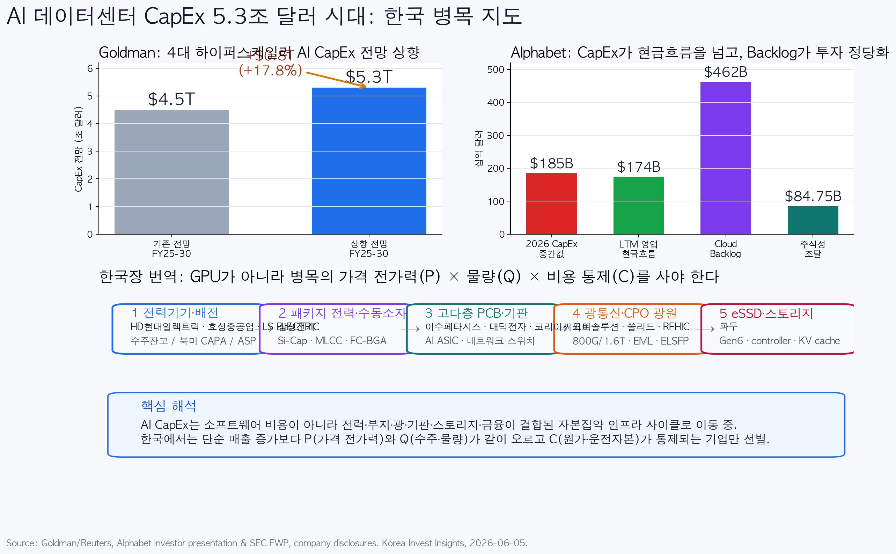

## 摘要

AI 数据中心支出已经不只是科技巨头的资本开支，而是在变成一个基础设施资产类别，涉及电力、土地、私募基础设施资金、债务和股权融资。

Reuters 引述 Goldman 报道，Meta、Microsoft、Amazon 和 Alphabet 在 FY2025-2030 的 CapEx 预测从 4.5 万亿美元上调至 5.3 万亿美元。Alphabet 也表示 2026 年 CapEx 为 1800-1900 亿美元，并预计 2027 年将显著高于 2026 年。

对韩国股票而言，这不是买入所有 AI 主题股的信号。优先顺序应是：

| 优先级 | 层级 | 韩国公司 |
|---:|---|---|
| 1 | 电力设备与电网 | HD Hyundai Electric, Hyosung Heavy, LS ELECTRIC |
| 2 | MLCC / FC-BGA / Si-Cap | Samsung Electro-Mechanics |
| 3 | 多层 PCB 与网络板 | Isu Petasys, Daeduck, Korea Circuit |
| 4 | 光连接 / CPO | OE Solutions, Solid, RFHIC |
| 5 | eSSD / 存储 | Fadu |

核心是 P x Q x C：价格、数量和成本。只有能够证明提价、重复订单和现金流的企业，才值得获得高估值。

来源：[Reuters/Goldman](https://www.reuters.com/business/finance/private-infra-real-estate-capital-play-larger-financing-role-ai-data-center-boom-2026-06-03/), [Alphabet](https://blog.google/alphabet/investor-presentation-june-2026/), [TrendForce](https://www.trendforce.com/presscenter/news/20260603-13077.html).

