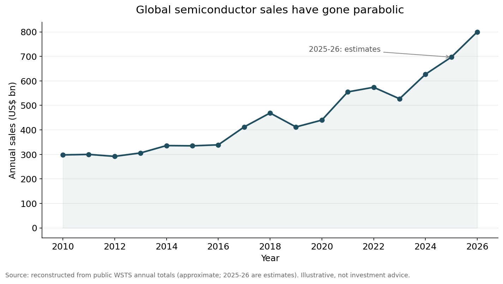
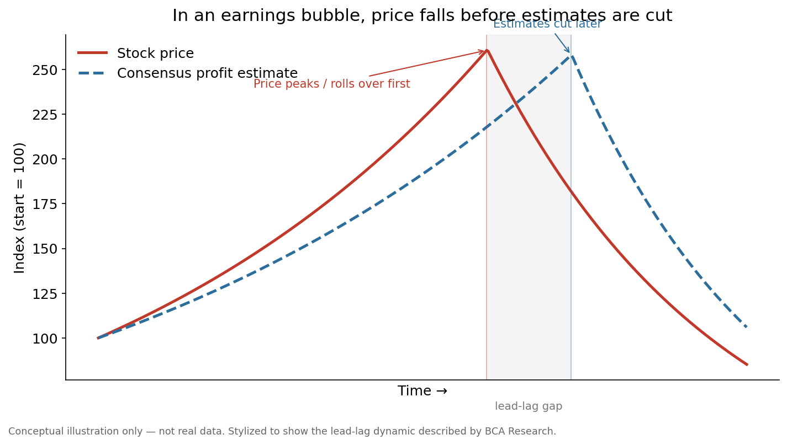

> This is a methodology note. For the underlying pieces that fed the analysis, it helps to read them alongside: [the AI substrate/PCB thesis (the system BOM's common bottleneck)](/post/ai-pcb-thesis-system-bom-common-bottleneck-2026-05-05/), [Goldman's token demand vs. J.P. Morgan's memory ASP peak-out](/post/goldman-token-demand-vs-jpm-memory-asp-peakout-korea-semiconductor-2026-05-31/), and [the Thesis OS public note](/post/thesis-os-open-source-research-operating-system-2026-05-30/) that explains the structure running all of this work.

## TL;DR

* In a recent report, BCA Research argues that <strong>the AI bubble is not a valuation bubble but an earnings bubble</strong>. It is not the P/E that swells but earnings themselves. And like every bubble it deflates eventually, though BCA adds that its own AI demand gauges show no imminent signal yet.
* The defining feature of an earnings bubble is the <strong>lead-lag</strong>. In BCA's words, in almost every case "stocks began to fall well before profit estimates were cut." Consensus estimates are a lagging signal.
* So precisely in a phase where money is crowding into AI infrastructure like this, what matters more is a <strong>deep-dive that reads system structure and leading demand indicators directly, instead of waiting on consensus EPS</strong>. Once estimates are cut, it is already too late.
* This note sets out, without exaggeration, what such a deep-dive actually looks at, and how we have run it as a structure called <strong>Thesis OS</strong>.

---

## 1. What it means to call the AI bubble an "earnings bubble"

When people say "bubble," they usually picture P/E ratios shooting up — a valuation bubble, where price rises far faster than earnings. BCA Research sees AI as a somewhat different kind. It is an <strong>earnings bubble, where earnings themselves swell rather than price</strong>.

This is not a new pattern. Homebuilders and banks did exactly this just before the financial crisis. Their P/E ratios looked low, but only because unsustainable earnings inflated the denominator (E) and made the multiple look cheap. Industries that swing hard with boom and bust — natural resources, airlines, shipping, and today's semiconductors — are vulnerable to this kind of earnings bubble.

Right now the semiconductor revenue curve resembles that picture.

<small>Source: an approximate reconstruction based on public WSTS annual aggregates, with 2025-2026 as estimates. Illustrative, not investment advice. The shape of the underlying data is in the same vein as the "parabolic semiconductor sales" chart presented in the BCA Research report (2026-05-28).</small>

A revenue curve going parabolic is both good news and a warning. When earnings rise fast, the P/E looks low. But if those earnings are a product of the cycle, the very fact that the multiple looks cheap can become a trap. The old warning of cyclical industries applies here: <strong>"the most dangerous moment is when earnings are at their peak."</strong>

Make no mistake. Neither BCA nor we are saying "it deflates now." BCA judges that its AI demand gauges — adoption rates, token spending, AI coding-tool downloads, GPU and memory prices — are mostly still at reassuring levels. The point is not timing but <strong>how this bubble behaves</strong>.

---

## 2. The real trap of an earnings bubble is the "lead-lag"

What makes an earnings bubble dangerous is not that it bursts, but the <strong>order in which it bursts</strong>.

The core point BCA makes is this: Wall Street analysts are poor at calling when an earnings bubble will deflate. And in almost every case, <strong>"stocks began to fall well before profit estimates were cut"</strong> (BCA Research, 2026-05-28).

Here is what that sentence means in practice, drawn as a picture.

<small>This is a conceptual diagram, not actual data. It simplifies the lead-lag structure BCA described, in which the price leads and the estimates lag.</small>

The red line (the share price) turns down first. The blue dotted line (consensus earnings estimates) is cut only much later. The gray band in between is the lag. If you hold a rule that says "I'll sell when analysts cut their target price or estimates," you will always move late by exactly that lag.

The conclusion follows. <strong>Consensus estimates are a lagging signal.</strong> The stock does not look most expensive when earnings peak, and by the time estimates are cut the price has already fallen. So if you watch only the estimates, you miss both the peak of the bubble and its inflection point.

---

## 3. That is why a deep-dive is needed — what does it look at

If estimates lag, what should you watch to get ahead? A deep-dive looks not at headline EPS but at the <strong>structure and leading indicators</strong> that produce that EPS. Concretely, four things.

<strong>① It reads the system structure.</strong> The linear story — "after GPU comes memory, then substrates" — is easy to trade but only half right. Real AI infrastructure is a rack-level system in which GPU, CPU, DPU, NIC, switch ASIC, memory modules, and power boards all scale together. As we laid out in [the AI substrate/PCB thesis](/post/ai-pcb-thesis-system-bom-common-bottleneck-2026-05-05/), substrates and PCBs are not the final stop of a rotation but the common denominator of the entire system bill of materials (BOM). Knowing the structure reveals where the true bottleneck is.

<strong>② It separates the variables.</strong> Looking at the same AI demand, Goldman tracks token usage (Q) and cost per token (C), while J.P. Morgan tracks the rate of rise in memory prices (P). [Decompose the two forecasts into P, Q, and C](/post/goldman-token-demand-vs-jpm-memory-asp-peakout-korea-semiconductor-2026-05-31/) and it becomes clear that the two views, which looked like a clash, are actually talking about different variables and can hold at the same time. Lumping it all into a single headline number is what hides this.

<strong>③ It tracks leading indicators directly.</strong> Instead of waiting for consensus EPS to be cut, it watches what moves earlier — HBM long-term contract prices and volumes, server DRAM contract prices, token spending, GPU and memory spot prices, adoption rates. These change direction ahead of the estimates.

<strong>④ It separates fact, inference, and speculation.</strong> "Officially confirmed fact," "reasonable inference," and "mere speculation" do not go in the same box. Things that are unverified — customer names, whether a part was adopted, contract terms — are clearly flagged as inference or speculation. Without that separation, you get swept up in an attractive story and buy speculation as if it were fact.

These four do not wait for estimates to be cut. That is why they suffer less from the lag.

---

## 4. Thesis OS — the structure that runs this deep-dive as a system

Doing the four things above well once or twice is not hard. The hard part is doing them <strong>every time, with the same discipline</strong>. So we entrust this work to a structure rather than to a person's mood on a given day. That structure is [Thesis OS](/post/thesis-os-open-source-research-operating-system-2026-05-30/).

Thesis OS is divided into three roles.

| Role | What it does |
|---|---|
| <strong>Alpha (알파)</strong> | Evidence gathering — market data, screeners, crawlers, fact-checking pipelines |
| <strong>Lattice (격자)</strong> | Judgment — weaving evidence into a thesis, building forecasts, stress-testing with the counter-case |
| <strong>Arki (아키)</strong> | Governance — keeping the whole consistent through schemas, workflows, and health checks |

The point is not flashy automation but the <strong>repeatability of discipline</strong>. Separating evidence (Alpha) from judgment (Lattice) reduces the chance that a good story runs ahead of the evidence. With governance (Arki) in place, you split fact, inference, and speculation by the same standard each time and keep tracking the leading indicators. Thesis OS is open source, so interested readers can inspect the structure itself directly.

---

## 5. Our blog's work — plainly

We write this as a record, not a boast. The most honest evidence is what pieces this methodology actually produced.

* <strong>Mapping the system structure</strong>: [the AI substrate/PCB thesis](/post/ai-pcb-thesis-system-bom-common-bottleneck-2026-05-05/) — seeing AI as a rack-level system and redefining substrates as the common bottleneck.
* <strong>Separating the variables</strong>: [Goldman vs. J.P. Morgan](/post/goldman-token-demand-vs-jpm-memory-asp-peakout-korea-semiconductor-2026-05-31/) — decomposing two seemingly opposed forecasts into P, Q, and C.
* <strong>Earnings read-through</strong>: [Marvell Q1 FY2027](/post/marvell-q1-fy2027-korea-semiconductor-readthrough-2026-05-28/), [Dell Q1 FY2027](/post/dell-q1-fy2027-earnings-korea-ai-server-margin-readthrough-2026-05-29/) — translating U.S. earnings into Korean component and materials bottlenecks.
* <strong>Tracking the cost structure</strong>: [AI token futures and cost per token](/post/ai-token-futures-cost-per-token-korea-semiconductor-thesis-2026-05-30/) — the axis shifting from a performance race to a cost race.

What these pieces share is that they do not rush to a "buy/sell" conclusion. Instead they map the structure, separate the variables, present the leading indicators, and treat names not as recommendations but as observation points. The aim is to give readers material to judge for themselves. We do not claim to be able to call the market top or the moment the bubble bursts. As BCA concludes, even analysts are poor at that. What we are trying to do is more modest: <strong>to understand the structure before estimates are cut, and to make ourselves watch leading signals rather than lagging ones</strong>.

---

## 6. Closing

In a phase where this much capital has crowded into AI infrastructure, the most dangerous posture is to wait for the consensus to turn for you. In an earnings bubble that signal always arrives late. The share price moves before estimates are cut.

So a deep-dive is not a flashy forecast but <strong>preparation to be less late</strong>. Understanding the system, separating the variables, watching the leading indicators directly, and distinguishing fact from speculation. To repeat that work not once but every time with the same discipline, we use a structure called [Thesis OS](/post/thesis-os-open-source-research-operating-system-2026-05-30/). If you are interested, we encourage you to look not only at the conclusions but at the structure and process behind them.

<small>This piece briefly cites, with attribution, the published core argument of BCA Research's "Earnings Bubbles Are Still Bubbles" (Global Investment Strategy, 2026-05-28), and the charts are self-produced based on public data and concepts. It is not a recommendation to buy or sell any particular security; investment decisions and their consequences rest with the investor.</small>
