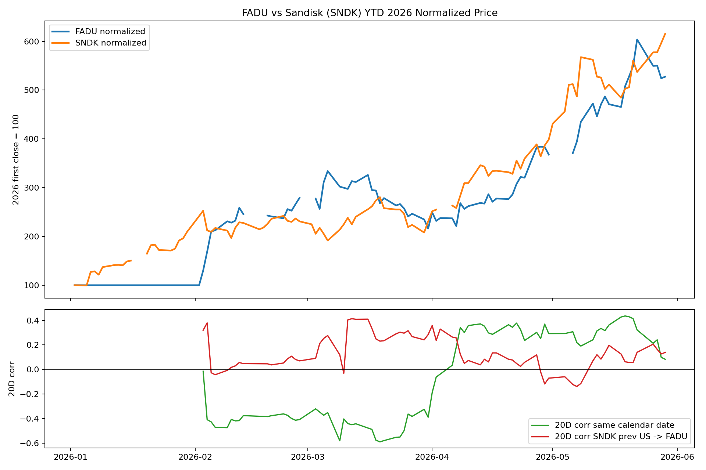
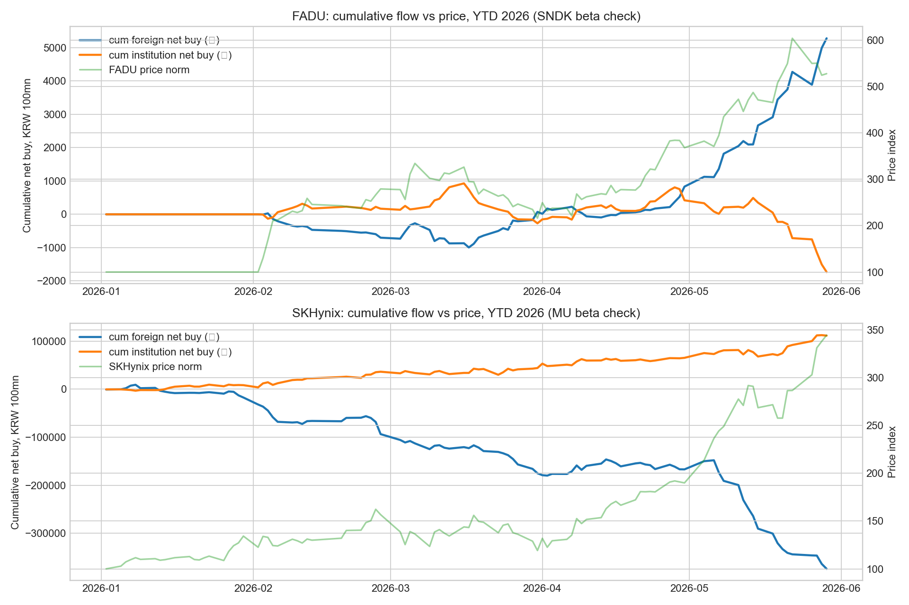

> 연결 맥락
> 이 글은 [SK하이닉스 vs 마이크론](/ko/post/sk-hynix-vs-micron-hbm-premium-ai-memory-platform-2026-05-31/)과 [AI 인프라 멀티플 지도](/ko/post/ai-infrastructure-multiple-map-gpu-hbm-mlcc-fcbga-samsung-2026-05-31/)의 후속입니다. 앞선 글들이 HBM과 메모리 대형주 프리미엄을 봤다면, 이번 글은 그 아래의 <strong>AI storage / NAND / eSSD controller</strong> 병목을 파두와 제주반도체로 번역합니다. 이후 후속편에서는 [파두가 메모리보다 좋은 AI 인프라 병목이 될 수 있는지](/ko/post/fadu-ai-infra-storage-bottleneck-p-q-new-segment-2026-06-02/)를 P·Q·새 세그먼트 관점에서 다시 점검했습니다. 관련 허브는 [AI HBM 허브](/ko/page/korea-semiconductor-hbm-kospi-hub/)와 [한국 반도체 밸류체인 허브](/ko/page/korea-semiconductor-equipment-ip-hub/)입니다.

## TL;DR

파두를 샌디스크의 한국 베타로 보는 시도는 이제 시작됐습니다. 특히 외국인 수급은 꽤 선명합니다. 2026년 5월 이후 파두 외국인은 약 <strong>+4,451억원</strong>을 순매수했고, 기관은 약 <strong>-2,152억원</strong>을 순매도했습니다. 같은 기간 파두는 +38.1%, 샌디스크는 +35.0% 올랐습니다.

하지만 가격 동조화는 아직 SK하이닉스-마이크론 페어만큼 구조화되지 않았습니다. 샌디스크 전일 수익률과 파두 익일 수익률의 상관은 5월 이후 +0.16, 최근 10~14거래일 +0.42입니다. 반면 마이크론-하이닉스는 각각 +0.57, +0.55입니다. 즉 <strong>외국인은 Yes, 국내 기관은 No, 시장 전체는 초기 형성 단계</strong>입니다.

결론은 <strong>파두 = AI storage/NAND의 한국 고베타 proxy 후보</strong>입니다. 다만 밸류에이션은 이미 높습니다. 구조적 질은 파두가 좋고, 숫자상 저평가는 제주반도체가 더 잘 보입니다. 글로벌 대안으로는 FY2027 추정 기준 샌디스크가 가장 싸 보이며, 웨스턴디지털은 HDD 병목이 인정됐지만 신규 진입 매력은 낮습니다.

---

## 데이터 기준과 한계

분석 기간은 <strong>2026-01-01~2026-05-29</strong>입니다. 파두와 SK하이닉스 가격·투자자 수급은 Research OS local DB의 `prices_daily`, `investor_flow_daily`를 사용했고, 샌디스크와 마이크론 가격은 Yahoo Finance/yfinance 기준입니다.

중요한 한계가 있습니다. 파두의 5월 일부 개인 수급과 세부 기관 주체 데이터는 local DB에 비어 있습니다. 따라서 이 글은 파두를 <strong>외국인/기관 합계</strong> 중심으로 판단합니다. 또한 샌디스크와 마이크론에는 한국식 투자자 주체별 수급 데이터가 없습니다.

---

## 1. 파두는 샌디스크를 따라가고 있나

가격 레벨만 보면 답은 “그렇다”에 가깝습니다. 연초 이후 파두는 21,250원에서 112,100원으로 올라 약 +427.5% 상승했습니다. 샌디스크도 같은 기간 강하게 상승했습니다. 둘 다 AI storage/NAND 리레이팅을 받은 겁니다.

하지만 수익률 상관은 아직 약합니다.

| 구분 | 샌디스크 → 파두 | 마이크론 → SK하이닉스 | 해석 |
|---|---:|---:|---|
| 연초 이후 가격 레벨 상관 | +0.91 | 높음 | 둘 다 같은 방향의 추세 |
| 전일 미국장 → 익일 한국장 수익률 | +0.12 | +0.46 | 파두 페어는 아직 약함 |
| 5월 이후 | +0.16 | +0.57 | 하이닉스-마이크론이 훨씬 구조적 |
| 최근 10~14거래일 | +0.42 | +0.55 | 파두 쪽 베타가 최근에야 형성 |

핵심은 “가격이 같이 올랐다”와 “매일 샌디스크를 따라 움직인다”가 다르다는 점입니다. 파두는 아직 샌디스크의 완성된 페어가 아닙니다. 다만 최근 2주 상관이 +0.42까지 올라온 것은 외국인이 이 관계를 발견하기 시작했다는 신호입니다.

---

## 2. 진짜 신호는 가격보다 외국인 수급

파두의 5월 이후 수급은 단순한 테마성 매수보다 선명합니다.

| 기간 | 파두 수익률 | 샌디스크 수익률 | 파두 외국인 누적 | 파두 기관 누적 | 외국인 순매수일 비율 |
|---|---:|---:|---:|---:|---:|
| 2026 YTD | +427.5% | 강한 상승 | +5,282억원 | -1,732억원 | 46.4% |
| 5월 이후 | +38.1% | +35.0% | +4,451억원 | -2,152억원 | 83.3% |
| 최근 10~14거래일 | +11.7% | +9.5% | +3,464억원 | -1,941억원 | 85.7% |

이 표가 말하는 것은 간단합니다.

외국인은 5월 이후 파두를 샌디스크/NAND/AI storage 베타로 강하게 사고 있습니다. 반대로 기관은 계속 팔고 있습니다. 즉 지금의 파두 랠리는 국내 기관 주도주가 아니라 <strong>외국인이 발견한 한국 고베타 proxy</strong>에 가깝습니다.

최근 일별 흐름도 그렇습니다.

| 날짜 | 파두 수익률 | 전일 SNDK | 외국인 | 기관 | 합계 |
|---|---:|---:|---:|---:|---:|
| 2026-05-22 | +9.9% | +11.0% | +527억 | -421억 | +107억 |
| 2026-05-26 | -9.0% | -4.0% | -385억 | -37억 | -422억 |
| 2026-05-27 | +0.1% | +7.0% | +558억 | -393억 | +165억 |
| 2026-05-28 | -4.7% | 0.0% | +544억 | -358억 | +186억 |
| 2026-05-29 | +0.6% | +3.0% | +291억 | -228억 | +62억 |

샌디스크가 강한 날 파두가 무조건 오르는 것은 아닙니다. 그런데 외국인은 조정일에도 꽤 꾸준히 샀습니다. 그래서 지금 봐야 할 변수는 가격 상관보다 <strong>외국인 순매수 지속성</strong>입니다.

---

## 3. 왜 SK하이닉스-마이크론보다 약한가

SK하이닉스와 마이크론은 같은 HBM/DRAM 글로벌 메모리 사이클의 대형주입니다. 실적 항목, 고객, 제품군, 투자자 베이스가 비슷합니다. 그래서 페어가 더 직접적입니다.

파두와 샌디스크는 다릅니다.

샌디스크는 NAND flash와 data-center SSD 수요를 직접 받는 글로벌 대형주입니다. 파두는 SSD controller, firmware, enterprise SSD solution에 가까운 팹리스입니다. 둘 다 AI storage/NAND 사이클에 연결되지만, 손익 구조와 고객 인증 리스크가 다릅니다.

따라서 파두는 샌디스크를 그대로 복제하는 주식이 아닙니다. 더 정확히는:

> 샌디스크 = AI storage/NAND 글로벌 온도계
> 파두 = 외국인이 새로 발견한 한국 고베타 proxy
> 검증 변수 = 외국인 순매수 지속 + 118,500원 돌파 + 기관 매도 둔화

---

## 4. “Next 삼성전기” 프레임으로 본 파두와 제주반도체

삼성전기 리레이팅의 핵심은 “작은 부품”이 AI 패키지 병목으로 재분류된 것입니다. 같은 프레임을 메모리·스토리지에 적용하면 조건은 다섯 가지입니다.

| 조건 | 의미 |
|---|---|
| Bottleneck business | AI 인프라가 커질수록 반드시 필요한 병목인가 |
| P 상승 | 제품 가격 또는 ASP가 올라가는가 |
| Q 상승 | 출하량·수주·고객 프로그램이 늘어나는가 |
| Customer validation | 대형 고객 인증이 확인되는가 |
| Multiple reclassification | 기존 업종 멀티플에서 AI 인프라 멀티플로 바뀌는가 |

이 기준에서 파두와 제주반도체는 둘 다 후보지만 성격이 다릅니다.

| 기업 | 병목 | 장점 | 약점 | 판단 |
|---|---|---|---|---|
| 파두 | AI eSSD controller / firmware / SSD solution | 구조적으로 가장 깨끗한 AI storage 병목 | 기대가 이미 높고 밸류에이션 부담 큼 | Watch / Wait |
| 제주반도체 | LPDDR4X, MCP, legacy low-power memory | 숫자상 훨씬 싸 보임, 1Q26 OPM 37.2% | 사이클 피크와 고객 집중도 확인 필요 | Tactical Watchlist |
| 샌디스크 | NAND / data-center SSD | 글로벌 AI storage/NAND 온도계, FY2027E 저평가 가능성 | NAND peak-out 리스크 | Conditional Buy 후보 |
| 웨스턴디지털 | HDD capacity / nearline storage | HDD 병목과 현금창출력 좋음 | 이미 가격에 상당 부분 반영 | 신규 진입 매력 낮음 |

---

## 5. 파두: 구조는 좋지만 가격은 까다롭다

파두의 구조적 논리는 강합니다. AI 데이터센터에서 GPU/HBM만 늘어나는 것이 아니라 KV-cache, checkpoint, training/inference data pipeline, enterprise SSD, controller/firmware 병목이 같이 커집니다. 파두는 이 중 <strong>eSSD controller와 firmware 인증 병목</strong>에 가까운 회사입니다.

공개 보도 기준 파두는 1Q26 매출 595억원, 영업이익 77억원으로 흑자 전환했고, 4월까지 신규 수주가 1,663억원에 달했습니다. 1Q26 매출의 약 80%는 controller 관련 매출로 알려져 있습니다. ([StorageNewsletter][1])

문제는 가격입니다. 첨부 리서치 기준 MarketScreener 추정치는 2026E 매출 3,233억원, 2027E 매출 5,848억원, 2027E PER 38배 수준입니다. 1Q26 단순 연율화 기준으로도 P/S와 P/E 부담이 큽니다. 따라서 파두는 “좋은 회사라서 지금 산다”가 아니라 <strong>수주가 매출과 이익으로 전환되는지 확인하면서 사는 주식</strong>입니다.

### 파두 체크포인트

| 체크포인트 | Buy로 올리는 조건 |
|---|---|
| 가격 | 118,500원 돌파 후 안착, 거래대금 동반 |
| 수급 | 외국인 순매수 지속, 기관 매도 둔화 |
| 실적 | 2Q26 매출 700억~800억원, OPM 15% 이상, 가능하면 20% |
| 수주 | 누적 신규 수주 4,000억원 이상 가시화 |
| 제품 | Gen6 / CXL / low-latency SSD design win |

### 무효화 조건

* 샌디스크가 강한데도 파두 외국인 순매수가 멈출 때
* 105,900원 이탈과 외국인 순매도가 동시에 나올 때
* 수주가 매출로 전환되지 않거나 OPM이 10% 아래로 떨어질 때
* controller mix가 낮아지고 단순 SSD solution 매출 비중이 커질 때

---

## 6. 제주반도체: 더 싼 숫자, 더 높은 반복성 의심

[제주반도체 1Q26 글](/ko/post/jeju-semiconductor-1q26-earnings-legacy-memory-squeeze-2026-05-15/)에서 정리했듯 제주반도체는 HBM 회사가 아닙니다. AI 때문에 삼성·SK·마이크론의 생산능력이 HBM·서버 DRAM으로 빨려 들어가면서 LPDDR4X, MCP, low-power memory가 부족해졌고, 그 가격 상승을 받은 회사입니다.

1Q26 매출은 1,804억원, 영업이익은 671억원으로 OPM 37.2%였습니다. The Elec은 NAND MCP, DRAM, TLC NAND 매출이 모두 크게 늘었다고 보도했습니다. TrendForce는 2Q26 LPDDR4X ASP가 QoQ +70~75%, LPDDR5X가 +78~83% 오를 것으로 봤습니다. ([TrendForce][2])

숫자만 보면 제주반도체가 파두보다 싸 보입니다. 1Q26을 단순 연율화하면 매출 7,216억원, 영업이익 2,684억원이고, 첨부 기준 시가총액 3.37조원은 P/S 4.7배, P/OP 12.6배입니다.

하지만 질문은 반복성입니다. 1Q가 피크인지, 2Q에도 매출 1,800억원 이상과 OPM 30% 이상이 유지되는지가 핵심입니다. 그래서 제주반도체는 장기 구조주라기보다 <strong>전술적 저평가 후보</strong>입니다.

---

## 7. 글로벌 비교: 샌디스크가 가장 싸고, WDC는 덜 매력적

샌디스크는 AI storage/NAND 사이클의 글로벌 온도계입니다. FY2Q26 매출은 30.25억달러, GAAP 순이익은 8.03억달러, non-GAAP EPS는 6.20달러였습니다. 회사는 FY3Q26 매출 가이던스를 44억~48억달러, non-GAAP EPS를 12~14달러로 제시했습니다. ([Sandisk][3])

웨스턴디지털은 HDD 병목과 현금창출력이 좋습니다. FY3Q26 매출은 33.37억달러, GAAP gross margin은 50.2%, operating cash flow는 11.2억달러였습니다. 다만 새 진입 관점에서는 이미 HDD 병목 프리미엄이 꽤 반영됐습니다. ([Western Digital][4])

| 기업 | 핵심 노출 | 투자 판단 |
|---|---|---|
| Sandisk | NAND, data-center SSD | Conditional Buy 후보 |
| 제주반도체 | LPDDR/MCP legacy memory squeeze | Tactical Watchlist |
| 파두 | AI eSSD controller / firmware | Watch / Wait |
| Western Digital | HDD capacity / cash flow | 신규 진입 매력 낮음 |

---

## 최종 판단

파두는 샌디스크의 한국 베타로 <strong>해석되기 시작한</strong> 주식입니다. 아직 하이닉스-마이크론처럼 완성된 글로벌 페어는 아닙니다. 그러나 5월 이후 외국인 +4,451억원 순매수는 우연으로 보기 어렵습니다.

실전 결론은 이렇습니다.

| 조건 | 액션 |
|---|---|
| SNDK 강세 + 파두 외국인 순매수 지속 + 118,500원 돌파 | 파두를 한국 AI storage beta로 인정, 조건부 Buy 상향 |
| SNDK 강세인데 파두 외국인 둔화·기관 매도 확대 | 베타 실패, 단기 theme peak 경계 |
| SNDK 조정에도 파두 외국인 순매수 유지 | 파두 고유 알파로 업그레이드 가능 |
| 105,900원 이탈 + 외국인 순매도 | 단기 리스크 관리 |

한 문장으로 압축하면:

> 파두는 AI storage/NAND의 한국 고베타 proxy로 발견되는 중이다. 다만 지금은 “Buy now”보다 “외국인 수급과 118,500원 돌파를 확인하는 Watch / conditional Buy”가 맞다.

---

## 근거 구분

### [Fact]

* 파두 1Q26 매출 595억원, 영업이익 77억원, 4월까지 신규 수주 1,663억원은 공개 보도로 확인됩니다. ([StorageNewsletter][1])
* TrendForce는 2Q26 LPDDR4X ASP +70~75%, LPDDR5X +78~83% QoQ를 제시했습니다. ([TrendForce][2])
* Sandisk FY2Q26 매출은 30.25억달러, GAAP 순이익은 8.03억달러, non-GAAP EPS는 6.20달러입니다. ([Sandisk][3])
* Western Digital FY3Q26 매출은 33.37억달러, GAAP gross margin은 50.2%, operating cash flow는 11.2억달러입니다. ([Western Digital][4])
* 파두-샌디스크 수급·상관 분석은 Research OS local DB와 yfinance 데이터를 2026-05-29까지 정렬해 계산했습니다.

### [Inference]

* 파두는 샌디스크를 그대로 추종하는 페어라기보다, 외국인이 새로 발견하는 한국 AI storage/NAND 고베타 proxy에 가깝습니다.
* 제주반도체는 구조적 AI storage 병목보다는 LPDDR/MCP 공급 부족의 전술적 저평가 후보입니다.
* 파두의 다음 단계는 가격 상승보다 수주→매출→OPM 전환 검증입니다.

### [Blocked]

* 파두의 고객별 수주, controller별 ASP, gross margin, Gen6/CXL design win 세부 내역.
* 샌디스크·마이크론의 한국식 투자자 주체별 수급.
* 제주반도체 2Q26 이후 LPDDR/MCP 이익 반복성.
* 파두 일부 세부 수급 항목은 local DB에서 비어 있어 외국인/기관 합계 중심으로 판단했습니다.

[1]: https://www.storagenewsletter.com/2026/05/12/fadu-fiscal-1q26-financial-results/ "FADU: Fiscal 1Q26 Financial Results - StorageNewsletter"
[2]: https://www.trendforce.com/presscenter/news/20260514-13044.html "Mobile DRAM Contract Prices Continue Rising in 2Q26, Pressuring Smartphone Production, Says TrendForce"
[3]: https://investor.sandisk.com/news-releases/news-release-details/sandisk-reports-fiscal-second-quarter-2026-financial-results "Sandisk Reports Fiscal Second Quarter 2026 Financial Results"
[4]: https://www.westerndigital.com/en-ca/company/newsroom/press-releases/2026/2026-04-30-wd-reports-fiscal-third-quarter-2026-financial-results "WD Reports Fiscal Third Quarter 2026 Financial Results"
