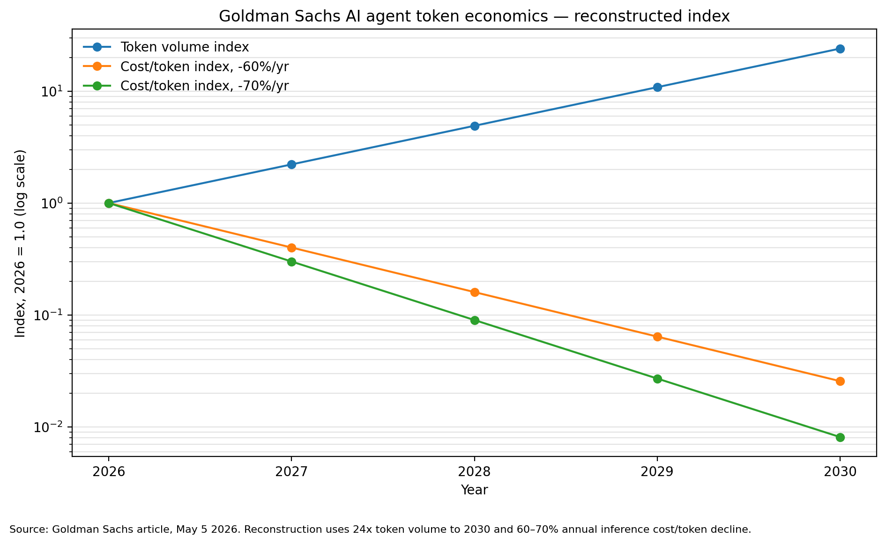
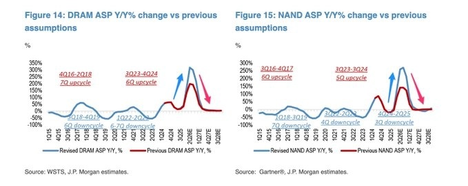
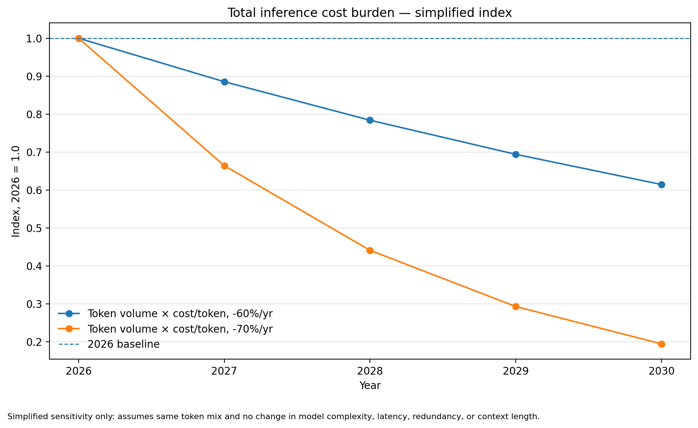

> This piece follows on from [AI Token Futures and Cost per Token](/post/ai-token-futures-cost-per-token-korea-semiconductor-thesis-2026-05-30/), [Samsung Electronics 2026 Deep Dive](/post/kr-deep-dive-samsung-electronics-2026-04-16/), [SK Hynix: The HBM Heavyweight](/post/kr-deep-dive-sk-hynix-2026-04-16/), and [Korea AI Infrastructure After Nvidia Q1 FY27](/post/nvidia-q1-fy27-korea-ai-infra-supply-chain-2026-05-21/). Where those earlier posts looked separately at cost per token, individual companies, and the spread of AI infrastructure, this one <strong>merges two different calls — Goldman on demand and J.P. Morgan on memory pricing — into a single framework</strong> and lays out the investment timeline from 2026 to 2030.

## TL;DR

* Goldman Sachs sees <strong>an explosion in token usage (24x by 2030) plus a steep drop in cost per token (60-70% per year)</strong>. J.P. Morgan sees <strong>the year-over-year (YoY) growth rate of DRAM and NAND ASP slowing from 2027</strong>. Because they track different variables, the two calls do not clash head-on.
* Combine them and a single path appears: <strong>2026 is memory ASP beta, 2027 is a peak-out in price momentum, and 2028-2030 is a rotation of alpha into the components and systems that lower cost per token</strong>.
* So the investment conclusion is not "buy memory without limit." In 2026, memory beta such as HBM, server DRAM and eSSD is favorable, but after that you have to <strong>be selective about where the bottlenecks are</strong> — ASIC, AI networking, optical, HBM leaders, eSSD, advanced packaging, and MLCC/FC-BGA.
* The two most common misreadings are: (1) seeing J.P. Morgan's peak-out and concluding "the AI infrastructure cycle is over," and (2) seeing Goldman's demand and concluding "memory prices keep surging through 2030." Both go too far.

---

## 1. Two Giants, Two Seemingly Opposite Calls

Looking at the same AI era, two global investment banks have painted pictures that seem to point in opposite directions.

<strong>Goldman Sachs</strong> (official article, May 5, 2026) looks at the demand side. The core is two points.

- <strong>Token usage grows 24x by 2030.</strong> The call is that monthly usage reaches 120 quadrillion tokens in 2030; working backward, that puts the 2026 base at roughly 5 quadrillion. That is about 121% average annual growth over four years.
- At the same time, <strong>inference cost per token falls 60-70% per year.</strong> The drivers are improving chip efficiency and better data-center architecture.

<small>Source: a reconstructed chart that simply indexes the figures in Goldman Sachs's official article (2026-05-05). It is not the original chart but the original numbers — "24x tokens by 2030, cost per token down 60-70% a year" — plotted on a log scale.</small>

In the chart above, the blue line (usage) climbs steeply, and the orange and green lines (cost per token) fall even more steeply. At a 60% annual decline, cost four years out is about 2.6% of the 2026 level (roughly a 39x improvement); at 70%, about 0.8% (roughly a 123x improvement).

By contrast, the <strong>J.P. Morgan</strong> material looks at price. The picture is that DRAM and NAND ASP rise strongly in 2026 but that, <strong>from late 2026 into early 2027, the year-over-year growth rate decelerates quickly.</strong>

<small>Source: a session-uploaded image (DRAM from WSTS / J.P. Morgan estimates, NAND from Gartner / J.P. Morgan estimates). Detailed figures such as FY26 DRAM +53% and NAND +30%, FY27 DRAM +1% and NAND -6% are based on a secondary summary; the original table is unverified.</small>

On the surface, "demand explodes" (Goldman) and "memory price gains roll over" (J.P. Morgan) seem to clash. But look closely and the two calls are <strong>talking about different things.</strong>

---

## 2. Why It's Not a Clash — Separating P, Q and C

A memory company's profit breaks down into a simple multiplication.

> Revenue = shipments (Q) × average selling price (P), and the token economy = usage (Q) × cost per token (C).

Through this lens, it becomes clear that the two calls are watching different variables.

| Dimension | Goldman Sachs | J.P. Morgan |
|---|---|---|
| Variable watched | Token usage (Q), cost per token (C) | YoY change in DRAM/NAND ASP (P momentum) |
| Core message | AI usage explodes long term, cost per token plunges | Memory price growth rate slows from 2027 |
| Time horizon | 2026-2030 | Late 2026 to early 2027 |

There is a trap that must be flagged here. <strong>The vertical axis of J.P. Morgan's chart is not the absolute level of price but the "year-over-year growth rate (YoY %)."</strong> The two are entirely different.

Take an example.

| Point in time | ASP index | YoY |
|---|---:|---:|
| 4Q25 | 100 | – |
| 4Q26 | 300 | +200% |
| 4Q27 | 315 | +5% |

From 4Q26 to 4Q27 the price index still <strong>rises</strong>, from 300 to 315. Yet the year-over-year growth rate plunges from +200% to +5%. In other words, J.P. Morgan's 2027 "peak-out" may not mean prices collapse but that <strong>the pace of increase slows.</strong> The stock market usually prices in this <strong>direction of the growth rate</strong> before it prices in "record-high profit" itself. That is why share prices can cool first, right when profit is at its peak.

To sum up, Goldman watches <strong>Q (usage) and C (cost)</strong>, while J.P. Morgan watches <strong>the pace of P (price).</strong> Because these are different variables, both can be right at the same time.

---

## 3. Total Inference Cost May Actually Fall

Here a counterintuitive conclusion emerges. Even if usage grows 24x, if cost per token falls 60-70% per year, then <strong>the total inference-cost burden could actually be lower than in 2026.</strong>

It is simple arithmetic. Assuming the same token mix and the same model complexity, total cost in 2030 is the usage index × the cost-per-token index.

- At a 60% annual decline: 24 × 2.6% ≈ <strong>61% of 2026</strong>
- At a 70% annual decline: 24 × 0.8% ≈ <strong>19% of 2026</strong>

<small>This is a heavily simplified sensitivity calculation. It does not reflect token mix, model size, context length, the rise in reasoning tokens, multimodality, redundant processing, latency constraints, or memory-bandwidth bottlenecks. In practice these factors could push cost back up.</small>

This chart is the heart of Goldman's logic. <strong>Whoever lowers cost per token ends up making the money.</strong> More than the rise in usage itself, it is the cost reduction that makes that usage affordable which keeps the industry's cash flow alive. That said, as the caveat notes, if context length or reasoning tokens rise quickly, the real cost curve may fall less than this chart suggests.

---

## 4. So the Timeline Shifts

Combine the two calls and the following path is logically consistent.

| Period | What happens | Where it's favorable |
|---|---|---|
| <strong>2026</strong> | Agent usage surges → HBM, server DRAM, eSSD and NAND allocation tightens → DRAM and NAND ASP spike | Memory ASP beta works strongly |
| <strong>2027</strong> | A higher base plus some supply additions and long-term agreements (LTAs) slow the YoY ASP growth rate. B2B AI memory stays firm; B2C consumer memory hits price resistance | Share prices price in "slowing growth rate" before "peak profit." Segment divergence begins |
| <strong>2028-2030</strong> | Usage keeps rising, but the drop in cost per token absorbs it | Alpha rotates from broad memory beta to the <strong>token-cost-reduction stack</strong> |

The core message is one. From 2027, "how much further DRAM and NAND prices rise" matters less than <strong>"which components and systems lower cost per token."</strong>

---

## 5. Example Investment Ideas (Observation Points, Not Recommendations)

Below are not stock recommendations but <strong>examples</strong> of "where to look first" along the timeline above. AI and memory stocks have already re-rated quickly, so this is not a call to buy right now but a map for when the conditions are met.

### Example 1 — 2026 Memory ASP Beta

The phase where HBM, server DRAM and eSSD allocation tightens and DRAM and NAND prices spike. Memory large-caps such as <strong>SK Hynix, Samsung Electronics and Micron</strong> benefit directly. The counterargument is that once the 2027 slowdown in the growth rate begins, the share price can take multiple compression first, even if profit is high.

### Example 2 — Token-Cost-Reduction Stack

The real heart of Goldman's logic is not the rise in usage but the <strong>fall in cost per token.</strong> Customers will pay more for chips and systems that lower their cost per token. <strong>Custom ASICs, AI networking and optical, and HBM leaders</strong> fit this best. (The interconnect, substrate and power bottlenecks seen in the [Marvell read-through](/post/marvell-q1-fy2027-korea-semiconductor-readthrough-2026-05-28/) are this same thread.)

### Example 3 — eSSD / Enterprise NAND

Agent inference demands far more retrieval (RAG), logs, context, KV cache and checkpoint storage than plain training. If it is true that AI servers use roughly 3x the SSD capacity of ordinary servers, then NAND can be reclassified not as a plain commodity-cycle asset but as an <strong>AI storage bottleneck.</strong> The counterargument is the possibility that price resistance in consumer SSDs dilutes enterprise strength.

### Example 4 — Advanced Packaging / MLCC / FC-BGA

If Goldman's 2030 token call is right, the complexity of server and rack architecture keeps rising. It is not only GPUs, ASICs and HBM that grow; demand for substrate area, power stabilization, decoupling capacitors and high-speed signal quality grows alongside. High-spec MLCC and FC-BGA suppliers such as <strong>Samsung Electro-Mechanics</strong> fall here.

### Different Peak-Outs by Segment

What matters is not "memory as a whole" but the differences by segment. J.P. Morgan's peak-out logic does not apply equally to all memory.

| Segment | Likelihood peak-out applies | Tension with long-term demand |
|---|---|---|
| HBM | Low-Medium | High (demand keeps reinforcing the bandwidth wall) |
| Server DRAM | Medium | Medium |
| eSSD / Enterprise NAND | Medium | High (structural demand possible) |
| Mobile DRAM | High | Low (fast consumer price resistance) |
| Commodity DRAM/NAND | High | Low (peak-out logic applies best) |

> Common condition: the examples above need more than "oversold" or "because it's AI." A candidate must be somewhere where <strong>actual orders, contract prices and earnings estimates are newly rising, and where bottlenecks and entry barriers are confirmed.</strong>

---

## 6. The Two Most Common Misreadings

In this phase the market is prone to two mistakes pointing in opposite directions.

<strong>Misreading 1 — "J.P. Morgan says peak-out, so the AI infrastructure cycle is over."</strong> No. A peak-out is a slowdown in the <strong>growth rate</strong> of price, not a collapse in the <strong>level</strong> of price. And it applies best to commodity memory and less to bottlenecks such as HBM, eSSD, ASIC and packaging.

<strong>Misreading 2 — "Goldman says 24x tokens, so DRAM and NAND prices keep surging through 2030 too."</strong> This too goes too far. Goldman says explosive usage and a <strong>steep drop in cost per token</strong> at the same time. If cost falls quickly, the YoY growth rate of memory prices can slow even as usage rises.

The right reading is in between. <strong>A memory super-cycle in 2026, a peak-out in price momentum in 2027, and a long-term expansion of the token-cost-reduction stack in 2028-2030.</strong>

---

## 7. Fund Manager's Comment

The two calls are not enemies but two axes of one picture. Goldman speaks to "how much, and how cheaply, we come to use AI"; J.P. Morgan speaks to "how long memory prices keep rising fast in that process." The investor's job is not to pick one of the two but to <strong>not miss the inflection points on the timeline.</strong>

The two most dangerous choices are these.

* <strong>Throwing out all of AI infrastructure on seeing the single word peak-out</strong> — the mistake of giving away even the winners with bottlenecks at a bargain price.
* <strong>Chasing commodity memory to the bitter end on token demand alone</strong> — the mistake of taking multiple compression head-on in the phase where the price growth rate rolls over.

The signals to check now, put simply, are these.

| What you watch | Goldman (demand) strengthens | J.P. Morgan (peak-out) strengthens |
|---|---|---|
| Token usage | High growth sustained | Growth rate slows |
| Cost per token | Continues to fall 60%+ a year | Decline rate slows, latency cost rises |
| HBM long-term agreements | Prices held or raised | Renegotiation, volume deferral |
| Server DRAM contract price | Further increase | Slowing growth rate, spot discounts |
| Enterprise SSD | CSP long-term agreements expand | Consumer SSD price resistance spreads in |

In short, <strong>recognizing memory beta in 2026 while preparing, from 2027, to shift weight toward the bottlenecks that lower cost per token</strong> is the most reasonable stance available now. It is neither chasing memory to the end nor throwing it all out in fear of the peak-out.

<small>This piece is an analysis reconstructed from Goldman Sachs's official article (2026-05-05), J.P. Morgan-related charts and secondary summaries, and TrendForce's official outlook. The full text of J.P. Morgan's original report, its quarterly ASP tables, and its segment-level detail could not be verified, and company names are examples illustrating the analytical flow, not investment recommendations. Actual investment decisions and their responsibility rest with the investor.</small>
