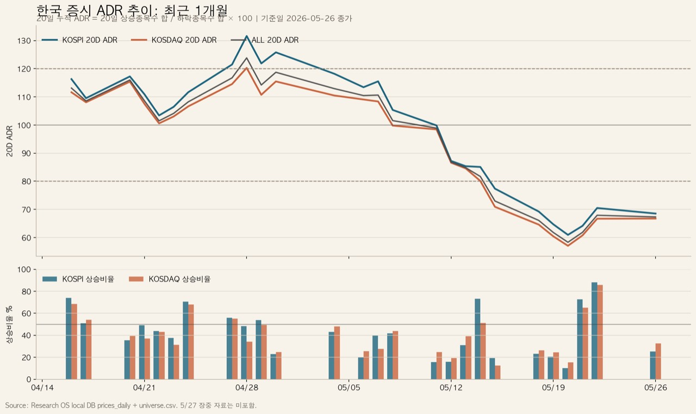

> 이 글은 [복합 리스크오프와 회복 트리거](/ko/post/macro-snapshot-complex-risk-off-recovery-triggers-2026-05-17/), [KOSPI 외국인 지분율 vs 삼성전자·SK하이닉스](/ko/post/korea-foreign-ownership-kospi-samsung-hynix-divergence-2026-05-26/), [한국증시 외국인 수급 분석](/ko/post/korea-foreign-investor-flow-memory-megacap-rotation-2026-05-24/), [국민성장펀드와 코스닥 스마트머니](/ko/post/national-growth-fund-kosdaq-smart-money-policy-bottlenecks-2026-05-24/)의 후속 레짐 노트다. 앞글들이 매크로, KOSPI 대형주 수급, 코스닥 정책자금을 따로 봤다면, 이번 글은 **시장 내부 폭**, 즉 ADR로 지금 장의 질을 점검한다.

## TL;DR

* 최근 1개월 한국 증시 20일 ADR은 **전체 113.1 → 67.3**, KOSPI **116.3 → 68.5**, KOSDAQ **111.6 → 66.7**로 급락했다. 지수가 버텨도 평균 종목은 이미 조정장에 들어갔다.
* 지금은 넓은 위험 선호장이 아니다. **AI 인프라 병목, MLCC·FC-BGA·SOCAMM·후공정, 조선·방산·전력 일부**만 살아 있는 좁은 주도주 장세다.
* 다음 포인트는 1선 대장 추격이 아니라 **ADR 회복 + 거래대금 증가 + 외국인/기관 수급이 처음 붙는 2선 후보**다. 원문 스크리너 기준 우선 후보는 HPSP, SFA반도체, 하나마이크론, 동진쎄미켐, 케이엠더블유다.



<small>Source: Research OS local DB `prices_daily` + `universe.csv`. 기준일은 2026년 5월 26일 종가. 2026년 5월 27일 장중 자료는 반영하지 않았다.</small>

---

## 1. ADR은 무엇을 말해주나

ADR은 지수의 높이가 아니라 **시장 내부의 폭**을 본다.

산식은 단순하다.

```text
일간 ADR = 상승 종목 수 / 하락 종목 수 × 100
20일 ADR = 최근 20거래일 상승 종목 수 합 / 최근 20거래일 하락 종목 수 합 × 100
상승비율 = 상승 종목 수 / 전체 종목 수 × 100
```

ADR이 100이면 상승 종목과 하락 종목이 균형이다. ADR이 80 아래로 내려가면 하락 종목이 뚜렷하게 많다는 뜻이다. ADR이 60\~70대인데 지수가 강하면, 그 장은 보통 **몇 개 대형주 또는 일부 테마가 시장을 끌고 가는 장**이다.

지금 한국장이 그렇다.

| 시장 | 2026-04-16 20D ADR | 2026-05-26 20D ADR | 변화 | 해석 |
|---|---:|---:|---:|---|
| KOSPI | 116.3 | 68.5 | -47.8p | 대형주도 확산 약화 |
| KOSDAQ | 111.6 | 66.7 | -44.9p | 중소형 브레드스 급랭 |
| 전체 | 113.1 | 67.3 | -45.8p | 평균 종목은 조정장 |

핵심은 KOSDAQ만 약한 것이 아니라는 점이다. KOSPI도 20일 ADR이 68.5까지 내려왔다. 즉 “코스닥만 소외되고 코스피는 건강하다”가 아니다. 더 정확한 표현은 이렇다.

> 한국 시장 전체의 폭은 좁아졌고, 살아남은 돈은 AI 인프라·조선·방산 같은 주도 섹터에 압축됐다.

---

## 2. 5월 하순 반등은 왜 아직 충분하지 않은가

5월 20일에는 전체 상승 종목 333개, 하락 종목 2,082개였다. 일간 ADR은 **16.0**, 상승비율은 **13.5%**였다. 단기 투매에 가까운 날이었다.

그 뒤 5월 21\~22일에는 반등이 강했다.

| 날짜 | 전체 상승 | 전체 하락 | 일간 ADR | 20D ADR | 상승비율 | 해석 |
|---|---:|---:|---:|---:|---:|---|
| 2026-05-20 | 333 | 2,082 | 16.0 | 58.3 | 13.5% | 단기 투매 |
| 2026-05-21 | 1,695 | 720 | 235.5 | 61.9 | 68.6% | 기술적 반등 |
| 2026-05-22 | 2,097 | 283 | 742.2 | 67.9 | 86.1% | 강한 반등 |
| 2026-05-26 | 749 | 1,660 | 45.1 | 67.3 | 30.2% | 재차 약화 |

문제는 5월 26일이다. 강한 반등 뒤 다시 하락 종목이 1,660개로 늘었다. 상승비율도 30.2%로 내려왔다.

따라서 현재 상태는 “브레드스 확산이 확인됐다”가 아니다. 더 정확히는 **브레드스 저점권에서 반등 시도와 재약화가 반복되는 구간**이다.

이 점은 기존 [매크로 리스크오프 글](/ko/post/macro-snapshot-complex-risk-off-recovery-triggers-2026-05-17/)과 연결된다. 당시 핵심은 유가, 장기금리, 달러, 원화, 중국 신용, 외국인 수급이 동시에 안정되어야 한국 베타가 회복된다는 것이었다. 지금 ADR은 그 회복이 아직 시장 전체로 퍼지지 않았음을 보여준다.

---

## 3. 현재 레짐: Narrow Leadership

현재 한국장은 **Narrow Leadership / Selective Risk-On**이다.

| 항목 | 판단 |
|---|---|
| 시장 폭 | 약함. 전체 20D ADR 67.3 |
| 주도주 | 매우 강함. AI 인프라와 조선·방산 일부 집중 |
| 매매 난이도 | 높음. 평균 종목보다 주도주 선별이 중요 |
| 신규 진입 방식 | 1선 추격보다 눌림·2선 선별 |
| 포트폴리오 운영 | 주도주는 유지, 약한 종목은 교체, 현금 과소 보유 주의 |

이 장에서 가장 위험한 판단은 “지수가 안 빠지니 시장 전체가 좋다”는 해석이다. ADR이 60대라면 대다수 종목은 이미 약하다. 반대로 “브레드스가 나쁘니 모든 주식을 피해야 한다”도 틀리다. 실제로 돈은 특정 섹터에 강하게 남아 있다.

자금이 몰린 곳은 네 그룹이다.

1. **AI 인프라 병목:** 삼성전기, 제주반도체, 대덕전자, 심텍, 해성디에스, 하나마이크론, HPSP
2. **대형 메모리:** SK하이닉스, 삼성전자
3. **조선·방산·원전/SMR:** HD현대중공업, 한화오션, 두산퓨얼셀
4. **전력·광통신·네트워크:** 전력/전선 일부, RF·광통신 일부

즉 시장은 약하지만 주도주는 강하다. 이 둘은 모순이 아니다. 오히려 브레드스가 무너질수록 돈은 검증된 주도 섹터로 더 좁게 몰린다.

---

## 4. 주도주는 어디였나

최근 1개월 주도주는 AI 인프라와 조선·방산으로 압축된다.

단위는 수익률 %, 거래대금 억원, 수급 억원이다.

| 종목 | 1M | 5D | 평균 거래대금 | 외국인 1M | 기관 1M | 개인 1M | 해석 |
|---|---:|---:|---:|---:|---:|---:|---|
| 제주반도체 | +173.6 | +28.4 | 3,692.8 | +1,440.8 | +595.8 | -1,962.1 | LPDDR 테마 2차 발견. 과열 |
| 삼성전기 | +146.0 | +52.5 | 8,986.4 | -9,036.0 | +4,953.0 | +3,922.2 | MLCC+FC-BGA 대장. 기관 주도 |
| 대덕전자 | +81.4 | +20.5 | 1,198.1 | +524.4 | +827.0 | -954.7 | FC-BGA/MLB 핵심 |
| 심텍 | +74.5 | +32.3 | 822.6 | +678.3 | +1,376.0 | -2,070.4 | SOCAMM/기판 핵심 |
| 해성디에스 | +72.7 | +19.2 | 297.3 | +132.7 | +656.4 | -53.9 | heat spreader/기판 옵션 |
| 하나마이크론 | +48.3 | +5.0 | 1,200.6 | +2,172.5 | +158.3 | +135.8 | 외국인 주도 후공정 회복 |
| HD현대중공업 | +51.0 | +21.1 | 3,642.0 | -5,344.5 | +7,038.2 | -1,987.9 | 기관 주도 조선+원전 옵션 |
| 한화오션 | +2.1 | +16.3 | 2,369.4 | +1,472.3 | +1,393.3 | +6,409.7 | 5일 수급 개선, 아직 후발 |

여기서 중요한 것은 **같은 주도주라도 수급의 질이 다르다**는 점이다.

삼성전기는 1개월 +146.0% 상승했지만 외국인은 9,036억원을 팔았다. 기관과 개인이 흡수했다. 이는 [삼성전기 시총 100조 분석](/ko/post/samsung-electro-mechanics-100tn-murata-hyundai-market-cap-2026-05-26/)에서 본 것처럼 AI 수동소자 리레이팅이 강하지만, 신규 추격의 효율은 낮아졌다는 뜻이다.

반면 하나마이크론은 1개월 +48.3% 상승하면서 외국인 1개월 순매수가 +2,172.5억원이다. 이미 대장화된 종목보다 후공정 확산 후보로 보는 이유다.

HD현대중공업은 외국인이 팔고 기관이 크게 샀다. 이 구조는 [HD현대중공업 SMR 옵션 분석](/ko/post/hd-hyundai-heavy-industries-smr-terrapower-natrium-option-2026-05-27/)과도 맞물린다. 조선·엔진·SMR 내러티브는 살아 있지만, 이 역시 기관 주도 랠리라 가격 위치가 중요하다.

---

## 5. KOSDAQ은 약한가, 아니면 선별적으로 돌아오는가

KOSDAQ 20D ADR은 66.7이다. 표면적으로는 약하다. 하지만 이것이 “코스닥 전체 회피”를 뜻하지는 않는다.

이전 [코스닥 스마트머니와 펄어비스 반등 후보](/ko/post/kosdaq-smart-money-return-pearl-abyss-rebound-2026-05-22/) 글의 핵심은 가격보다 수급이 먼저 움직일 수 있다는 것이었다. 이번 ADR 데이터는 그 프레임을 더 좁힌다.

지금 필요한 것은 코스닥 전체 매수가 아니라 **거래대금이 처음 붙고, 외국인/기관 수급이 확인되며, 20일선 과이격이 덜한 2선 후보**다.

원문 스크리너 기준 우선 후보는 다음이다.

| 우선 | 종목 | 테마 | 5D | 20D | 5D 평균 거래대금 | 거래대금 가속 | 20일선 이격 | fi5 | 판단 |
|---:|---|---|---:|---:|---:|---:|---:|---:|---|
| 1 | HPSP | 반도체 장비/AI 인프라 | +12.7 | +3.4 | 1,989.2 | 1.28x | +2.9 | +509.3 | 가장 깨끗한 2선 후보 |
| 2 | SFA반도체 | 후공정 | +19.9 | -2.5 | 3,020.5 | 3.41x | +7.4 | +259.1 | 후공정 확산 후보 |
| 3 | 하나마이크론 | 후공정 | -1.2 | +16.6 | 1,386.3 | 1.18x | +3.8 | +129.4 | 눌림형 후보 |
| 4 | 동진쎄미켐 | 소재 | +5.4 | -4.0 | 642.5 | 1.15x | +3.1 | +447.4 | 소재 수급 회복 후보 |
| 5 | 케이엠더블유 | RF/AI-RAN | +11.7 | +20.8 | 259.0 | 1.30x | n/a | +226.8 | AI-RAN 이벤트 확인형 |

`fi5`는 최근 5일 외국인+기관 순매수다. 일부 종목은 로컬 DB 수급 커버리지 공백이 있을 수 있으므로 실제 진입 전 Kiwoom/KRX 수급 재검증이 필요하다.

---

## 6. 브레드스 확산을 확인하는 트리거

지금은 아직 “시장 전체 매수” 구간이 아니다. 전체 ADR이 67.3이면 하락 종목이 여전히 많다.

확산을 확인하려면 다음 조건이 필요하다.

| 트리거 | 기준 | 의미 |
|---|---|---|
| 20D ADR 80 회복 | 전체 ADR 80 이상 | 하락 종목 우위 완화 |
| 20D ADR 100 회복 | 전체 ADR 100 이상 | 상승/하락 균형 회복 |
| 일간 상승비율 55% 이상 | 2\~3거래일 연속 | 반등이 하루짜리가 아님 |
| KOSDAQ 거래대금 증가 | 거래대금 확대 + 상승종목 증가 | 중소형 확산 가능성 |
| 외국인 매도 흡수 | 환율 안정 + 지수 보합/상승 | 진짜 리스크오프보다 매물 흡수장 |

섹터별로는 아래 순서가 중요하다.

| 섹터 | 확인할 신호 | 의미 |
|---|---|---|
| AI 인프라 2선 | HPSP, SFA반도체, 하나마이크론, 동진쎄미켐 거래대금 증가 | 반도체 안에서 확산 |
| 광통신/RF/AI-RAN | 케이엠더블유, RFHIC, 오이솔루션 수급 전환 | Marvell/NVIDIA AI-RAN 연계 |
| FC-BGA/MLB | 대덕전자, 이수페타시스, 코리아써키트 재강세 | custom ASIC·AI networking 확인 |
| 테스트소켓/후공정 | ISC, 리노공업, 티에스이, 두산테스나 거래대금 증가 | SOCAMM/ASIC 테스트 확산 |
| 조선/방산 2선 | 대장주 눌림 중 후발 수급 유입 | 주도 테마 내 순환매 |

이 프레임은 [마벨·브로드컴 실적 전 한국 반도체 병목 점검](/ko/post/marvell-broadcom-earnings-korea-ai-bottleneck-preview-2026-05-23/)과도 연결된다. HBM 단일 베팅에서 custom ASIC, AI networking, optical, power integrity로 돈이 내려오려면, ADR이 무너지더라도 해당 하위 병목의 거래대금은 살아 있어야 한다.

---

## 7. 실행 판단

현재 한국장은 두 문장으로 정리된다.

> 시장 전체는 약하다.  
> 하지만 주도 섹터는 아직 죽지 않았다.

그래서 행동도 양쪽을 모두 반영해야 한다.

| 행동 | 조건 | 대상 |
|---|---|---|
| 보유 주도주 유지 | ADR 약해도 상대강도 유지 | 삼성전기, 대덕전자 등 기존 AI 인프라 |
| 신규 추격 제한 | 20D ADR 80 미만 | 급등 1선 대장 |
| 2선 후보 관찰 | 거래대금 가속 + fi5 양수 + 20일선 이격 낮음 | HPSP, SFA반도체, 하나마이크론 |
| 약한 포지션 교체 | 보유 종목이 시장 대비 약하고 수급도 약함 | 비주도·비핵심 종목 |
| 현금 관리 | 브레드스 회복 전 포트 집중도 높음 | 현금 완전 소진 금지 |

1선 대장 추격은 비효율적이다. 삼성전기, 제주반도체, 심텍은 이미 큰 수익률을 냈고 이격도 크다. 반대로 시장 전체가 약하다고 해서 모든 종목을 피하면 주도주 장세를 놓친다.

가장 합리적인 접근은 **주도주 보유 + 2선 후보 대기 + ADR 80 회복 확인**이다.

---

## 8. 결론

한국 증시는 끝난 장이 아니다. 하지만 넓게 사는 장도 아니다.

2026년 5월 26일 기준 전체 20일 ADR은 **67.3**이다. KOSPI는 **68.5**, KOSDAQ은 **66.7**이다. 이 숫자는 평균 종목을 넓게 사기 어렵다는 신호다. 동시에 삼성전기, 제주반도체, 대덕전자, 심텍, 하나마이크론, HD현대중공업 같은 주도주는 강하게 움직였다.

따라서 현재장은 **위험 선호 확산장**이 아니라 **좁은 주도주 장세**다.

투자 판단의 핵심은 세 가지다.

1. 전체 ADR이 80 이상으로 회복되는지
2. KOSDAQ 거래대금과 상승종목 수가 같이 늘어나는지
3. AI 인프라 2선 후보에 외국인·기관 수급이 처음 붙는지

이 세 가지가 확인되기 전까지는 1선 대장 추격보다 2선 후보 관찰이 낫다. 브레드스가 회복되면 시장은 넓어지고, 회복되지 않으면 소수 주도주만 살아남는다. 지금 필요한 것은 낙관도 비관도 아니다. **시장 폭이 좁다는 사실을 인정하고, 그 안에서 돈이 실제로 붙는 곳만 보는 것**이다.

---

## Appendix. 근거 분류

### [Fact]

* 2026년 5월 26일 기준 전체 20D ADR은 **67.3**이다.
* 2026년 4월 16일 기준 전체 20D ADR은 **113.1**이다.
* 2026년 5월 26일 일간 전체 상승 종목은 **749개**, 하락 종목은 **1,660개**, 일간 ADR은 **45.1**이다.
* 최근 1개월 주도주에는 삼성전기, 제주반도체, 대덕전자, 심텍, 해성디에스, 하나마이크론, HD현대중공업 등이 포함된다.
* HPSP, SFA반도체, 하나마이크론, 동진쎄미켐은 2선 후보 스크리너에서 수급·거래대금 조건이 상대적으로 양호했다.

### [Inference]

* 현재장은 넓은 위험 선호장이 아니라 좁은 주도주 장세다.
* 외국인 매수 여부보다 중요한 것은 외국인 매도에도 가격이 버티고 거래대금이 붙는 섹터다.
* AI 인프라 안에서는 SOCAMM/LPDDR에서 FC-BGA/MLB, 후공정, 광통신/RF로 로테이션 가능성이 있다.
* 1선 주도주 추격보다 2선 후보의 초기 거래대금·수급 전환을 보는 편이 기대값이 높다.

### [Speculation]

* Marvell 실적은 SOCAMM보다 custom ASIC, optical, AI-RAN 테마를 강화할 수 있다.
* Broadcom 실적은 AI networking, FC-BGA/ABF, 고속 MLB 쪽을 다시 점화할 수 있다.
* ADR이 80 이상으로 회복되면 2선 후보군의 확산 확률이 올라갈 수 있다.

### [Blocked]

* 2026년 5월 27일 장마감 확정 ADR은 이 글에 반영하지 않았다.
* 일부 종목의 5일 수급 데이터는 로컬 DB 커버리지 공백으로 0 또는 누락될 수 있다.
* RFHIC, 오이솔루션 등 AI-RAN 후보는 별도 Kiwoom/KRX 수급 검증 전까지 확정 판단을 보류한다.

<small>Data source: Research OS local DB `prices_daily`, `universe.csv`, `korea_adr_recent_20260526.csv`, `korea_leaders_20260415_20260526.csv`, `second_line_theme_flow_candidates_20260527.csv`. 데이터 기준일: 2026년 5월 26일 종가. 이 글은 투자 조언이 아닌 리서치 메모다.</small>

*Disclaimer: For research and information purposes only. Not investment advice. Names cited are for analytical illustration; readers should perform their own due diligence and consult licensed advisors before any investment decision.*
