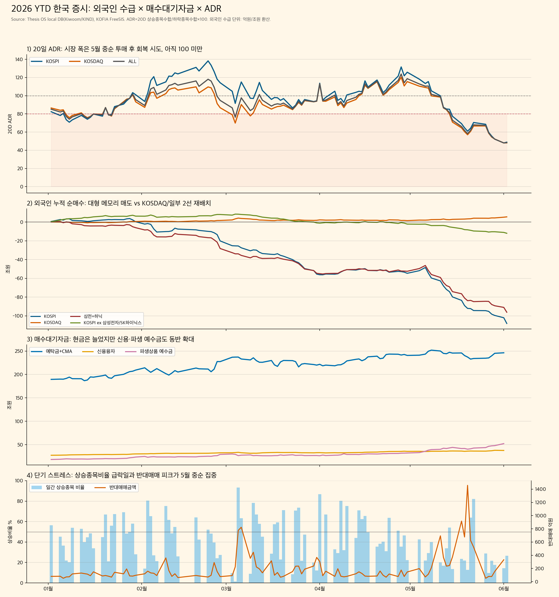
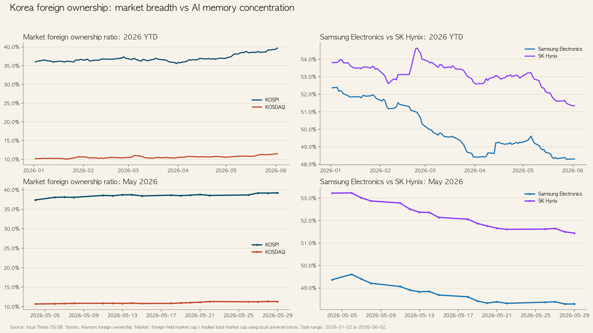
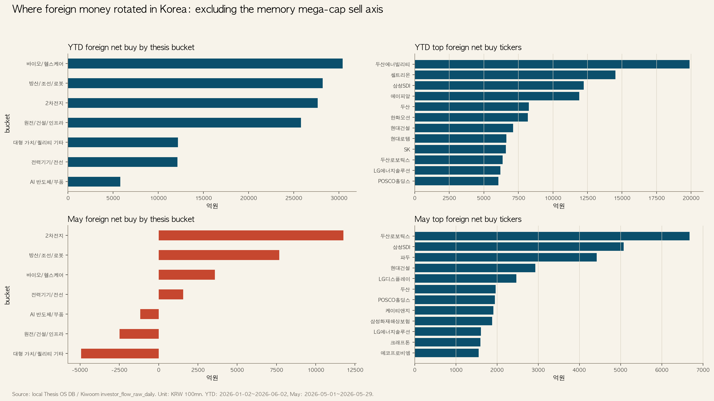

> Contexte: suite aux notes sur le marché coréen après GTC Taipei, le marché étroit autour de Jensen Huang et le playbook des investisseurs étrangers.

## TL;DR

La Corée ne manque pas de liquidité. L'argent proche du marché actions a fortement augmenté. Le problème est que cet argent ne se diffuse pas à l'ensemble du marché. Il se concentre sur quelques leaders.

Les étrangers ne quittent pas simplement la Corée. La lecture la plus juste est la suivante: ils réduisent les mégacaps mémoire, surtout Samsung Electronics et SK hynix, puis se redéploient sélectivement vers KOSDAQ, batteries, robotique, biotech et certaines infrastructures.

## Données clés

| Élément | Date | Valeur |
|---|---:|---:|
| KOSPI 20D ADR | 2026-06-02 | **48.9** |
| KOSDAQ 20D ADR | 2026-06-02 | **48.1** |
| ADR total 20D | 2026-06-02 | **48.4** |
| Valeurs en hausse / baisse | 2026-06-02 | **693 / 1,741** |
| Dépôts + CMA | 2026-01-02 → 2026-06-01 | **KRW 189.5T → 246.3T** |
| Achat net étranger KOSPI YTD | jusqu'au 2026-06-02 | **KRW -108.1T** |
| Achat net étranger KOSDAQ YTD | jusqu'au 2026-06-02 | **KRW +5.5T** |
| Samsung Electronics + SK hynix | jusqu'au 2026-06-02 | **KRW -96.1T** |

## Lecture

FreeSIS indique au 1er juin 2026 des dépôts investisseurs de **KRW 132.6T**, des soldes CMA de **KRW 113.7T** et du crédit actions de **KRW 37.7T**. Ce n'est donc pas un marché sans argent.

> Il y a de l'argent, mais il n'achète pas l'action moyenne.

La vente étrangère se concentre sur les deux grandes valeurs mémoire, tandis que l'achat se déplace vers des noms comme Doosan Enerbility, Celltrion, Samsung SDI, APR, Hanwha Ocean, Hyundai E&C, Doosan Robotics, FADU et Sanil Electric.

## Conclusion

Le régime actuel est **Selective Risk-On / Breadth Stress**. Il existe du pouvoir d'achat, mais la largeur de marché est faible. Avant un retour de l'ADR vers 60, puis 80 et 100, il faut éviter d'acheter le marché entier. La stratégie est d'acheter seulement les replis des leaders dont la force relative et les flux restent confirmés.

[Blocked] Les données intrajournalières et de clôture du 3 juin 2026 ne sont pas incluses.

