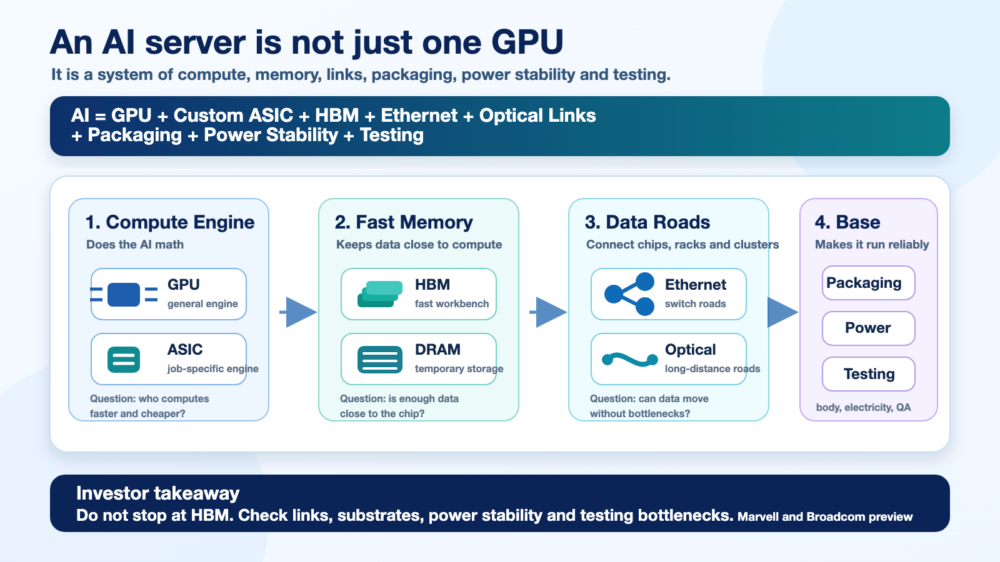

> Related series:
> [ARM rally and Korea's next AI bottlenecks](/post/arm-ai-cpu-rally-korea-semiconductor-value-chain-2026-05-22/) / [NVIDIA Q1 FY27 and Korean AI infrastructure](/post/nvidia-q1-fy27-korea-ai-infra-supply-chain-2026-05-21/) / [Samsung Electro-Mechanics silicon capacitor contract](/post/samsung-electro-mechanics-silicon-capacitor-1p5tn-2026-05-21/) / [Samsung Electronics re-rating thesis](/post/samsung-electronics-tsmc-rerating-thesis-2026-05-16/)

*Marvell and Broadcom's next earnings calls are not just U.S. semiconductor events. They are a check on whether the AI infrastructure bottleneck is moving from GPU-only demand into custom ASICs, Ethernet networking, optical links, package substrates, silicon capacitors, high-speed PCBs and test sockets. If the numbers are strong, Korea's read-through expands from SK hynix and Samsung Electronics HBM into Samsung Electro-Mechanics, FC-BGA, power-integrity components and selected back-end names.*

## Summary

Broadcom is the larger macro signal. In Q1 FY2026, Broadcom reported revenue of **$19.311B**, AI revenue of **$8.4B**, Q2 revenue guidance of **$22.0B**, and Q2 AI semiconductor revenue guidance of **$10.7B**. On that guidance, AI semiconductor revenue alone would be **48.6%** of total Q2 revenue. Broadcom is no longer just "semis plus VMware." It is increasingly an **AI custom-chip and AI networking company with a VMware cash-flow engine attached**. ([Broadcom][1])

Marvell is smaller, but the signal is cleaner. Q4 FY2026 revenue was **$2.219B**, Q1 FY2027 guidance is **$2.4B ±5%**, and Q4 data-center revenue was **$1.651B**, or **74%** of revenue. Marvell's call will test whether custom silicon, electro-optics and CXL/PCIe switching are moving from narrative into revenue acceleration. ([Marvell][2])

For Korean investors, the question is not "Are Marvell and Broadcom AI winners?" The question is whether their comments confirm a broader physical bottleneck: **XPU + HBM + Ethernet fabric + optical links + advanced packaging + power integrity**.

If that signal is strong, the Korean priority stack becomes:

1. **SK hynix / Samsung Electronics** — HBM, server DRAM, LPDDR/SOCAMM.
2. **Samsung Electro-Mechanics** — silicon capacitor, FC-BGA, MLCC and package-level power integrity.
3. **High-speed PCB and test sockets** — Isu Petasys, Daeduck, Simmtech, TLB, Korea Circuit, ISC, LEENO, TSE, with direct revenue proof required.

The conclusion is simple: **Marvell and Broadcom earnings are a test of whether Korea's AI semiconductor thesis should broaden beyond HBM into ASIC networking, packaging and power-delivery bottlenecks.**

---

## 1. Dates and Baselines

| Item | Marvell | Broadcom |
|---|---:|---:|
| Next earnings | Q1 FY2027, May 27, 2026 at 1:45 p.m. PDT | Q2 FY2026, June 3, 2026 at 5:00 p.m. EDT |
| Korea time | **May 28, 2026 05:45 KST** | **June 4, 2026 06:00 KST** |
| Latest reported revenue | Q4 FY26 **$2.219B** | Q1 FY26 **$19.311B** |
| Next guidance | Q1 FY27 **$2.4B ±5%** | Q2 FY26 **$22.0B** |
| AI / data-center benchmark | Q4 data-center **$1.651B**, **74%** mix | Q1 AI revenue **$8.4B**, Q2 AI semiconductor **$10.7B** guide |

Marvell's Q1 guide implies roughly **+8.2% QoQ** growth at the midpoint. Broadcom's Q2 AI semiconductor guide implies **+27.4% QoQ** from Q1 AI revenue. These are the two numbers to watch first.

---

## 2. Broadcom — The Bigger Macro Signal

The key Broadcom question is not only whether AI semiconductor revenue beats **$10.7B**. The more important question is whether AI networking is rising inside the AI revenue mix.

Broadcom's AI infrastructure exposure includes custom XPUs, Ethernet switches, NICs, SerDes, DSPs, retimers and optical connectivity. As clusters expand, the bottleneck shifts from individual accelerators to the fabric connecting chips, racks and data centers.

| Broadcom checkpoint | Why it matters | Korea read-through |
|---|---|---|
| Q2 AI semiconductor revenue above $10.7B | Confirms custom-chip demand strength | HBM, FC-BGA, test, package components |
| Rising AI networking share | Confirms Ethernet and optical bottlenecks | High-layer PCB, low-loss materials, sockets |
| Google TPU and long-duration customer visibility | Extends the custom-ASIC cycle | HBM customer diversification, packaging duration |
| Margin defense | Revenue growth must convert into profit | Supplier pricing power check |
| Packaging and supply-chain comments | Shows where the physical constraint sits | Samsung Electro-Mechanics, memory, substrates, test |

Broadcom's OpenAI collaboration is also important. The companies announced a **10GW** custom AI accelerator collaboration, with deployment expected to begin in the second half of 2026 and run through the end of 2029. The system includes accelerators as well as Ethernet, PCIe and optical connectivity. ([Broadcom OpenAI][3])

---

## 3. Marvell — The Cleaner Connectivity Signal

Marvell's market cap and revenue base are smaller than Broadcom's, but it is a cleaner signal for the "connectivity bottleneck" thesis.

The call should answer four questions:

| Marvell checkpoint | Why it matters | Korea read-through |
|---|---|---|
| Q1 FY27 revenue vs $2.4B guide and Q2 guide | Confirms FY27 acceleration | AI ASIC and interconnect demand durability |
| Custom-silicon design wins | Shows hyperscaler ASIC diversification | HBM, packaging and test demand broadening |
| Electro-optics / DSP / 1.6T-3.2T roadmap | Confirms data-movement bottleneck | Limited direct Korea exposure; long-term option |
| XConn / CXL / PCIe | Connects to memory pooling | CXL memory, SOCAMM, server DRAM |
| NVLink Fusion collaboration | Shows custom ASIC and NVIDIA ecosystems can coexist | HBM diversification, test and package complexity |

In April 2026, Marvell announced the Polariton acquisition to strengthen its optical roadmap toward 3.2T and beyond. As AI workloads expand, data-center bandwidth demand rises and optical links become a power-efficiency problem, not only a speed problem. ([Marvell Polariton][4])

Marvell's XConn acquisition points to PCIe/CXL switching and scale-up fabric. That matters for Korean memory because CXL and memory pooling broaden the hierarchy from "HBM next to GPU" into rack-level memory architecture. ([Marvell XConn][5])

---

## 4. Korea Translation — What Comes After HBM?

The first-order Korea frame has been:

> AI = NVIDIA GPU = HBM = SK hynix.

That remains true, but it is no longer enough. If Broadcom and Marvell print strong numbers, the frame broadens:

> AI = GPU + custom ASIC + HBM + Ethernet + optics + packaging + power integrity + test.

### Memory Still Comes First

Custom ASICs may compete with NVIDIA GPUs for some workloads, but they do not remove the memory bottleneck. Google TPUs, Broadcom XPUs, OpenAI accelerators and Marvell custom silicon all need high-bandwidth memory. SK hynix remains the cleaner exposure. Samsung Electronics has a larger option set, but needs HBM4, HBM4E and customer qualification proof.

### Samsung Electro-Mechanics Is the Cleanest Non-Memory Bottleneck

Samsung Electro-Mechanics has three relevant exposures: FC-BGA, MLCC and silicon capacitors. The company announced an approximately **KRW 1.5T** silicon capacitor supply contract for 2027-2028 and described the product as a component used inside high-performance packages such as AI server GPUs and HBM to stabilize power supply. ([Samsung Electro-Mechanics][6])

This is the cleanest Korean non-memory read-through from AI ASIC and AI networking. As chips get larger and more power-dense, power integrity becomes a package-level constraint.

### PCB and Test Need Proof

Isu Petasys, Daeduck, Simmtech, TLB and Korea Circuit are plausible high-speed board and module substrate candidates. ISC, LEENO and TSE are plausible test-socket candidates. But this group needs proof: customer qualification, AI-related revenue, ASP uplift and margin preservation.

---

## 5. Practical Watchlist

| Priority | Layer | Korean names | View |
|---:|---|---|---|
| 1 | HBM / server DRAM / SOCAMM | SK hynix, Samsung Electronics | Core layer. Custom ASICs expand the customer base |
| 2 | Silicon capacitor / FC-BGA | Samsung Electro-Mechanics | Clearest non-memory bottleneck with an official large contract |
| 3 | High-speed PCB / low-loss materials | Isu Petasys, Daeduck, Simmtech, TLB, Korea Circuit, Doosan Electronics BG | Positive if AI networking grows; direct proof required |
| 4 | Test sockets / inspection | ISC, LEENO, TSE, Intekplus | Benefits from ASIC SKU growth and I/O complexity |
| 5 | Optical interconnect | Korean optical modules and materials candidates | Directionally right, but direct Korea exposure is less clear |

---

## 6. What To Listen For

For Broadcom, bullish lines would be:

- AI semiconductor revenue tracking above **$10.7B**.
- AI networking share rising.
- Better visibility into 2027.
- Supply chain and packaging constraints under control.

For Marvell, bullish lines would be:

- Q1 FY27 above the **$2.4B** midpoint and Q2 guidance showing acceleration.
- Record custom-silicon bookings or design wins.
- Electro-optics, optical DSP and CXL/PCIe switching turning into FY27/FY28 revenue.
- Data-center growth and gross margin holding together.

---

## Final Read

Marvell and Broadcom earnings are not a blanket buy signal for Korean semiconductors. They are a bottleneck map.

If Broadcom beats the AI semiconductor guide and talks up AI networking, Korea's read-through expands beyond HBM into FC-BGA, high-speed PCBs, test sockets and silicon capacitors. If Marvell confirms custom silicon and optical interconnect acceleration, AI servers should be viewed less as GPU boxes and more as **memory, connectivity, package and power-delivery systems**.

The safest conclusion is still disciplined: SK hynix and Samsung Electronics remain the memory core; Samsung Electro-Mechanics is the clearest non-memory bottleneck; PCB and test-socket names need revenue and margin proof before they deserve full re-rating.

---

## Fact / Inference / Blocked

### [Fact]

- Marvell's Q1 FY2027 call is scheduled for May 27, 2026 at 1:45 p.m. PDT. ([Marvell][7])
- Marvell's Q4 FY2026 revenue was $2.219B and Q1 FY2027 guidance is $2.4B ±5%. ([Marvell][2])
- Marvell's Q4 FY2026 data-center revenue was $1.651B, or 74% of revenue. ([Marvell][2])
- Broadcom's Q2 FY2026 earnings call is scheduled for June 3, 2026 at 5:00 p.m. EDT. ([Broadcom Events][8])
- Broadcom's Q1 FY2026 AI revenue was $8.4B and Q2 AI semiconductor guidance is $10.7B. ([Broadcom][1])
- Samsung Electro-Mechanics announced an approximately KRW 1.5T silicon capacitor supply contract. ([Samsung Electro-Mechanics][6])

### [Inference]

- Custom ASIC growth is more likely to broaden HBM demand than reduce it.
- For Korea, the more actionable read-through is memory, package substrates, silicon capacitors and test sockets rather than generic optical themes.
- Samsung Electro-Mechanics' silicon capacitor contract is evidence that package-level power integrity is moving into commercial supply.

### [Blocked]

- Customer-level proof that specific Korean suppliers ship directly into Broadcom or Marvell ASIC programs.
- The exact customer, margin and package placement for Samsung Electro-Mechanics' silicon capacitor contract.
- AI customer revenue split for Korean PCB and test-socket suppliers.

---

*This article is for research and commentary only, not investment advice. Earnings dates and guidance are based on company IR materials as of May 23, 2026 KST. Korean supply-chain exposure includes inference because customer-level disclosures are limited.*

[1]: https://investors.broadcom.com/news-releases/news-release-details/broadcom-inc-announces-first-quarter-fiscal-year-2026-financial "Broadcom Inc. Announces First Quarter Fiscal Year 2026 Financial Results and Quarterly Dividend"
[2]: https://investor.marvell.com/news-events/press-releases/detail/1011/marvell-technology-inc-reports-fourth-quarter-and-fiscal-year-2026-financial-results "Marvell Technology, Inc. Reports Fourth Quarter and Fiscal Year 2026 Financial Results"
[3]: https://investors.broadcom.com/news-releases/news-release-details/openai-and-broadcom-announce-strategic-collaboration-deploy-10 "OpenAI and Broadcom announce strategic collaboration to deploy 10 gigawatts of OpenAI-designed AI accelerators"
[4]: https://investor.marvell.com/news-events/press-releases/detail/1020/marvell-announces-acquisition-of-polariton-technologies-advancing-optical-performance-scaling-to-3-2t-and-beyond "Marvell Announces Acquisition of Polariton Technologies"
[5]: https://investor.marvell.com/news-events/press-releases/detail/1004/marvell-to-acquire-xconn-technologies-expanding-leadership-in-ai-data-center-connectivity "Marvell to Acquire XConn Technologies"
[6]: https://samsungsem.com/global/newsroom/news/view.do?id=10310 "Samsung Electro-Mechanics Signs 1.5 Trillion KRW Silicon Capacitor Supply Contract"
[7]: https://investor.marvell.com/news-events/press-releases/detail/1021/marvell-technology-inc-announces-conference-call-to-review-first-quarter-of-fiscal-year-2027-financial-results "Marvell Technology, Inc. Announces Conference Call to Review Q1 FY2027 Results"
[8]: https://investors.broadcom.com/company-information/events-presentations "Broadcom Events & Presentations"
