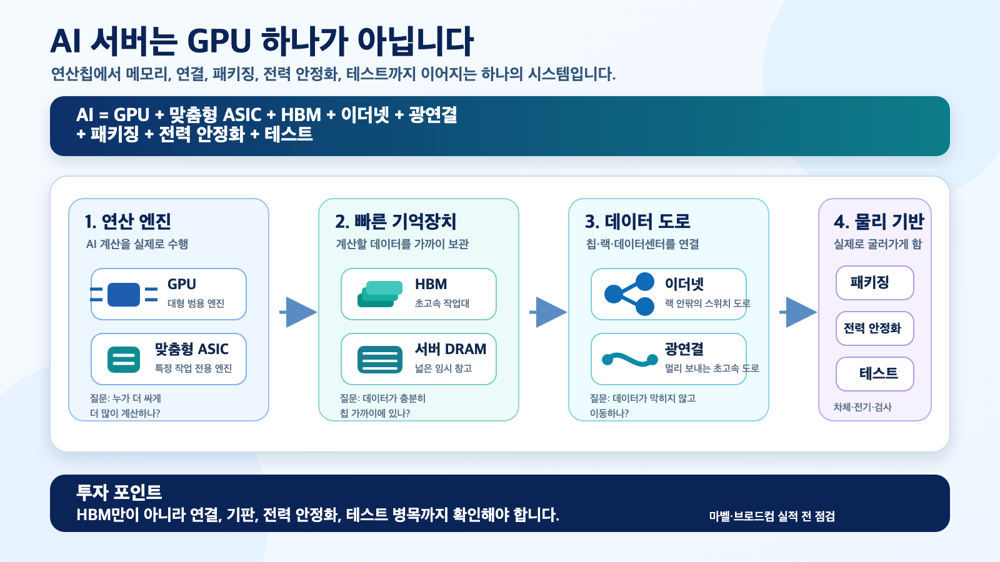

> 📚 관련 시리즈
> [ARM 급등과 한국 반도체 병목 이동](/ko/post/arm-ai-cpu-rally-korea-semiconductor-value-chain-2026-05-22/) / [엔비디아 Q1 FY27 이후 한국 AI 인프라](/ko/post/nvidia-q1-fy27-korea-ai-infra-supply-chain-2026-05-21/) / [삼성전기 실리콘 커패시터 1.5조원](/ko/post/samsung-electro-mechanics-silicon-capacitor-1p5tn-2026-05-21/) / [삼성전자 TSMC식 리레이팅](/ko/post/samsung-electronics-tsmc-rerating-thesis-2026-05-16/) / [엔비디아 VR200 부품 원가표 검산](/ko/post/vera-rubin-vr200-bom-memory-pcb-mlcc-korea-alpha-2026-05-21/)
>
> 🔁 실적 발표 후속편: [마벨 Q1 FY2027 실적과 한국 반도체 — HBM보다 연결·기판·전력 병목](/ko/post/marvell-q1-fy2027-korea-semiconductor-readthrough-2026-05-28/)
>
> 🔁 브로드컴 Q2 후속편: [브로드컴이 2027년 AI 반도체 1,000억 달러를 다시 확인했다](/ko/post/broadcom-ai-semiconductor-100b-2027-korea-value-chain-2026-06-05/)

*마벨과 브로드컴의 다음 실적발표는 한국 반도체 투자에서 “HBM만 보면 되는가”라는 질문을 다시 여는 이벤트다. 브로드컴은 AI 맞춤형 칩과 AI 이더넷 네트워크가 Q2 AI 반도체 107억 달러 가이던스를 얼마나 넘는지, 마벨은 맞춤형 AI 칩·전기광학·CXL/PCIe 연결이 실제 매출 가속으로 이어지는지가 핵심이다. 숫자가 강하면 한국 수혜는 SK하이닉스·삼성전자 HBM에서 삼성전기 실리콘 커패시터, FC-BGA, 고속 PCB, 테스트소켓으로 확산된다.*



## 핵심 요약

이번 이벤트의 본질은 <strong>AI 맞춤형 칩 자체가 아니라 AI 시스템의 물리 병목</strong>이다. AI 데이터센터가 커질수록 병목은 GPU 하나에서 HBM, 맞춤형 ASIC, 이더넷 스위치, 광연결, 고성능 패키지, 전력 안정화 부품, 고속기판, 테스트소켓으로 넓어진다.

브로드컴은 이 흐름의 가장 큰 숫자다. Q1 FY2026 매출은 <strong>193.11억 달러</strong>, AI 매출은 <strong>84억 달러</strong>, Q2 전체 매출 가이던스는 <strong>220억 달러</strong>, Q2 AI 반도체 매출 가이던스는 <strong>107억 달러</strong>다. 산식상 Q2 AI 반도체 매출은 전체 매출 가이던스의 <strong>48.6%</strong>다. 브로드컴은 더 이상 “반도체 + VMware”가 아니라 <strong>AI 맞춤형 칩과 AI 네트워크에 VMware 현금흐름이 붙은 회사</strong>로 봐야 한다. ([Broadcom][1])

마벨은 숫자는 작지만 신호는 더 날카롭다. Q4 FY2026 매출은 <strong>22.19억 달러</strong>, Q1 FY2027 가이던스는 <strong>24.0억 달러 ±5%</strong>다. Q4 데이터센터 매출은 <strong>16.51억 달러</strong>, 매출 비중 <strong>74%</strong>다. 마벨이 Q2 가이던스와 데이터센터 매출에서 재가속을 보여주면, 시장은 “AI 병목이 연산칩에서 연결·광·메모리 이동으로 내려오고 있다”는 쪽으로 다시 가격을 매길 수 있다. ([Marvell][2])

한국 투자자의 결론은 분명하다. 이 실적발표는 미국 반도체 두 종목만 보는 이벤트가 아니다. 한국 쪽에서는 <strong>SK하이닉스·삼성전자 메모리</strong>, <strong>삼성전기 실리콘 커패시터/FC-BGA</strong>, <strong>고속 PCB와 테스트소켓</strong>을 다시 점검하는 이벤트다.

다만 모든 한국 반도체가 같이 수혜를 받는 것은 아니다. 실제 고객 인증, 수주, 판가 상승, 수율, 마진이 확인된 병목만 살아남는다. “AI 수혜”라는 이름만 붙은 범용 PCB·광통신·소재주는 조심해야 한다.

한 줄 결론은 이렇다. <strong>마벨·브로드컴 실적은 한국 반도체 투자에서 HBM 단일 베팅을 AI ASIC·네트워크·패키징·전력 안정화 병목으로 넓힐지 확인하는 시험대다.</strong>

---

## 1. 일정과 기준선

| 구분 | 마벨 | 브로드컴 |
|---|---:|---:|
| 다음 실적발표 | Q1 FY2027, 2026년 5월 27일 13:45 PDT | Q2 FY2026, 2026년 6월 3일 17:00 EDT |
| 한국 시간 | <strong>2026년 5월 28일 05:45 KST</strong> | <strong>2026년 6월 4일 06:00 KST</strong> |
| 최근 기준 매출 | Q4 FY26 <strong>22.19억 달러</strong> | Q1 FY26 <strong>193.11억 달러</strong> |
| 다음 분기 가이던스 | Q1 FY27 <strong>24.0억 달러 ±5%</strong> | Q2 FY26 <strong>220억 달러</strong> |
| AI 핵심 숫자 | Q4 데이터센터 <strong>16.51억 달러</strong>, 비중 <strong>74%</strong> | Q1 AI 매출 <strong>84억 달러</strong>, Q2 AI 반도체 <strong>107억 달러</strong> 가이던스 |
| 핵심 질문 | 맞춤형 칩·광연결·CXL이 매출 가속으로 이어지는가 | AI ASIC과 AI 이더넷 네트워크가 107억 달러 기준선을 넘는가 |

계산은 단순하다. 마벨의 Q1 FY2027 가이던스 중간값은 직전 분기 대비 <strong>+8.2%</strong>다. 산식은 `24.0 / 22.187 - 1`이다. 브로드컴 Q2 AI 반도체 가이던스의 Q1 대비 증가율은 <strong>+27.4%</strong>다. 산식은 `10.7 / 8.4 - 1`이다. Q2 전체 매출 가이던스에서 AI 반도체가 차지하는 비중은 <strong>48.6%</strong>다. 산식은 `10.7 / 22.0`이다.

이 숫자들이 중요한 이유는 하나다. AI 수요가 여전히 GPU 하나에만 머무르는지, 아니면 맞춤형 칩과 네트워크, 광연결, 메모리 계층, 전력 안정화 부품으로 번지고 있는지 보여주기 때문이다.

---

## 2. 브로드컴 — 더 큰 매크로 신호

브로드컴은 이번 이벤트의 더 큰 신호다. 시장이 보고 싶은 것은 Q2 AI 반도체 매출 <strong>107억 달러</strong>를 넘는지뿐만이 아니다. 더 중요한 것은 <strong>AI 네트워크 비중이 커지는지</strong>다.

브로드컴의 AI 매출은 맞춤형 XPU만으로 구성되지 않는다. 이더넷 스위치, NIC, SerDes, DSP, retimer, 광연결까지 묶인다. AI 클러스터가 커질수록 칩 하나보다 칩과 칩, 랙과 랙을 연결하는 네트워크가 더 중요해진다. 브로드컴이 실적콜에서 “AI networking”을 얼마나 강하게 말하는지가 한국 고속 PCB·기판·테스트소켓의 read-through를 결정한다.

| 브로드컴 체크포인트 | 왜 중요한가 | 한국 read-through |
|---|---|---|
| Q2 AI 반도체 107억 달러 초과 여부 | AI 맞춤형 칩 수요의 강도 확인 | HBM, FC-BGA, 테스트, 패키지 부품 |
| AI 네트워크 비중 확대 | XPU 단품보다 이더넷·광·스위치 병목이 커지는지 확인 | 고다층 PCB, 저손실 소재, 테스트소켓 |
| Google TPU 장기 계약 지속성 | 맞춤형 AI 칩 사이클이 1~2분기 이벤트가 아니라 장기 사이클인지 확인 | HBM 고객 다변화, 패키징 수요 지속 |
| 마진 방어 | AI 매출이 커져도 이익률이 유지되는지 확인 | 부품업체 판가 전가력 점검 |
| 공급망·패키징 병목 언급 | HBM, 기판, 전력 안정화, 열 관리 중 어디가 병목인지 확인 | 삼성전기·메모리·기판·테스트 우선순위 |

브로드컴과 OpenAI의 10GW 맞춤형 AI 가속기 협력도 중요하다. 회사 발표 기준 배포는 2026년 하반기부터 시작해 2029년 말까지 이어지는 구조다. 여기에는 가속기뿐 아니라 이더넷, PCIe, 광연결이 포함된다. ([Broadcom OpenAI][3])

이건 한국에 두 가지 의미를 준다. 첫째, 맞춤형 ASIC은 NVIDIA GPU의 경쟁자이지만 HBM과 패키징에는 증분 수요가 될 수 있다. 둘째, 고객별 칩 종류가 늘수록 테스트소켓과 고속기판의 복잡도가 올라간다.

<strong>브로드컴 콜에서 가장 강한 문장</strong>은 이런 형태일 것이다.

```text
AI semiconductor revenue is tracking above $10.7B.
AI networking share continues to rise.
Visibility into 2027 has improved.
Supply chain is secured.
```

반대로 조심해야 할 문장은 “customer deployment timing shifted”, “margin pressure from AI mix”, “supply constraints”다. AI 수요가 좋아도 출하 시점과 마진이 흔들리면 한국 2차군은 먼저 조정받을 수 있다.

---

## 3. 마벨 — 연결 병목의 순도 높은 신호

마벨은 브로드컴보다 작다. 그러나 AI 인프라 병목이 “연산칩 → 연결·광·메모리 이동”으로 이동하는지를 확인하기에는 더 순수한 신호다.

마벨의 Q4 데이터센터 매출은 <strong>16.51억 달러</strong>, 전체의 <strong>74%</strong>다. 이제 마벨은 더 이상 범용 반도체 사이클주가 아니다. 데이터센터 AI 인프라 반도체 회사로 재분류된 상태다. ([Marvell][2])

마벨에서 봐야 할 것은 네 가지다.

| 마벨 체크포인트 | 왜 중요한가 | 한국 read-through |
|---|---|---|
| Q1 FY27 매출 24억 달러 달성 및 Q2 가이던스 | FY2027 성장 가속이 실제 숫자로 확인되는지 | AI ASIC·광연결 수요 지속성 |
| 맞춤형 칩 수주와 설계 채택 | 대형 클라우드 고객의 ASIC 다변화 확인 | HBM·패키지·테스트 수요 확장 |
| 전기광학·광 DSP·1.6T/3.2T 로드맵 | 데이터 이동 병목이 커지는지 확인 | 한국 직접 수혜는 제한적, 장기 옵션 |
| XConn·CXL/PCIe | 메모리 풀링과 랙 단위 확장 확인 | CXL 메모리, SOCAMM, 서버 DRAM |
| NVIDIA NVLink Fusion 협업 | NVIDIA 생태계와 맞춤형 ASIC 생태계가 공존하는지 확인 | HBM 수요 다변화, 테스트·패키지 복잡도 증가 |

마벨은 2026년 4월 Polariton 인수를 발표하며 1.6T에서 3.2T 이상으로 가는 광연결 로드맵을 강화한다고 밝혔다. AI 작업량이 늘수록 데이터센터 안에서 필요한 대역폭이 폭발하고, 랙 간 연결도 더 빠르고 낮은 전력이 필요해진다. ([Marvell Polariton][4])

또 XConn 인수는 PCIe/CXL 스위칭과 UALink 방향성에 붙어 있다. CXL과 메모리 풀링은 “GPU 옆 HBM”만의 문제가 아니라 랙 전체 메모리 구조의 문제다. 이 지점은 삼성전자·SK하이닉스의 HBM뿐 아니라 DDR5, LPDDR, SOCAMM, CXL 메모리까지 연결된다. ([Marvell XConn][5])

다만 한국 투자자가 조심해야 할 점도 있다. 광 DSP와 실리콘 포토닉스의 초과 이익은 상당 부분 마벨·브로드컴 같은 미국 설계사와 대만·일본 패키징/소재 생태계에 귀속될 가능성이 크다. 한국에서 더 현실적인 연결은 <strong>메모리, 패키지 기판, 전력 안정화 부품, 테스트소켓</strong>이다.

---

## 4. 한국 반도체 번역 — HBM 다음은 무엇인가

한국 시장의 1차 결론은 쉬웠다.

> AI = NVIDIA GPU = HBM = SK하이닉스

이 프레임은 여전히 맞다. 하지만 충분하지 않다. 브로드컴과 마벨이 강한 숫자를 보여주면 프레임은 이렇게 바뀐다.

> AI = GPU + 맞춤형 ASIC + HBM + 이더넷 + 광연결 + 패키징 + 전력 안정화 + 테스트

이 변화에서 한국 수혜는 세 층으로 나뉜다.

### 4.1 메모리 — 여전히 본류

맞춤형 ASIC이 커지면 NVIDIA GPU 비중이 일부 낮아질 수 있다. 그러나 HBM 수요가 줄어든다는 뜻은 아니다. Google TPU, Broadcom XPU, OpenAI 맞춤형 칩, Marvell custom silicon 모두 고대역폭 메모리를 필요로 한다.

한국에서는 SK하이닉스가 가장 직접적이고, 삼성전자는 HBM4·HBM4E·맞춤형 HBM·파운드리 옵션까지 붙는다. 다만 삼성전자는 “옵션”이 아니라 실제 고객 인증과 물량이 확인되어야 리레이팅이 지속된다.

### 4.2 삼성전기 — 가장 선명한 비메모리 병목

삼성전기는 이번 read-through에서 가장 깔끔하다. 이유는 세 가지다.

첫째, FC-BGA는 AI ASIC·스위치 ASIC·네트워크 칩 패키징 수요와 직접 연결된다. 둘째, MLCC와 실리콘 커패시터는 AI 패키지의 전력 안정화와 연결된다. 셋째, 삼성전기는 이미 <strong>약 1.5조원 규모 실리콘 커패시터 공급계약</strong>을 공식 발표했다. 공급 기간은 2027년 1월 1일부터 2028년 12월 31일까지다. ([Samsung Electro-Mechanics][6])

이 계약의 의미는 “커패시터 하나 더 판다”가 아니다. AI GPU와 HBM 패키지 내부의 순간 전력 흔들림을 잡는 부품으로 삼성전기가 들어간다는 의미다. 브로드컴·마벨 실적에서 패키징, 전력, 신호 안정성 병목이 강하게 언급될수록 삼성전기의 논리는 더 강해진다.

### 4.3 고속 PCB·테스트소켓 — 증거가 필요하다

이수페타시스, 대덕전자, 코리아써키트, 심텍, 티엘비는 AI 네트워크와 메모리 모듈 확산의 후보군이다. ISC, 리노공업, 티에스이는 고속 칩 테스트와 소켓의 후보군이다.

문제는 확신도다. 이 그룹은 “AI 수혜”라는 말만으로는 부족하다. 실제 AI향 매출, 고객 인증, 수주, 판가 상승, 영업이익률 유지가 필요하다.

브로드컴이 AI 네트워크 매출을 강조하고, 마벨이 custom silicon과 optical interconnect 수주를 강조한다면 이 그룹에는 우호적이다. 그러나 고객·제품·마진이 분기 실적으로 확인되지 않으면 테마성 반등으로 끝날 수 있다.

---

## 5. 레이어별 우선순위

| 우선순위 | 레이어 | 한국 관련주/관찰 대상 | 판단 |
|---:|---|---|---|
| 1 | HBM / 서버 DRAM / SOCAMM | SK하이닉스, 삼성전자 | 본류. 맞춤형 ASIC 확산은 HBM 고객 기반을 넓히는 변수 |
| 2 | 실리콘 커패시터 / FC-BGA | 삼성전기 | 가장 선명한 비메모리 병목. 공식 대형 계약 존재 |
| 3 | 고속 PCB / 저손실 소재 | 이수페타시스, 대덕전자, 심텍, 티엘비, 코리아써키트, 두산전자BG | AI 네트워크 강세 시 수혜. 직접 납품·마진 확인 필요 |
| 4 | 테스트소켓 / 검사 | ISC, 리노공업, 티에스이, 인텍플러스 | 칩 종류와 I/O 증가의 2차 수혜. 분기 실적 확인 필요 |
| 5 | 광연결 / 실리콘 포토닉스 | 국내 광모듈·소재 후보군 | 장기 방향은 맞지만 한국 직접 수혜 확신도 낮음 |

---

## 6. 실적콜에서 바로 들어야 할 문장

### 브로드컴

강한 신호:

- AI 반도체 매출이 <strong>107억 달러</strong> 기준선을 웃돈다.
- AI networking 비중이 계속 올라간다.
- 2027년 가시성이 개선됐다.
- 공급망과 패키징 병목이 통제되고 있다.

약한 신호:

- 고객 배포 시점이 밀렸다.
- AI 제품 믹스 때문에 마진 압박이 있다.
- 비AI 반도체 회복이 약하다.
- 공급망·패키징·전력 병목이 출하를 제한한다.

### 마벨

강한 신호:

- Q1 FY27 매출이 가이던스 중간값 <strong>24억 달러</strong>를 넘고, Q2 가이던스가 재가속을 보여준다.
- custom silicon 수주와 설계 채택이 사상 최고 수준을 유지한다.
- 전기광학, 광 DSP, CXL/PCIe 스위칭이 FY27/FY28 매출로 가시화된다.
- 데이터센터 매출 비중과 마진이 동시에 유지된다.

약한 신호:

- 대형 고객 한 곳의 일정이 밀린다.
- custom ASIC이 매출은 키우지만 마진을 희석한다.
- 광연결과 CXL 매출 기여가 뒤로 밀린다.

---

## 7. 투자 판단

| 종목/군 | 판단 | 이유 |
|---|---|---|
| SK하이닉스 | 보유 유지 / 조정 매수 후보 | HBM 본류. 다만 이미 기대치가 높아 신규 추격보다 확인 후 진입 |
| 삼성전자 | Watchlist | HBM4와 맞춤형 HBM 옵션. 단 실행 증거가 필요 |
| 삼성전기 | Watchlist → 조정 시 Buy 후보 | 실리콘 커패시터/FC-BGA로 AI 패키지 전력·기판 병목에 직접 연결 |
| 이수페타시스·대덕전자·심텍·티엘비·코리아써키트 | Watchlist | AI 네트워크·SOCAMM·고속기판 수혜 가능. 직접 매출 확인 필요 |
| ISC·리노공업·티에스이 | Watchlist | ASIC SKU 증가와 테스트 복잡도 수혜. 고객·제품 확인 필요 |
| 국내 광통신 테마 | 선별 전까지 보류 | 방향은 맞지만 핵심 이익은 마벨·브로드컴 내부로 갈 가능성 |

---

## 8. 폐기 조건

이 thesis가 약해지는 조건은 명확하다.

1. 브로드컴 Q2 AI 반도체 매출이 107억 달러를 밑돌거나 Q3 가이던스가 약하다.
2. 마벨 Q2 FY27 가이던스가 재가속을 보여주지 못한다.
3. 양사가 AI 네트워크·광연결보다 고객 일정 지연과 마진 압박을 더 강조한다.
4. HBM 리드타임이 짧아지고 가격 상승세가 꺾인다.
5. 한국 2차군에서 AI향 매출은 늘지 않고 주가만 테마로 오른다.
6. 삼성전기 실리콘 커패시터가 후속 고객·마진·증설 가시성을 보여주지 못한다.

---

## 9. 최종 해석

마벨과 브로드컴 실적발표는 한국 반도체에 단순한 미국 주식 이벤트가 아니다. 이것은 AI 인프라의 병목이 어디로 이동하는지 확인하는 체크포인트다.

브로드컴이 AI 반도체 107억 달러 기준선을 넘고 AI 네트워크 가시성을 높이면, 한국에서는 HBM뿐 아니라 FC-BGA, 고속 PCB, 테스트소켓, 실리콘 커패시터까지 다시 봐야 한다. 마벨이 custom silicon과 광연결에서 재가속을 보여주면, AI 서버는 GPU 박스가 아니라 <strong>메모리·연결·패키징·전력 안정화 시스템</strong>이라는 해석이 더 강해진다.

하지만 결론은 무차별 매수가 아니다. 가장 강한 본류는 여전히 SK하이닉스·삼성전자 메모리이고, 가장 선명한 비메모리 병목은 삼성전기다. 고속 PCB와 테스트소켓은 다음 단계 후보지만, 수주와 마진 확인 전에는 “검증 대기”가 맞다.

한 줄로 정리하면, <strong>마벨·브로드컴 실적은 HBM 단일 베팅을 끝내는 이벤트가 아니라, HBM 위에 붙는 AI 네트워크·패키징·전력 안정화 병목을 확인하는 이벤트다.</strong>

---

## Fact / Inference / Blocked

### [Fact]

- Marvell Q1 FY2027 실적콜은 2026년 5월 27일 13:45 PDT에 예정되어 있다. ([Marvell][7])
- Marvell Q4 FY2026 매출은 22.19억 달러, Q1 FY2027 매출 가이던스는 24.0억 달러 ±5%다. ([Marvell][2])
- Marvell Q4 FY2026 데이터센터 매출은 16.51억 달러, 매출 비중은 74%다. ([Marvell][2])
- Broadcom Q2 FY2026 실적콜은 2026년 6월 3일 17:00 EDT에 예정되어 있다. ([Broadcom Events][8])
- Broadcom Q1 FY2026 AI 매출은 84억 달러, Q2 AI 반도체 매출 가이던스는 107억 달러다. ([Broadcom][1])
- 삼성전기는 약 1.5조원 규모 실리콘 커패시터 공급계약을 체결했고, AI 서버 GPU·HBM 패키지 내부 전력 안정화 부품이라고 설명했다. ([Samsung Electro-Mechanics][6])

### [Inference]

- Broadcom·Marvell의 AI 맞춤형 칩 확산은 HBM 수요를 줄이기보다 고객 기반을 넓힐 가능성이 높다.
- 한국에서 더 직접적인 read-through는 광통신 테마보다 메모리, 패키지 기판, 실리콘 커패시터, 테스트소켓이다.
- 삼성전기 실리콘 커패시터 계약은 AI 패키지 내부 전력 안정화 병목이 상업 양산 매출로 연결되기 시작했다는 신호다.

### [Blocked]

- Broadcom·Marvell 맞춤형 칩 프로젝트에 한국 개별 기업이 직접 납품하는 고객명 단위 증거.
- 삼성전기 실리콘 커패시터 계약의 정확한 고객명, 제품별 마진, 패키지 내 적용 위치.
- 한국 PCB·테스트소켓 업체의 AI 고객별 매출 비중.

---

*이 글은 리서치와 논평으로만 활용해야 하며 투자 조언이 아닙니다. 실적 일정과 가이던스는 각사 공식 IR 자료 기준이며, 시점에 따라 업데이트될 수 있습니다. 한국 기업별 수혜 강도는 공개 고객 정보가 제한적이므로 밸류체인 기반 추론을 포함합니다. 분석이 틀릴 수도 있습니다. 데이터 기준일: 2026년 5월 23일 KST.*

[1]: https://investors.broadcom.com/news-releases/news-release-details/broadcom-inc-announces-first-quarter-fiscal-year-2026-financial "Broadcom Inc. Announces First Quarter Fiscal Year 2026 Financial Results and Quarterly Dividend"
[2]: https://investor.marvell.com/news-events/press-releases/detail/1011/marvell-technology-inc-reports-fourth-quarter-and-fiscal-year-2026-financial-results "Marvell Technology, Inc. Reports Fourth Quarter and Fiscal Year 2026 Financial Results"
[3]: https://investors.broadcom.com/news-releases/news-release-details/openai-and-broadcom-announce-strategic-collaboration-deploy-10 "OpenAI and Broadcom announce strategic collaboration to deploy 10 gigawatts of OpenAI-designed AI accelerators"
[4]: https://investor.marvell.com/news-events/press-releases/detail/1020/marvell-announces-acquisition-of-polariton-technologies-advancing-optical-performance-scaling-to-3-2t-and-beyond "Marvell Announces Acquisition of Polariton Technologies"
[5]: https://investor.marvell.com/news-events/press-releases/detail/1004/marvell-to-acquire-xconn-technologies-expanding-leadership-in-ai-data-center-connectivity "Marvell to Acquire XConn Technologies"
[6]: https://samsungsem.com/global/newsroom/news/view.do?id=10310 "Samsung Electro-Mechanics Signs 1.5 Trillion KRW Silicon Capacitor Supply Contract"
[7]: https://investor.marvell.com/news-events/press-releases/detail/1021/marvell-technology-inc-announces-conference-call-to-review-first-quarter-of-fiscal-year-2027-financial-results "Marvell Technology, Inc. Announces Conference Call to Review Q1 FY2027 Results"
[8]: https://investors.broadcom.com/company-information/events-presentations "Broadcom Events & Presentations"
