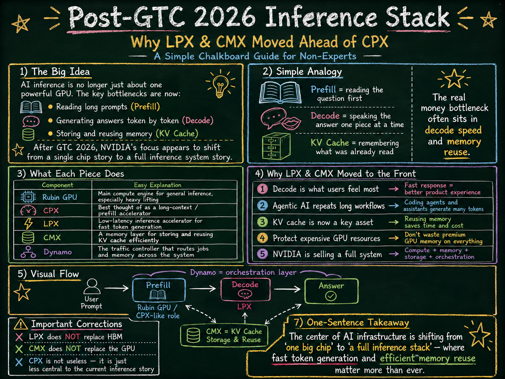

> 📚 NVIDIA·Vera Rubin follow-up series
> [NVIDIA Q1 FY27 and Korea AI Infrastructure](/post/nvidia-q1-fy27-korea-ai-infra-supply-chain-2026-05-21/) / [Vera Rubin VR200 BOM Cost Check](/post/vera-rubin-vr200-bom-memory-pcb-mlcc-korea-alpha-2026-05-21/) / [AI-RAN and the Korea Supply Chain](/post/ai-ran-nvidia-earnings-skt-vs-supply-chain-2026-05-17/) / [Marvell Q1 FY2027 and Korean Semiconductors](/post/marvell-q1-fy2027-korea-semiconductor-readthrough-2026-05-28/)

> 📚 Samsung Electronics · Korea semiconductor linked reads
> [Samsung Electronics PER 15x Re-rating Thesis](/post/samsung-electronics-tsmc-rerating-thesis-2026-05-16/) / [Samsung Foundry Customer List](/post/samsung-foundry-customer-list-tesla-tenstorrent-2026-05-03/) / [AI HBM Hub](/page/korea-semiconductor-hbm-kospi-hub/) / [Semiconductor Value Chain Hub](/page/korea-semiconductor-equipment-ip-hub/)

## Beginner TL;DR

CPX is the accelerator that <strong>reads a long prompt for the first time</strong>. LPX is the accelerator that <strong>rapidly pulls out one token at a time</strong>.

Post-GTC 2026, NVIDIA's message has shifted: the bigger bottleneck is not the one-time prefill read, but the continuously repeated decode and KV cache management. That is why the strategic focus moved from CPX as a standalone chip to an inference system built around <strong>Rubin GPU + LPX + CMX + Dynamo</strong>.

<strong>Conclusion:</strong> LPX and CMX moved to the front because the monetizable bottleneck in AI inference has shifted from "reading long context once" to <strong>"generating every token quickly and cheaply reusing that memory."</strong>

From a Korean semiconductor perspective, this should not be read as "weakening HBM demand." It should be interpreted as an inference infrastructure value chain that spans <strong>HBM + high-speed networking + storage tiers + substrate/packaging + power/cooling</strong>.

## 0. The Simplest Analogy: AI Inference Is "Read, Then Speak"

When you send a question to an AI, two stages happen internally.

| Stage | Plain-Language Explanation | Technical Term | Bottleneck |
|---|---|---|---|
| Stage 1 | The AI reads the question and supporting material first | Prefill / Context phase | Ability to read long documents quickly |
| Stage 2 | The AI speaks the answer one word at a time | Decode / Generation phase | Ability to generate one token at a time, quickly and stably |
| Memory | Notes taken while reading | KV cache | Where those notes are stored and how fast they can be retrieved |

CPX was primarily aimed at <strong>Stage 1: reading long context for the first time</strong>. The Rubin CPX NVIDIA unveiled in 2025 was a GPU targeting 1M+ token context workloads — very long context processing — with 30 PFLOPS NVFP4 compute, 128 GB GDDR7, and 3× attention acceleration. ([NVIDIA Developer][2])

LPX and CMX, by contrast, target <strong>Stage 2: answer generation</strong> and <strong>Memory: KV cache management</strong>, respectively. Per NVIDIA's LPX documentation, the Rubin GPU handles prefill and decode attention, while LPX accelerates latency-sensitive operations such as FFN/MoE inside the decode loop. ([NVIDIA Developer][3]) CMX creates a dedicated KV cache tier between GPU HBM and conventional storage. ([NVIDIA Developer][7])

## 0.1 Glossary

### GTC 2026

GTC is NVIDIA's most important developer and customer event for announcing its AI infrastructure strategy. The central message of GTC 2026 was an expansion from "a GPU company for AI training" to <strong>"a company selling the full AI factory operating system and hardware stack."</strong>

At GTC 2026, NVIDIA unveiled Dynamo 1.0 and described it as the distributed operating system for the AI factory — software that orchestrates GPUs, memory, and storage at the cluster level. ([NVIDIA Newsroom][8])

### Inference

Inference is the process by which an AI actually generates a response. AI infrastructure used to revolve around "GPUs for training a model." But as real-world usage of products like ChatGPT, Claude, coding agents, and search agents has exploded, <strong>inference cost and latency now matter more than training.</strong>

This shift is significant for investors. Training is a CAPEX driven by a small number of large AI labs. Inference is an OPEX that accrues daily with every user request. That means cost-per-token, response latency, and power efficiency flow directly into service margins.

### Token

A token is the smallest unit an AI reads or writes. In English it may be a word or word fragment; in Korean it may be a character, a word, or part of a word. When users feed in long reports, codebases, or video transcripts, token counts surge.

Revenue and cost in AI services ultimately converge on one question: "How many tokens can be processed, how cheaply, and how fast?"

### Prefill / Context Phase

Prefill is the stage where the AI reads the question and any attached material for the first time. For example, if you submit a 200-page report and ask for a summary, the model first reads the entire document to build its internal state. That process is prefill.

CPX was originally aimed at this domain. NVIDIA's own CPX description draws the distinction: the context phase is compute-bound, while the generation phase is memory bandwidth-bound. ([NVIDIA Developer][2])

In plain language:

> CPX = a dedicated reading-assist device that speeds up the initial read of long material.

### Decode / Generation Phase

Decode is the stage where the AI generates its answer one token at a time. The AI does not produce a full response all at once. Even a short reply is constructed internally as a sequence of small pieces.

The key point is that <strong>decode is repetitive work.</strong> Long answers, coding agents, reasoning models, and tool-use agents continuously generate thousands to tens of thousands of tokens. Users experience this stage's speed directly.

NVIDIA's LPX documentation states that in interactive inference, time-to-first-token, tokens/sec per user, and tail latency are the core metrics. ([NVIDIA Developer][3])

In plain language:

> LPX = an accelerator that helps the AI speak quickly and without interruption, one word at a time.

### KV Cache

KV cache is the intermediate memory where the AI stores what it has already read, so it does not need to recompute it.

Imagine a 30-minute conversation with an AI. If the model had to re-read and recompute the entire prior conversation from scratch with every new response, costs would explode. Instead, the model stores what it has already processed as a KV cache.

NVIDIA's CMX documentation calls KV cache "inference context" and notes that in agentic systems it is reused like the model's long-term memory. ([NVIDIA Developer][7])

In plain language:

> KV cache = the working memo where the AI remembers "what we talked about earlier."

### HBM

HBM is the ultra-high-speed memory bonded directly to the GPU. It is the most critical memory in AI training and inference — expensive, supply-constrained, and difficult to package.

There is an important misconception to dispel. <strong>LPX and CMX should not be seen as replacing HBM.</strong> LPX is an SRAM-based low-latency decode assist device; CMX is a storage tier for KV cache. HBM remains the core memory of the Rubin GPU.

The precise framing is:

> LPX and CMX do not eliminate HBM demand. They offload certain bottlenecks that were crowding HBM, allowing HBM to focus on higher-value computation.

### SRAM

SRAM is very fast but small-capacity memory. It can be accessed far more quickly than HBM on a GPU, but is difficult to produce in large volumes.

SRAM is the heart of LPX. Per NVIDIA's official LPX materials, the Groq 3 LPX rack offers 256 chips, 128 GB total SRAM, 40 PB/s on-chip SRAM bandwidth, and 640 TB/s scale-up bandwidth. ([NVIDIA Developer][3])

A quick sanity check:

| Item | Formula | Value |
|---|---:|---:|
| LPX chip count | 32 trays × 8 chips | 256 chips |
| SRAM capacity | 32 trays × 4 GB | 128 GB |

In other words, LPX is not a large-capacity memory device. It is closer to <strong>a device that uses small, very fast SRAM to reduce decode latency.</strong>

### CPX

CPX is best understood as Context Processing X — a GPU specialized for processing long context. Its original rationale was clear: when an AI first reads a long codebase, long video, long report, or long research document, prefill cost grows. CPX was designed to accelerate that "first read."

However, post-GTC 2026 public messaging put LPX and CMX more prominently forward than CPX. Tom's Hardware noted that the Rubin CPX was absent from GTC 2026 keynote slides while Groq 3 LPU/LPX racks appeared, interpreting this as a signal that NVIDIA is more focused on the LPU side than on CPX — though it stopped short of concluding CPX was fully cancelled, noting it could remain as an off-roadmap product for certain customers. ([Tom's Hardware][9])

In summary:

> CPX = an accelerator specialized for reading long material the first time.
> Its priority in current messaging appears to have declined, though a full cancellation is difficult to confirm.

### LPX / LPU

LPX is a low-latency inference rack that attaches the Groq LPU to NVIDIA's Vera Rubin platform. LPU stands for Language Processing Unit — a processor specialized for language model inference.

LPX has three core strengths:

| Strength | Plain-Language Explanation |
|---|---|
| Low latency | Responses arrive quickly without stutter |
| Predictable execution | Variance in per-user response latency is reduced |
| SRAM-based high-speed processing | Small but extremely fast memory handles decode operations |

NVIDIA describes LPX as designed to work in tandem with the Rubin GPU: the Rubin GPU handles prefill and decode attention, while LPX takes on latency-sensitive FFN/MoE operations during decode. ([NVIDIA Developer][3])

In plain language:

> Rubin GPU = the heavy-duty general-purpose engine.
> LPX = a high-speed auxiliary engine that boosts token generation throughput.

### CMX

CMX is a dedicated memory/storage tier for KV cache.

In the agentic AI era, conversations, code, tool calls, search results, and task histories grow long — and KV cache grows with them. Keeping all KV cache in GPU HBM is too expensive. Offloading it to conventional SSDs or object storage is too slow. CMX sits in between.

| Location | Plain-Language Analogy | Characteristics |
|---|---|---|
| GPU HBM | Notes on your desk | Fastest but expensive |
| CMX | The cabinet right beside you | Quite fast and much larger |
| Conventional storage | The warehouse | Large but slow |

NVIDIA describes CMX as a G3.5 tier between GPU HBM and conventional storage, enabling KV cache to be shared and reused across pods to reduce the bottleneck for long-context and agentic inference. ([NVIDIA Developer][7])

In plain language:

> CMX = a dedicated cache warehouse that stores the AI's conversation memory cheaply and quickly.

### Dynamo

Dynamo is the traffic control system for NVIDIA's inference infrastructure. No matter how good the GPU, LPX, CMX, KV cache, and storage are, efficiency collapses without knowing where to route a request, which cache to reuse, and which GPU already holds the relevant memory.

Dynamo orchestrates all of that. NVIDIA states that Dynamo 1.0 splits inference work between GPUs and lower-cost storage, and can route requests to the GPU that already holds the relevant KV cache for agentic AI and long prompts. ([NVIDIA Newsroom][8])

In plain language:

> Dynamo = the AI factory operating system that decides "send this request to that GPU — it already has the relevant memory."

## 0.2 Why LPX and CMX Rather Than CPX

### CPX Is Good at "Reading Once"; LPX Is Good at "Talking Continuously"

CPX targets prefill. It is useful when reading a long document for the first time.

But the bottleneck users actually feel in live AI services is often in decode. If a response comes back slowly, if a coding agent takes a long time to move to the next file edit, or if a voice assistant cuts out, users notice immediately.

NVIDIA's LPX documentation itself states that workloads are shifting more toward decode due to longer reasoning outputs, prefix caching, and longer context. ([NVIDIA Developer][3])

The logic for putting LPX ahead of CPX is therefore simple:

> The speed of generating every token repeatedly is more directly tied to service quality and billing than the speed of reading something once.

### In Agentic AI, KV Cache Becomes a Core Asset

A conventional chatbot answers one question and stops. An agent is different. A coding agent, for example, cycles through reading code, generating a patch, running tests, reading errors, revising, retesting, and reporting results.

Throughout that process, it must continuously remember prior context. KV cache is no longer a temporary scratchpad — it becomes <strong>the agent's working memory.</strong>

NVIDIA's CMX documentation notes that as long-context and agentic workflows grow, KV cache capacity requirements grow proportionally, and the ability to reuse and store that cache is essential to both performance and efficiency. ([NVIDIA Developer][7])

That is why CMX matters:

> The bottleneck in the agentic AI era is not just "computation" — it is "where you store the memory and how fast you can retrieve it."

### LPX Directly Improves User-Perceived Performance

In AI services, average throughput is not the only thing that matters. Users care about whether their answer arrives right now.

LPX reduces latency and jitter through SRAM, compiler-orchestrated execution, and deterministic execution. NVIDIA notes that the LPU's deterministic execution helps maintain stable time-to-first-token and per-token latency. ([NVIDIA Developer][3])

In plain language:

> A GPU-only setup is like a large restaurant with high total cooking capacity but variable per-table wait times. LPX is a dedicated express lane for VIP orders.

### CMX Keeps Expensive GPUs from Sitting Idle

GPUs are the most expensive component. If a GPU is waiting for data, money is leaking.

CMX keeps KV cache near the GPU and prefetches it, reducing GPU idle time and redundant recomputation. NVIDIA states that CMX targets up to 5× improvement in tokens-per-second and 5× power efficiency compared to traditional storage. ([NVIDIA Developer][7])

Translated into investor language:

> CMX is infrastructure that raises GPU CAPEX utilization and lowers cost-per-token.

### For NVIDIA, "The Full System" Is a Stronger Lock-In Than "A Single Chip"

CPX is essentially an individual accelerator. LPX, CMX, and Dynamo together are how NVIDIA controls the entire AI factory.

| Layer | Role |
|---|---|
| Rubin GPU | Large-scale compute, prefill, attention, training/inference general purpose |
| LPX / LPU | Low-latency decode acceleration |
| CMX | Dedicated KV cache context memory tier |
| Spectrum-X / NVLink | Data movement |
| BlueField-4 DPU | Storage/network I/O offload |
| Dynamo | Request routing, KV cache movement, GPU/memory orchestration |

This structure is powerful because customers are not simply buying a GPU. They are <strong>optimizing their entire inference service operation the NVIDIA way.</strong>

## 0.3 CPX, LPX, and CMX in One Sentence Each

| Term | One-Sentence Description | Analogy | Core Bottleneck |
|---|---|---|---|
| CPX | Accelerator for reading long context the first time | A speed-reading device for thick books | Prefill |
| LPX | Accelerator for generating one token at a time, quickly | A speech engine that delivers words fast and consistently | Decode latency |
| CMX | KV cache tier for storing and reusing the AI's prior memory | A dedicated cabinet for conversation notes | KV cache capacity / movement |
| Dynamo | Operating system that schedules and routes all inference work | Air traffic control tower | GPU utilization / routing |
| Rubin GPU | Large-scale general-purpose AI engine | Main engine | Training, prefill, attention, general inference |

## 0.4 Correcting the Most Important Misconceptions

### Misconception 1: "LPX Replaces HBM"

Inaccurate. LPX does not replace HBM. It <strong>complements the decode latency domain where HBM-based GPUs are less efficient.</strong>

HBM remains the core memory of the Rubin GPU. LPX handles small, fast tasks using SRAM. CMX partially extends KV cache storage beyond HBM.

The accurate framing is:

> LPX and CMX do not eliminate HBM demand. They concentrate HBM on higher-value computation and distribute surrounding bottlenecks elsewhere.

### Misconception 2: "CPX Has Become Irrelevant"

This is uncertain. The unresolved question is <strong>whether CPX was fully cancelled or merely deprioritized on the public roadmap.</strong>

The verification paths are NVIDIA's latest official roadmap, GTC 2026 keynote slides, the next earnings call, or customer system announcements. Based on current public reporting, CPX was absent from GTC 2026 keynote slides and roadmap presentations while LPX was prominent — but the possibility of CPX remaining as an off-roadmap product for specific customers has not been ruled out. ([Tom's Hardware][9])

The conservative framing is:

> Rather than "CPX fully cancelled," the safer statement is "the strategic front-line message has moved to LPX and CMX."

### Misconception 3: "A Better GPU Is All You Need for Inference"

Not anymore. Inference bottlenecks are a combined function of GPU compute, HBM, SRAM, KV cache, storage, networking, and routing software.

That is precisely why NVIDIA's emphasis post-GTC 2026 is not the standalone GPU but the <strong>AI factory stack.</strong>

## 0.5 Key Takeaway for Non-Technical Readers

The old AI infrastructure race was "who has the most powerful GPU?" Training was the focus: building large models required massive GPUs and HBM.

Now the battlefield is shifting. As AI moves into live services, billions to trillions of tokens must be processed every day. Users leave if responses are slow. Companies see margins erode if cost-per-token is too high. AI agents must continuously remember long conversations and task histories.

In this environment, a single fast GPU is no longer sufficient.

First, the AI must read long material for the first time — a task for CPX or the Rubin GPU. Second, the AI must generate answers quickly, one token at a time — the domain of LPX. Third, the AI must store prior conversation and task state without recomputing it — the domain of CMX. Fourth, someone must decide which GPU receives which request and which KV cache gets reused — the domain of Dynamo.

The essence of NVIDIA's post-GTC 2026 strategy is therefore:

> A shift from "sell more GPUs" to "design and operate the entire AI inference factory."

In this light, CPX may be a fine product, but it is too narrow to anchor a strategy. CPX excels at a specific interval — processing long context the first time. LPX and CMX, by contrast, target the repetitive, expensive bottlenecks of real AI services: decode latency and KV cache reuse.

For investors, this shift matters. The beneficiaries of AI inference infrastructure can no longer be explained by HBM alone. HBM remains critical, but the analysis must simultaneously cover high-speed networking, DPUs, SSDs/storage, CXL/memory tiers, substrates, packaging, power, and cooling. The AI inference stack is transitioning from a <strong>"GPU-centric single bottleneck"</strong> to a <strong>"composite bottleneck across memory, networking, storage, and software."</strong>

*The conclusion of this piece is simple. The directional thesis is correct. But the language must be precise. Post-GTC 2026, NVIDIA's inference strategy is not about selling a bigger Vera Rubin GPU — it has moved to a heterogeneous AI factory combining Vera Rubin GPU/CPU, Groq 3 LPX/LPU, BlueField-4 STX·CMX, Spectrum-X/SPX, and Dynamo. CPX was originally a GPU targeting long-context prefill/context phase, but GTC 2026's official front-line message brought forward the LPX·STX·CMX combination. However, there is still insufficient public language to conclude that NVIDIA has officially cancelled CPX.*

## Key Summary

- <strong>[Fact]</strong> At GTC 2026, NVIDIA presented the Vera Rubin platform as a rack-scale AI factory comprising a Vera Rubin NVL72 GPU rack, Vera CPU rack, Groq 3 LPX inference accelerator rack, BlueField-4 STX storage rack, and Spectrum-6 SPX Ethernet rack. ([NVIDIA Newsroom][1])
- <strong>[Fact]</strong> CPX was introduced in 2025 as a GPU targeting 1M+ token long-context processing and context phase acceleration, with 128 GB GDDR7, 30 PFLOPS NVFP4, and attention acceleration as its core messages. ([NVIDIA Developer][2])
- <strong>[Fact]</strong> LPX is a different product with a different character. NVIDIA states that LPX handles latency-sensitive FFN/MoE execution and speculative decoding draft generation inside the decode loop, while the Rubin GPU continues to handle prefill, decode attention, and verification. ([NVIDIA Developer][3])
- <strong>[Inference]</strong> LPX is therefore not HBM-bearish. Rubin GPU/HBM handles large memory and attention; LPU/SRAM complements the low-latency decode path. CMX/STX creates the KV cache storage tier on top of that.
- <strong>Korea read-through</strong> is widest for Samsung Electronics. HBM4·SOCAMM2, Groq LPU foundry, and PCIe Gen6 eSSD/KV-cache are bundled within a single company. SK하이닉스 has a cleaner HBM beta, but the incremental alpha in this piece is not "HBM alone" — it is the full memory hierarchy.

## 1. Verdict on Each Hypothesis

| Claim | Verdict | Comment |
|---|---:|---|
| Post-GTC 2026, NVIDIA's front-line strategy shifted to a combination of Vera Rubin GPU + Groq 3 LPX/LPU + storage/networking | <strong>Largely correct</strong> | The official Vera Rubin platform announcement bundled GPU, CPU, LPX, STX, and SPX into one platform. Closer to pod/rack orchestration than "GPU-only scaling." |
| CPX was a product targeting the prefill/context bottleneck | <strong>Correct</strong> | NVIDIA's CPX documentation explicitly targeted long-context context phase and 1M+ token workloads. |
| The monetizable bottleneck is decode rather than prefill | <strong>Conditionally correct</strong> | For coding agents, voice assistants, and multi-turn agentic workflows, decode latency and tail latency are more closely tied to billing and perceived quality. However, for long-document ingestion, full codebase analysis, and batch summarization, prefill/context remains a high-value bottleneck. |
| NVIDIA may have prioritized LPX over CPX | <strong>Strong inference</strong> | LPX·STX·SPX moved to the front in GTC 2026 messaging and CPX stepped back from the main stage. However, "official CPX cancellation" remains [Blocked]. |
| CPX's role was absorbed into the Vera Rubin + LPX + CMX/STX combination | <strong>Partially correct</strong> | Parts of CPX's context role are distributed across the Rubin GPU and the CMX/STX KV cache tier, while the low-latency decode that CPX could not address directly is now handled by LPX. It is not a 1:1 replacement. |
| Groq LPX/LPU complements the decode weakness of HBM GPUs rather than replacing HBM | <strong>Correct</strong> | The Rubin GPU is an HBM-based large-memory/attention engine; the LPU is an SRAM-based low-latency token engine. |
| Samsung Electronics entered as a Groq LPU manufacturing partner | <strong>Largely correct</strong> | Samsung Semiconductor stated that Jensen Huang mentioned Samsung's Groq LPU manufacturing role at GTC 2026. Specific LP30 volumes, margins, and yields have not been disclosed. ([Samsung Semiconductor][4]) |

## 2. Vera Rubin Is Not a Single GPU — It Is a POD-Scale AI Factory

NVIDIA's official message is not "the Vera Rubin GPU is fast." The more important development is that NVIDIA decomposed the AI factory into five rack-scale systems and reassembled them.

| System | Role | Investment Implication |
|---|---|---|
| Vera Rubin NVL72 GPU rack | Pretraining, post-training, prefill, decode attention, verification | HBM4 and GPU compute remain the mainstream. |
| Vera CPU rack | CPU orchestration for agentic AI workloads, coherent memory, host-side scheduling | CPUs are revalued as an orchestration layer within the AI rack. |
| Groq 3 LPX inference accelerator rack | Low-latency decode FFN/MoE, draft generation, deterministic token path | An attempt to price the tail latency of premium interactive inference. |
| BlueField-4 STX / CMX storage rack | KV cache storage, context memory tier, cache reuse | A structure to move KV cache costs — which had been crowding GPU HBM — down to pod-level storage. |
| Spectrum-6 SPX / Spectrum-X fabric | Deterministic fabric among GPU, LPU, storage, and DPU | Rack utilization and data movement become the bottleneck, not just the chip. |

NVIDIA's moat in this structure is not GPU FLOPS alone. NVIDIA is attempting to capture the full token economics — prefill cost, decode latency, KV cache reuse, networking jitter, watts/token, rack utilization — in a single integrated offering. This shift should be read not as "CPX dropped out" but as "NVIDIA decomposed inference into finer-grained components and created a monetization point at each layer."

## 3. Role Decomposition: CPX, LPX, and CMX

Treating CPX and LPX as the same category of "inference chip" creates confusion. They target different bottlenecks.

| Dimension | CPX | LPX/LPU | CMX/STX |
|---|---|---|---|
| Basic character | GDDR7-based context GPU | SRAM-based low-latency decode accelerator | BlueField-4-based context memory / KV cache storage tier |
| Core bottleneck | Long-context prefill, context phase, attention-heavy input processing | FFN/MoE and pointwise operations inside the decode loop, speculative decoding draft generation | KV cache storage, movement, and reuse as multi-turn and long-context workloads grow |
| Key resources | 128 GB GDDR7, 30 PFLOPS NVFP4 | 256 LPUs, 128 GB SRAM, 40 PB/s SRAM bandwidth (per LPX rack) | Flash/storage + DPU + Spectrum-X + DOCA/Dynamo |
| Relationship to GPU/HBM | Context-dedicated GPU alongside the Rubin GPU | SRAM decode tier complementing Rubin GPU/HBM | External context memory tier complementing GPU HBM |
| Investment interpretation | The solution to "context is too long" | The solution to "interactive token latency is where the money is" | The solution to "KV cache is eating into HBM" |

NVIDIA's LPX technical blog draws the division fairly clearly. The Rubin GPU handles long-context prefill, decode attention, and high-concurrency inference. LPX handles latency-sensitive token generation, FFN/MoE expert execution, and the draft path of speculative decoding. LPX is therefore not a chip that kills HBM; it is an auxiliary engine that accepts the small-batch, low-latency decode path that HBM-based GPUs handle less efficiently. ([NVIDIA Developer][3])

## 4. Strengths and Limits of "Decode Is the Monetizable Bottleneck"

This statement is more than half right. Decode is close to the monetization bottleneck in particular for the following workloads:

- Agentic coding assistants
- Multi-agent workflows
- Voice interaction
- Real-time translation
- Enterprise copilots with high tool-calling loop frequency
- Premium AI services demanding long reasoning outputs

Users do not directly feel prefill throughput. But time-to-first-token, tokens/sec/user, and tail latency are immediately felt. And in agentic workflows, a single-call delay compounds across dozens of model calls. This is why LPX moved to the front.

However, it is an overstatement to say decode is always more valuable than prefill. In long-context RAG, full codebase analysis, large-document processing, video understanding, and batch summarization, the cost of ingesting the input context and building the KV cache remains significant. CPX existed because that bottleneck was real. The more precise post-GTC 2026 framing is:

> For high-value interactive and agentic inference, decode latency has emerged as the monetization bottleneck, and NVIDIA is addressing it with LPX/LPU. However, in long-context AI, prefill and KV cache movement remain core bottlenecks — addressed by the Rubin GPU and the CMX/STX storage/networking tier.

## 5. Investment Read-Through

### NVIDIA: From GPU Company to Token Factory OS

NVIDIA's long-run logic is less about "a faster GPU" and more about "more inference attachment." When an LPX, BlueField-4, Spectrum-6, CMX, and Dynamo attach to every Vera Rubin rack alongside the GPU, NVIDIA collects a toll at more layers of the AI factory.

The bull case is clear. What customers need is not a chip benchmark — it is token throughput, low tail latency, watts/token, and utilization. NVIDIA is positioning itself as the company that sells all four as a single rack/POD bundle.

The counter-argument also exists. Google TPU, hyperscaler custom ASICs, and specialist inference chips such as Cerebras are all trying to reduce the NVIDIA tax. And if LPX and CMX fail to demonstrate the TCO improvement claimed by the vendor in production workloads, the attachment narrative weakens. NVDA's next checkpoint is therefore not just GPU revenue — it is the LPX·CMX·Spectrum attach rate per Rubin rack.

### Samsung Electronics: From Memory Cycle Play to Inference Memory Hierarchy Supplier

Samsung Electronics has the widest Korea-listed exposure to this shift, for four reasons:

1. <strong>HBM4/HBM4E</strong>: The large-memory tier of the Vera Rubin GPU.
2. <strong>SOCAMM2</strong>: Vera CPU and AI server memory architecture.
3. <strong>Groq LPU foundry</strong>: AI logic manufacturing option for the SRAM decode tier inside LPX.
4. <strong>PCIe Gen6 eSSD / KV cache storage</strong>: The context memory tier that CMX/STX opens.

Samsung Semiconductor disclosed that at GTC 2026 it showcased HBM4E, HBM5 architecture, SOCAMM2, and PM1763 PCIe 6.0 SSD, and that Jensen Huang mentioned Samsung's Groq LPU manufacturing role. ([Samsung Semiconductor][4]) Samsung Electronics' 1Q26 earnings materials also referenced HBM4 and SOCAMM2 mass product sales for the Vera Rubin platform and PCIe Gen6 SSD development. ([Samsung Newsroom][5])

The Samsung Electronics thesis is therefore too narrow if framed only as "HBM laggard catching up." The broader statement is:

> Samsung Electronics may be reclassified as an inference memory hierarchy supplier with simultaneous exposure across HBM4, SOCAMM2, LPU foundry, and KV cache SSD within the NVIDIA inference stack.

This thesis demands evidence, however. LPU yield and margin, HBM4E customer acceptance, SOCAMM2 shipment volume, and actual KV cache attachment for PCIe Gen6 eSSD all need to be confirmed.

### SK하이닉스 · Micron: HBM Winners, but Incremental Alpha Is Narrow Here

LPX is not HBM-bearish. It keeps Rubin GPU/HBM at the center of the premium inference stack while delegating only low-latency decode to SRAM LPUs. The HBM thesis for SK하이닉스 and Micron is therefore not impaired.

The new alpha generated in this piece, however, is not "HBM is good." That is already consensus. The new alpha is the addition of an SRAM decode tier, a KV cache storage tier, and a rack networking tier above and below HBM. SK하이닉스 has the cleaner pure HBM beta, but Samsung Electronics has the wider architectural read-through.

### 삼성전기: Not the Primary Subject, but Power Integrity Read-Through Holds

The LPX/CMX architecture is not just a story about adding more GPUs. As the number of chip types inside a rack increases and low-latency paths run in parallel with high-bandwidth memory paths, the importance of power integrity, high-speed substrates, SiCap/MLCC, and FC-BGA is maintained.

삼성전기 is not the protagonist of this piece. But just as the Marvell earnings confirmed the custom XPU·optical·scale-up networking thesis, NVIDIA's heterogeneous AI factory signals that the "small bottlenecks next to the GPU" in the Korean components supply chain may continue to command premium pricing.

## 6. Checklist

Maintaining this thesis requires verifying the following items in order:

| Checkpoint | Significance |
|---|---|
| Groq 3 LPX H2 2026 availability | Confirms whether LPX moves from slide to actual deployment |
| Samsung LPU mass production | Whether Samsung Foundry secures an AI inference logic reference win |
| HBM4E sample/customer acceptance | Samsung Memory penetration rate into the next Vera Rubin platform |
| SOCAMM2 shipment continuity | Whether the CPU/agentic AI memory architecture converts to revenue |
| PCIe Gen6 eSSD and CMX/STX adoption | Whether the KV cache storage tier translates to real sales |
| CPX follow-on roadmap | Whether CPX is on hold, a niche product, or set to reappear |
| Dynamo/AFD production benchmark | Whether heterogeneous decode actually lowers TCO |

## Final Judgment

The user's thesis is directionally correct. Post-GTC 2026, NVIDIA is decomposing inference from GPU-only scaling into <strong>HBM GPU + SRAM LPU + KV cache storage + high-speed networking + orchestration software.</strong>

The safest language is:

> Post-GTC 2026, NVIDIA's inference strategy has expanded from homogeneous scaling centered on the Vera Rubin GPU to a heterogeneous AI factory combining Vera Rubin NVL72 + Groq 3 LPX/LPU + BlueField-4 STX/CMX + Spectrum-X/SPX. The existing Rubin CPX was a GDDR7-based context GPU targeting the long-context prefill/context bottleneck, but GTC 2026's official platform messaging placed the LPX and KV cache storage/networking tier at the front. However, whether CPX has been officially cancelled cannot be concluded from public materials alone.

The more important investment statement is this:

> LPX is not an HBM replacement. The HBM GPU continues to handle large models, large context, attention, and verification. LPX complements the small-batch, low-latency decode path where the GPU is less efficient. This change is therefore not HBM-bearish — it is a signal that the AI inference memory hierarchy has become more complex.

## Evidence Classification Appendix

### [Fact]

- The NVIDIA Vera Rubin platform comprises Vera Rubin NVL72, Vera CPU, Groq 3 LPX, BlueField-4 STX, and Spectrum-6 SPX racks. ([NVIDIA Newsroom][1])
- CPX was announced in 2025 as a GPU for 1M+ token context workloads. ([NVIDIA Developer][2])
- LPX was presented as a rack-scale inference accelerator with 256 LPUs, 128 GB SRAM, 40 PB/s on-chip SRAM bandwidth, and 640 TB/s scale-up bandwidth. ([NVIDIA Developer][3])
- The Groq-NVIDIA deal is a non-exclusive inference technology licensing agreement; Groq continues to operate independently. ([Groq][6])
- Samsung showcased HBM4E, SOCAMM2, and PM1763 PCIe 6.0 SSD at GTC 2026 and was mentioned as a Groq LPU manufacturing partner. ([Samsung Semiconductor][4])

### [Inference]

- The interpretation that LPX·CMX/STX·SPX were prioritized over CPX in GTC 2026 front-line messaging is well-supported.
- LPX is more likely to complement the utilization and premium inference economics of Rubin GPU/HBM than to replace HBM demand.
- Samsung Electronics' investment thesis lies in the combination of HBM4 + SOCAMM2 + LPU foundry + eSSD/KV cache rather than in HBM4 alone.

### [Speculation]

- The claim that CPX has been fully cancelled or formally absorbed into LPX+CMX has not been confirmed.
- Groq LP30/LPU-specific volumes, ASP, wafer allocation, and gross margins cannot be verified from public materials alone.
- Whether LPX and CMX will reproduce NVIDIA's vendor-claimed perf/W, revenue uplift, and TPS improvements in production workloads remains unverified.

### [Blocked]

- Official cancellation status of CPX.
- Groq 3 LPX rack ASP and per-customer order quantities.
- Samsung Foundry LPU yield, wafer price, and margin contribution.
- Per-customer KV cache storage attachment for CMX/STX and actual TCO improvement.

*This piece should be used for research and commentary purposes only and does not constitute investment advice. Product roadmaps, yields, customer adoption, pricing, and revenue recognition are subject to change even after public disclosures and company announcements.*

[1]: https://nvidianews.nvidia.com/news/nvidia-vera-rubin-platform "NVIDIA Vera Rubin Opens Agentic AI Frontier | NVIDIA Newsroom"
[2]: https://developer.nvidia.com/blog/nvidia-rubin-cpx-accelerates-inference-performance-and-efficiency-for-1m-token-context-workloads/ "NVIDIA Rubin CPX Accelerates Inference Performance and Efficiency for 1M+ Token Context Workloads | NVIDIA Technical Blog"
[3]: https://developer.nvidia.com/blog/inside-nvidia-groq-3-lpx-the-low-latency-inference-accelerator-for-the-nvidia-vera-rubin-platform/ "Inside NVIDIA Groq 3 LPX | NVIDIA Technical Blog"
[4]: https://semiconductor.samsung.com/news-events/tech-blog/architecting-the-ai-era-samsung-electronics-and-nvidia-define-the-future-at-gtc-2026/ "Architecting the AI Era: Samsung Electronics and NVIDIA Define the Future at GTC 2026 | Samsung Semiconductor"
[5]: https://news.samsung.com/global/samsung-electronics-announces-first-quarter-2026-results "Samsung Electronics Announces First Quarter 2026 Results | Samsung Global Newsroom"
[6]: https://groq.com/newsroom/groq-and-nvidia-enter-non-exclusive-inference-technology-licensing-agreement-to-accelerate-ai-inference-at-global-scale "Groq and NVIDIA Enter Non-Exclusive Inference Technology Licensing Agreement | Groq"
[7]: https://developer.nvidia.com/blog/introducing-nvidia-bluefield-4-powered-inference-context-memory-storage-platform-for-the-next-frontier-of-ai/ "Introducing NVIDIA BlueField-4-Powered CMX Context Memory Storage Platform for the Next Frontier of AI | NVIDIA Technical Blog"
[8]: https://nvidianews.nvidia.com/news/dynamo-1-0 "NVIDIA Enters Production With Dynamo, the Broadly Adopted Inference Operating System for AI Factories | NVIDIA Newsroom"
[9]: https://www.tomshardware.com/pc-components/gpus/nvidia-removes-rubin-cpx-accelerators-from-its-roadmap-groq-3-lpus-take-center-stage-as-cpx-is-removed "Nvidia removes Rubin CPX accelerators from its roadmap — Groq 3 LPUs take center stage as CPX is removed | Tom's Hardware"

*Disclaimer: For research and information purposes only. Not investment advice. Names cited are for analytical illustration; readers should perform their own due diligence and consult licensed advisors before any investment decision.*
