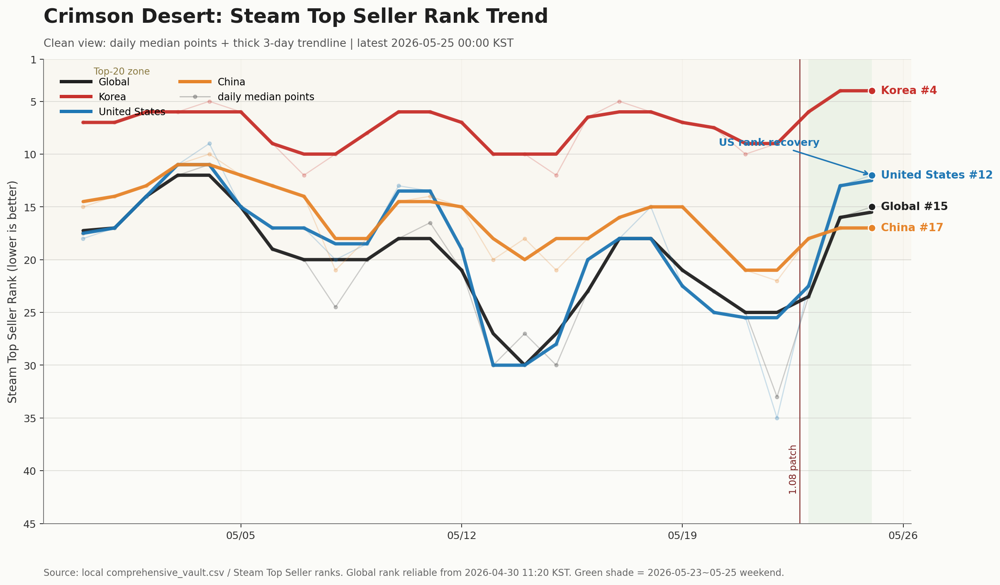
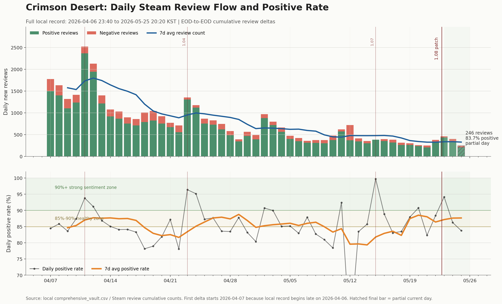
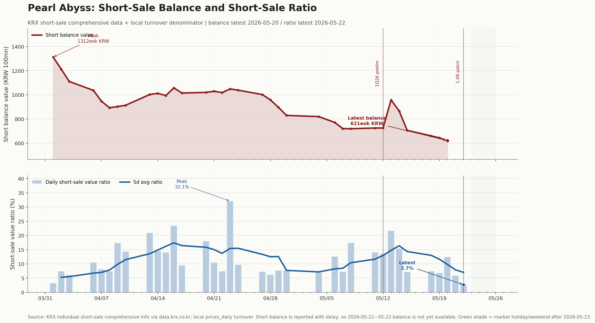
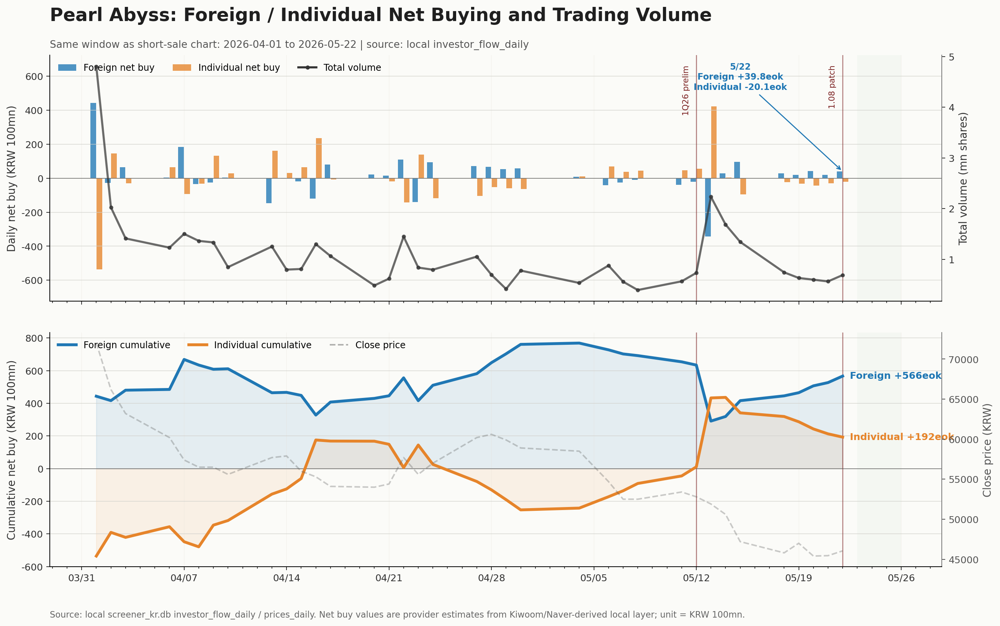

> **Pearl Abyss × Crimson Desert 系列**
> [Neowiz与CD Projekt比较](/post/pearl-abyss-neowiz-cd-projekt-rerating-comps-2026-05-23/) / [KOSDAQ smart money与Pearl Abyss](/post/kosdaq-smart-money-return-pearl-abyss-rebound-2026-05-22/) / [资金流底部测试](/post/pearl-abyss-flow-bottom-test-2026-05-18/) / [Patch 1.07周末数据](/post/pearl-abyss-crimson-desert-patch-107-weekend-data-2026-05-17/) / [Pearl Abyss hub](/page/pearl-abyss-crimson-desert-hub/)

*Pearl Abyss的讨论已经从“Crimson Desert有没有卖出去”转向“销售尾部能持续多久”。5月25日的数据给出的方向比较清楚：游戏长尾仍在，空头压力缓和，外资正在承接供给。*

## 核心摘要

- **Crimson Desert并不是销售崩塌的游戏。** 5月25日20:20 KST，Steam销售排名为全球 **#18**、韩国 **#5**、美国 **#13**、中国 **#17**。
- **CCU正常衰减，但购买转化代理指标改善。** 周末+假期窗口平均CCU同比上周同长度 <strong>-12.8%</strong>，但新增评论 <strong>+5.2%</strong>、评论/日 <strong>+4.7%</strong>，新增评论好评率升至 <strong>89.0%</strong>。
- **Patch 1.08后质量信号改善。** 自5月22日17:20以来新增评论 **1,318条**，好评率 **90.0%**。
- **空头压力缓和。** 空头余额从4月初约 **1,312亿韩元**降至5月20日 **621亿韩元**；空头成交额占比从5月13日 <strong>32.1%</strong>降至5月22日 **2.7%**。
- **外资正在承接。** 4月1日至5月22日，外资净买入 **566亿韩元**，个人净买入 **192亿韩元**，机构净卖出 **761亿韩元**。
- **结论：Hold逻辑增强。** 加仓仍需600万份官方确认、DLC/资料片路线图、DokeV可见度或股东回报信息。

## 1. 最新快照

| 指标 | 最新 |
|---|---:|
| CCU | 38,254 |
| 当日峰值CCU | 60,687 |
| 累计好评 | 130,176 |
| 累计差评 | 24,665 |
| 总评论 | 154,841 |
| 累计好评率 | 84.07% |
| 全球销售排名 | #18 |
| 韩国 | #5 |
| 美国 | #13 |
| 中国 | #17 |

实务估算销量约 **593万份**。实际突破600万份可能在5月底到6月初，但官方公告可能滞后。

## 2. 销售排名：长尾仍在

| 地区 | 当前读数 | 投资含义 |
|---|---|---|
| 韩国 | 较5月初改善，#4-5区间 | 核心玩家与补丁反应仍在 |
| 美国 | 1.08后回升至#12-13 | 核心AAA市场仍有新增购买转化 |
| 中国 | 维持#15-20 | Steam China需求有韧性 |
| 全球 | 回到#15-18 | 长尾上沿得到防守 |

美国回升尤其重要。AAA买断制市场很冷，能回到低双位数排名，说明不只是老玩家留存，新增购买仍在发生。

## 3. 评论：新增用户反应仍可接受

每日评论已低于首发高峰，但近一个月仍保持 **250-500条/日**。Patch 1.08后如下：

| 指标 | Patch 1.08后 |
|---|---:|
| 区间 | 5月22日17:20至5月25日20:20 |
| 平均CCU | 41,278 |
| 峰值CCU | 60,687 |
| 新增评论 | 1,318 |
| 新增评论好评率 | 90.0% |
| 全球平均排名 | #20.2 |
| 韩国平均排名 | #5.0 |
| 美国平均排名 | #19.0 |
| 中国平均排名 | #17.4 |

这不是只靠存量玩家支撑的形态。新增评论仍在，好评率改善，美国/全球排名也修复。

## 4. 空头与资金流

| 指标 | 高点/此前 | 最新 |
|---|---:|---:|
| 空头余额 | 4月初约1,312亿韩元 | 5月20日621亿韩元 |
| 空头成交额占比 | 5月13日32.1% | 5月22日2.7% |

KRX空头余额存在报告滞后，因此最新余额判断以5月20日为准。但方向是空头压力缓和。

| 投资者 | 4月1日-5月22日 |
|---|---:|
| 外资 | +566亿韩元 |
| 个人 | +192亿韩元 |
| 机构 | -761亿韩元 |

最近五个交易日，外资净买入 **151亿韩元**，个人净卖出 **149亿韩元**。结构是外资承接，机构卖压仍待消化。

## 5. 投资解读

| 层面 | 当前信号 | 解读 |
|---|---|---|
| 销售排名 | 韩国/美国/全球修复，中国Top 20 | 长尾上沿防守 |
| 评论 | 新增评论维持，1.08后好评率90% | 新买家反应改善 |
| 空头 | 余额下降，占比急降 | 卖压缓和 |
| 资金流 | 外资买入、机构卖出 | 重估延迟，逻辑未破 |

**立场：Hold / 触发条件出现后再加仓。**

| 加仓触发 | 含义 |
|---|---|
| 600万份官方确认 | 销售持续性的下一层证明 |
| DLC / 资料片 | 从一次性买断转向可重复IP收入 |
| DokeV可见度 | 验证引擎和AAA管线 |
| 股东回报 | 将现金流转化为股东价值 |

| 失效信号 | 含义 |
|---|---|
| 假期后全球跌出#25-30 | 长尾上沿破坏 |
| 美国回落到#25-30 | 核心市场转化减弱 |
| 日评论低于200且好评率落到80%出头 | 新增流入与质量信任同时恶化 |
| 空头占比再升且外资停止买入 | 股价压力恢复 |

数据来源：Research OS local DB、Steam排名与评论追踪、KRX空头统计、投资者流向数据。

*Disclaimer: 仅供研究与信息参考，不构成投资建议。*
