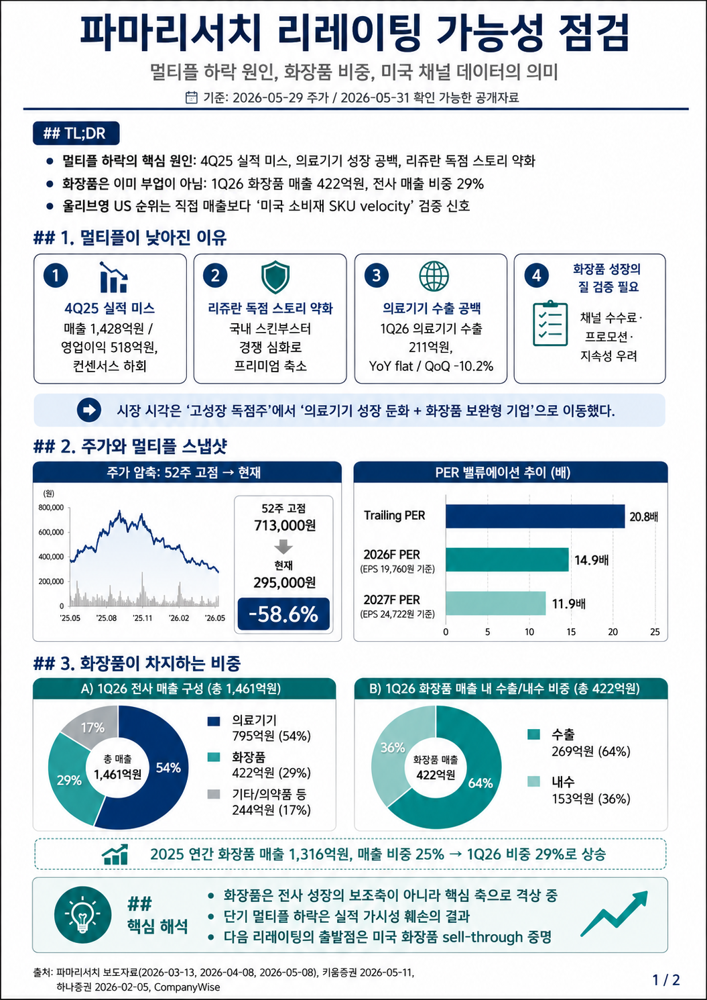
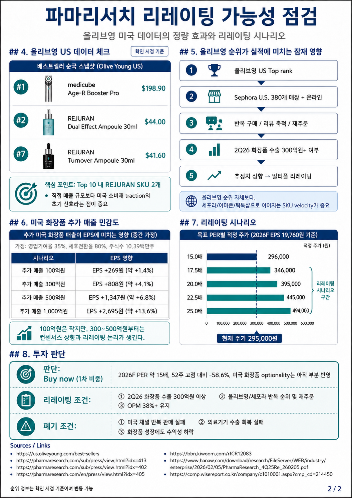

> Contexte : suite des notes sur [Rejuran / PharmaResearch](/post/rejuran-owner-pharmaresearch-pn-technology-skin-booster-2026-04-27/) et du [hub K-Beauty](/page/k-beauty-olive-young-pharmaresearch-hub/).

## TL;DR

La baisse du multiple de PharmaResearch ne vient pas seulement des flux. Elle reflète quatre facteurs : la déception du 4T25, une pause des exportations de dispositifs médicaux, une concurrence domestique plus forte dans les skin boosters et le doute sur la qualité récurrente du chiffre d'affaires cosmétique.

Mais les cosmétiques ne sont plus secondaires. Au 1T26, PharmaResearch a publié KRW 42,2 Mds de chiffre d'affaires cosmétique, soit environ 29% du total, dont KRW 26,9 Mds à l'export. ([PharmaResearch](https://pharmaresearch.com/sub/press/view.html?idx=413))

Le nouveau signal vient des États-Unis. Au 31 mai 2026, Olive Young U.S. classe REJURAN Dual Effect Ampoule au rang #2 et REJURAN Turnover Ampoule au rang #7 de ses best sellers. Ce n'est pas encore une preuve de chiffre d'affaires massif, mais c'est un premier signal de vitesse SKU dans le canal consommateur américain. ([Olive Young US](https://us.oliveyoung.com/best-sellers))

Conclusion : <strong>Buy now, mais seulement une première tranche</strong>. À KRW 295 000, le titre vaut environ 14,9x l'EPS 2026F de KRW 19 760. Une position plus forte exige des exportations cosmétiques 2T26 au-dessus de KRW 30 Mds, des réassorts aux États-Unis et une marge opérationnelle consolidée supérieure à 38%.

## Cadre D'Analyse

PharmaResearch ne doit plus être lu uniquement comme un monopole de dispositif médical Rejuran. La vraie question est de savoir si la confiance créée par le traitement Rejuran peut être convertie en plateforme de derma-cosmétiques via Sephora, Olive Young, Amazon et TikTok Shop.

| Couche | Signal positif | Risque |
|---|---|---|
| Dispositifs médicaux | Marque Rejuran, canal clinique | Exportations 1T26 faibles |
| Cosmétiques | 29% du chiffre d'affaires, forte part export | Promotions, frais de canal, inventaire |
| États-Unis | Sephora + Olive Young U.S. ranking | Manque de données magasin par magasin |
| Valorisation | PER 2026F autour de 14,9x | Le re-rating dépend du 2T26 |

## Scénarios

Avec un EPS 2026F de KRW 19 760 :

| PER cible | Prix implicite |
|---:|---:|
| 15,0x | KRW 296 000 |
| 17,5x | KRW 346 000 |
| 20,0x | KRW 395 000 |
| 22,5x | KRW 445 000 |
| 25,0x | KRW 494 000 |

Le scénario 20x est le bull case réaliste. Il nécessite que les classements Olive Young et Sephora se traduisent en exportations, réassorts et marges.

## Points À Suivre

- Deux SKU REJURAN dans le Top 20 Olive Young U.S. pendant plus de deux semaines.
- Exportations cosmétiques 2T26 au-dessus de KRW 30 Mds.
- Avis, ruptures et réassorts chez Sephora U.S.
- Reprise QoQ des exportations de dispositifs médicaux.
- OPM consolidée au-dessus de 38%.

*Document de recherche uniquement. Ce n'est pas un conseil en investissement personnalisé.*
