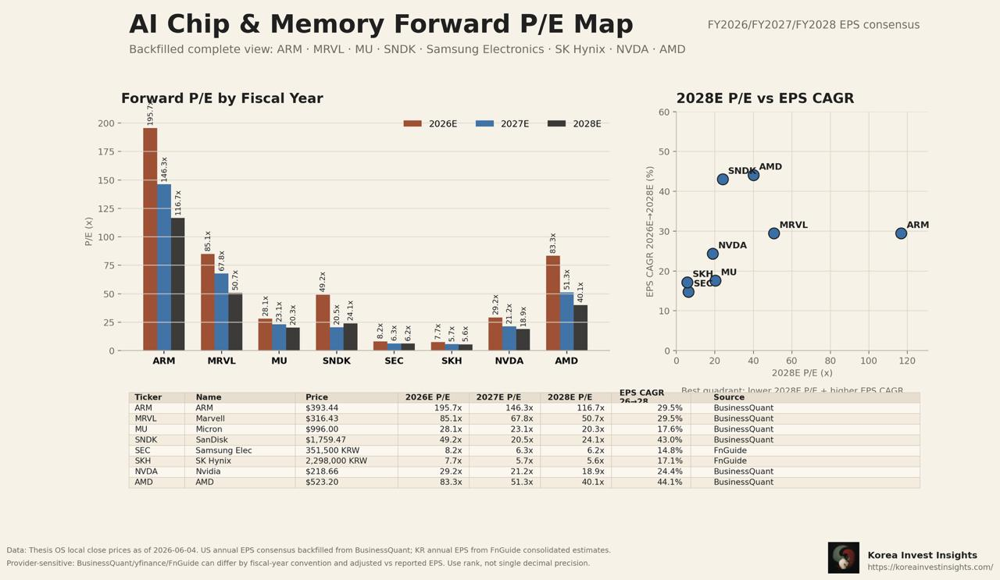

> 후속 글 맥락
> 이 글은 [삼하마 패리티: 삼성전자·하이닉스가 마이크론보다 다시 싸진 구간](/ko/post/samsung-hynix-micron-forward-per-parity-memory-catch-up-2026-06-03/), [SK하이닉스 vs 마이크론](/ko/post/sk-hynix-vs-micron-hbm-premium-ai-memory-platform-2026-05-31/), [삼성전자 HBM4E 12단 샘플 출하](/ko/post/samsung-electronics-hbm4e-12h-sample-market-watch-hanmi-tc-bonder-2026-06-01/)의 후속편입니다. 관련 허브는 [AI HBM 허브](/ko/page/korea-semiconductor-hbm-kospi-hub/), [한국 데일리 마켓 허브](/ko/page/korea-daily-market-hub/), [해외 투자자용 한국 주식 허브](/ko/page/korea-stocks-foreign-investors-hub/)입니다.

## TL;DR

- 이번 지도는 삼성전자·SK하이닉스·마이크론만이 아니라 ARM, 마벨, 엔비디아, AMD, 샌디스크까지 넣은 **AI 칩·메모리 forward P/E 지도**입니다.
- 결론은 단순합니다. **한국 메모리 대형주는 AI 칩 바스켓 안에서 가장 낮은 P/E 구간**에 있습니다. 하지만 낮은 P/E가 곧 매수 신호는 아닙니다. 시장은 여전히 메모리 피크이익을 의심합니다.
- 마이크론 프리미엄은 정당한 부분이 있습니다. 미국 상장, 달러 자산, AI 메모리 희소성, HBM4·SOCAMM2·데이터센터 SSD 스토리가 붙어 있습니다.
- 다만 삼성전자·SK하이닉스의 EPS 컨센서스가 훼손되지 않았는데 상대 P/E만 낮아졌다면, 이는 **한국 메모리의 펀더멘털 악화가 아니라 미국 AI 메모리 proxy가 먼저 비싸진 결과**입니다.
- 상대가치 순서는 여전히 **SK하이닉스 우선, 삼성전자는 HBM4E 확인 시 할인 해소형 옵션, 마이크론은 비교 기준점**입니다.

<div class="thesis-callout">
  <div class="thesis-callout__label">핵심 문장</div>
  <div class="thesis-callout__body">
    마이크론이 미국 AI 메모리 proxy로 먼저 비싸졌고, 삼성전자·SK하이닉스는 EPS 훼손 없이 상대 P/E가 낮아졌습니다. 이번 후속 지도는 그 괴리가 단순 삼하마 내부가 아니라 AI 칩 바스켓 전체에서도 보인다는 점을 보여줍니다.
  </div>
</div>

---

## 1. 한 장으로 보는 AI 칩·메모리 P/E 지도



이 지도는 FY2026, FY2027, FY2028 EPS 컨센서스 기준 forward P/E를 한 번에 보여줍니다. 데이터는 Thesis OS local close price와 BusinessQuant, FnGuide 기반 EPS 컨센서스가 섞여 있습니다.

중요한 주의점이 있습니다.

**이 표는 절대 소수점 비교용이 아닙니다.** 미국과 한국은 회계연도, 조정 EPS, 컨센서스 제공자, 통화 기준이 다릅니다. 그래서 이전 삼하마 패리티 글의 Research OS local DB PER과 이번 지도 속 BusinessQuant/FnGuide 혼합 PER은 숫자가 다를 수 있습니다. 이 글에서 보는 것은 **순위, 군집, 상대 방향**입니다.

| 종목 | 2026E P/E | 2027E P/E | 2028E P/E | EPS CAGR 2026~2028 | 해석 |
|---|---:|---:|---:|---:|---|
| ARM | 195.7배 | 146.3배 | 116.7배 | 29.5% | 가장 높은 플랫폼 프리미엄 |
| Marvell | 85.1배 | 67.8배 | 50.7배 | 29.5% | 맞춤형 AI 칩·네트워크 프리미엄 |
| Micron | 28.1배 | 23.1배 | 20.3배 | 17.6% | 미국 AI 메모리 proxy 프리미엄 |
| SanDisk | 49.2배 | 20.5배 | 24.1배 | 43.0% | NAND·스토리지 턴어라운드 고베타 |
| Samsung Electronics | 8.2배 | 6.3배 | 6.2배 | 14.8% | 가장 낮은 대형 AI 메모리 P/E 축 |
| SK hynix | 7.7배 | 5.7배 | 5.6배 | 17.1% | HBM 리더인데도 최저 P/E 축 |
| NVIDIA | 29.2배 | 21.2배 | 18.9배 | 24.4% | 높은 성장과 낮아지는 P/E의 균형 |
| AMD | 83.3배 | 51.3배 | 40.1배 | 44.1% | 성장 기대는 크지만 P/E도 높음 |

가장 눈에 띄는 것은 삼성전자와 SK하이닉스입니다. 둘은 2028E P/E가 각각 **6.2배, 5.6배**입니다. AI 칩 바스켓 안에서 압도적으로 낮습니다.

다만 이것은 두 가지로 해석할 수 있습니다.

1. **기회:** 시장이 한국 메모리 이익의 지속성을 너무 낮게 본다.
2. **함정:** 2026~2028 EPS 컨센서스가 피크이익을 과대평가하고 있다.

따라서 지금 질문은 “싸냐 비싸냐”가 아닙니다.

**2027~2028년 EPS가 실제로 유지될 수 있느냐**입니다.

---

## 2. 첫 번째 결론: 마이크론 프리미엄은 기술 프리미엄이 아니다

마이크론은 좋은 회사입니다. 그리고 이번 사이클에서 미국 투자자가 가장 쉽게 살 수 있는 대형 AI 메모리 주식입니다.

Micron은 FY2Q26에서 강한 숫자를 냈습니다. 회사는 FY3Q26 가이던스로 매출 **335억 달러**, 총이익률 약 **81%**, non-GAAP EPS **19.15달러**를 제시했습니다. ([Micron IR][1])

또한 준비 발언에서는 2026년 이후에도 DRAM과 NAND 수급이 타이트할 것으로 봤고, DRAM 가격은 전분기 대비 mid-60%, NAND 가격은 high-70% 상승했다고 설명했습니다. ([Micron Prepared Remarks][2])

이 숫자라면 마이크론 프리미엄은 설명됩니다.

| 마이크론 프리미엄 요인 | 의미 |
|---|---|
| 미국 상장 | 미국 기관·ETF·옵션·퀀트 자금이 바로 접근 가능 |
| 달러 자산 | 글로벌 AI CapEx 베팅을 달러 주식으로 보유 |
| AI 메모리 희소성 | 미국 상장 대형 메모리 제조사가 사실상 마이크론뿐 |
| HBM4·SOCAMM2·SSD 스토리 | HBM 단일이 아니라 AI memory/storage platform으로 설명 가능 |
| 강한 가이던스 | FY3Q26 EPS run-rate가 시장의 메모리 피크이익 의심을 낮춤 |

하지만 이것을 “마이크론이 SK하이닉스보다 HBM 기술력이 높다”로 해석하면 틀립니다.

마이크론 프리미엄의 본질은 **기술 1등 프리미엄이 아니라 미국 상장 AI 메모리 희소성 프리미엄**입니다.

---

## 3. 두 번째 결론: 한국 메모리 할인은 일부 정당하지만 폭은 과도하다

한국 메모리주가 할인받는 이유도 있습니다.

삼성전자는 pure memory가 아닙니다. 스마트폰, 가전, 디스플레이, 파운드리, 시스템LSI가 섞인 복합기업입니다. HBM에서도 SK하이닉스보다 후발 할인 요인이 남아 있습니다.

SK하이닉스는 더 순수한 메모리 기업이지만, 한국 상장, 원화 자산, 외국인 접근성, 코리아 디스카운트가 있습니다.

그렇다고 현재 할인 폭이 모두 정당한 것은 아닙니다.

사용자 제공 로컬 DB 스냅샷 기준 2Q run-rate 영업이익 배수를 보면 차이는 더 커집니다.

| 기업 | 기준 이익 | 연율화 이익 | 시가총액 또는 지분가치 | 2Q run-rate OP multiple |
|---|---:|---:|---:|---:|
| 삼성전자 | 2Q26E OP 약 90조원 | 약 360조원 | 약 2,176조원 | 약 6.0배 |
| SK하이닉스 | 2Q26E OP 약 66.5조원 | 약 266조원 | 약 1,532조원 | 약 5.8배 |
| Micron | FY3Q26 OP 약 257억 달러 | 약 1,028억 달러 | 약 1.137조 달러 | 약 11.1배 |

여기서도 마이크론은 한국 메모리주보다 약 **1.8~1.9배 높은 영업이익 배수**를 받고 있습니다.

정상적인 미국 상장 프리미엄은 있을 수 있습니다. 하지만 HBM 리더십과 이익률까지 고려하면 SK하이닉스가 마이크론의 절반 수준 배수를 받아야 한다는 주장은 약합니다.

---

## 4. 왜 낮은 P/E가 바로 매수 신호는 아닌가

메모리 주식의 낮은 P/E는 항상 두 얼굴을 가집니다.

| 해석 | 의미 |
|---|---|
| 좋은 낮은 P/E | 시장이 이익 지속성을 과소평가했고, EPS가 유지되면 주가가 따라간다 |
| 나쁜 낮은 P/E | 지금 EPS가 피크이고, 다음 해 이익이 꺾이면 P/E는 갑자기 높아진다 |

그래서 이번 지도에서 가장 중요한 열은 2026E P/E가 아니라 **2028E P/E와 EPS CAGR**입니다.

삼성전자와 SK하이닉스의 2028E P/E가 6배 안팎으로 유지된다는 것은, 컨센서스가 “2026년만 반짝”으로 보지 않는다는 뜻입니다. 특히 SK하이닉스는 EPS CAGR도 **17.1%**로 마이크론 **17.6%**와 크게 다르지 않습니다.

그렇다면 질문은 이렇게 바뀝니다.

```text
한국 메모리주의 2028E EPS가 유지된다면,
왜 SK하이닉스는 마이크론보다 훨씬 낮은 P/E를 받아야 하는가?
```

이 질문에 대한 답이 명확하지 않다면, 현재 할인은 투자 기회에 가깝습니다.

---

## 5. 종목별 판단

### SK하이닉스: 상대가치 1순위

SK하이닉스는 이번 지도에서 가장 설득력 있는 상대가치 후보입니다.

이유는 세 가지입니다.

1. HBM 리더십이 가장 명확합니다.
2. 2028E P/E가 **5.6배**로 AI 메모리 바스켓 최저권입니다.
3. EPS CAGR은 **17.1%**로 마이크론과 큰 차이가 없습니다.

따라서 SK하이닉스는 “싸지만 위험한 메모리주”가 아니라, **마이크론 대비 할인 폭이 과도해진 HBM 리더**로 보는 편이 맞습니다.

다만 단기 접근은 여전히 분할입니다. 외국인 매도와 한국 수급 할인은 아직 사라지지 않았습니다. SK하이닉스에 풀사이즈로 들어가는 조건은 **외국인 순매도 둔화, 2Q26 영업이익 확인, 3Q DRAM/HBM 가격 가이던스 유지**입니다.

### 삼성전자: 할인은 정당하지만 옵션은 크다

삼성전자는 SK하이닉스보다 할인 정당성이 큽니다. HBM 후발 할인, 복합기업 할인, 파운드리 손실, 세트 사업 혼합이 모두 있습니다.

그럼에도 삼성전자를 버리면 안 됩니다. 삼성전자의 2028E P/E는 **6.2배**입니다. HBM4E 고객 인증과 양산 수율이 확인되면, 시장은 삼성전자를 단순 복합 전자주가 아니라 **AI 메모리 catch-up 대형주**로 다시 볼 수 있습니다.

삼성전자의 핵심은 마이크론과 같은 P/E를 받는 것이 아닙니다.

**6배 안팎의 배수가 7~8배로만 올라가도 할인 해소 효과는 충분히 큽니다.**

### Micron: 좋은 기업, 하지만 이제는 기준점

마이크론은 여전히 좋은 기업입니다. 그러나 지금은 “가장 싼 메모리주”가 아닙니다.

마이크론의 역할은 두 가지입니다.

1. 미국 시장이 AI 메모리 이익 지속성을 어느 정도까지 가격화할 수 있는지 보여주는 기준점
2. 삼성전자·SK하이닉스의 코리아 디스카운트가 얼마나 큰지 측정하는 비교 대상

마이크론이 더 오르려면 FY3Q26 실적 상회, FY4Q26 가이던스 상향, FY2027 EPS 상향, 장기공급계약의 가격 방어력 확인이 필요합니다.

---

## 6. 투자 판단표

| 구분 | 삼성전자 | SK하이닉스 | Micron |
|---|---|---|---|
| 현재 성격 | HBM catch-up 대형주 | HBM 리더 | 미국 AI 메모리 proxy |
| 2028E P/E 지도상 위치 | 6.2배 | 5.6배 | 20.3배 |
| EPS CAGR 2026~2028 | 14.8% | 17.1% | 17.6% |
| 할인 정당성 | 일부 정당 | 과도해 보임 | 프리미엄 일부 정당 |
| 매력도 | 중립~우호 | 우호 | 중립 |
| 핵심 조건 | HBM4E 인증·양산 | 외국인 매도 둔화·2Q 실적 | FY3Q beat·FY4Q guide |
| 실패 조건 | HBM 지연·DS 이익 하회 | HBM 가격 둔화·EPS 하향 | gross margin 80% 하회·피크아웃 |

---

## 7. 리스크

첫째, **메모리 가격 피크아웃**입니다. 낮은 P/E는 피크이익이면 함정이 됩니다.

둘째, **2027~2028 공급 증가**입니다. HBM·DRAM·NAND 공급이 생각보다 빠르게 늘면 컨센서스 EPS가 내려갈 수 있습니다.

셋째, **AI CapEx 둔화**입니다. 하이퍼스케일러의 AI 투자 속도가 꺾이면 HBM, 서버 DRAM, eSSD의 가격 방어력이 약해집니다.

넷째, **코리아 디스카운트 재확대**입니다. 정책, 지배구조, 노동, 초과이익 분배 이슈가 부각되면 한국 반도체 배수는 다시 눌릴 수 있습니다.

다섯째, **데이터 제공자 차이**입니다. 이번 지도는 BusinessQuant, FnGuide, Thesis OS local close price를 함께 사용했습니다. 숫자는 절대 정밀값이 아니라 상대 군집을 보는 용도입니다.

---

## 최종 결론

이번 후속 분석의 결론은 첫 번째 삼하마 글보다 더 분명합니다.

**마이크론 프리미엄은 맞습니다. 하지만 SK하이닉스와 삼성전자의 할인 폭도 과도해졌습니다.**

AI 칩·메모리 전체 바스켓에서 ARM, 마벨, AMD는 높은 기대를 높은 P/E로 받고 있습니다. 엔비디아는 높은 성장과 낮아지는 P/E가 균형을 이룹니다. 마이크론은 미국 AI 메모리 proxy로 프리미엄을 받습니다.

그 아래에서 삼성전자와 SK하이닉스는 가장 낮은 P/E에 있습니다.

따라서 현 시점의 상대가치 결론은 다음입니다.

```text
1순위: SK하이닉스
- HBM 리더십, 낮은 2028E P/E, 마이크론과 유사한 EPS CAGR
- Micron 대비 할인 폭이 과도

2순위: 삼성전자
- 할인은 일부 정당
- HBM4E 인증과 DS 이익 상향이 확인되면 할인 해소형 이벤트 드리븐

3순위: Micron
- 좋은 기업이지만, 이제는 한국 메모리주의 벤치마크
- 신규 상대매력은 한국 메모리보다 낮음
```

한 줄로 줄이면 이렇습니다.

**메모리 주식이 다시 싸 보이는 이유는 이익이 망가졌기 때문이 아니라, 미국 AI 메모리 proxy가 먼저 비싸졌기 때문입니다. 그 괴리가 유지되는 동안 삼하마 패리티 트레이드는 여전히 살아 있습니다.**

## 근거와 데이터

- AI Chip & Memory Forward P/E Map: Thesis OS local close price, BusinessQuant, FnGuide 컨센서스 조합, 2026-06-04 기준 이미지.
- Micron FY2Q26 실적 및 FY3Q26 가이던스: [Micron IR][1]
- Micron FY2Q26 준비 발언: [Micron Prepared Remarks][2]
- 이전 분석: [삼하마 패리티](/ko/post/samsung-hynix-micron-forward-per-parity-memory-catch-up-2026-06-03/), [SK하이닉스 vs 마이크론](/ko/post/sk-hynix-vs-micron-hbm-premium-ai-memory-platform-2026-05-31/)

[1]: https://investors.micron.com/news-releases/news-release-details/micron-technology-inc-reports-results-second-quarter-fiscal-2026 "Micron Technology, Inc. Reports Results for the Second Quarter of Fiscal 2026"
[2]: https://investors.micron.com/static-files/e089f8c0-065d-47b8-9d02-bfa863cdb357 "Micron FY2Q26 Prepared Remarks"
