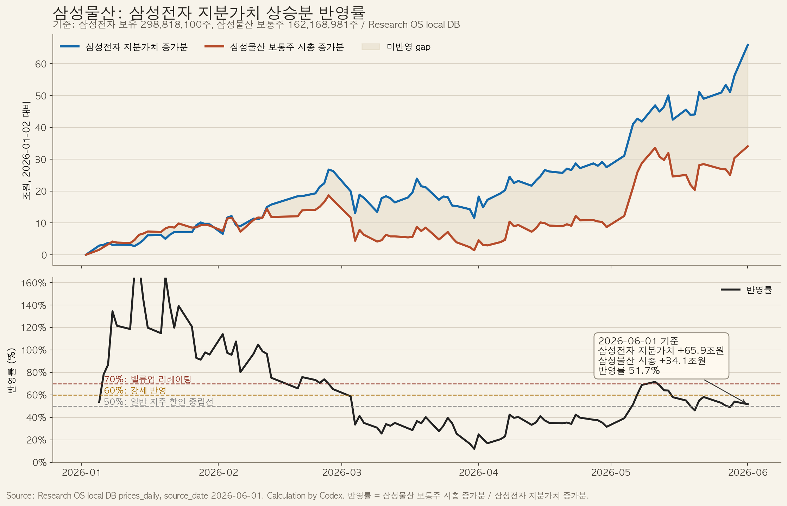

> Bối cảnh
> Bài viết này tóm tắt luận điểm tiếng Hàn: Samsung C&T có thể là proxy trễ của Samsung Electronics sau đợt tăng mạnh nhờ AI/HBM/bộ nhớ.

## TL;DR

Ý tưởng dùng Samsung C&T như một proxy trễ của Samsung Electronics là hợp lý, nhưng không nên hiểu là "mua miễn phí cổ phần Samsung Electronics" hay một công cụ thay thế high-beta ổn định.

Samsung C&T nắm **298.818.100 cổ phiếu** Samsung Electronics. Tính đến ngày 1/6/2026, phần sở hữu này trị giá khoảng **104,3 nghìn tỷ won**. Từ đầu năm 2026, giá trị phần sở hữu tăng khoảng **65,9 nghìn tỷ won**, trong khi vốn hóa cổ phiếu thường của Samsung C&T tăng khoảng **34,1 nghìn tỷ won**. Tỷ lệ pass-through là **51,7%**.

Tỷ lệ này từng là **71,6% vào ngày 11/5**, nhưng giảm xuống **51,7% vào ngày 1/6** vì Samsung Electronics tăng nhanh hơn Samsung C&T. Nếu thị trường phục hồi về pass-through **60%**, giá hàm ý của Samsung C&T là khoảng **489.000 won**. Kịch bản **70%** cho giá khoảng **529.000 won**, nhưng cần thêm catalyst về governance, Value-Up hoặc cải thiện hoạt động kinh doanh.

Về beta, tương quan YTD giữa Samsung Electronics và Samsung C&T là **0,82**, nhưng beta của Samsung C&T với Samsung Electronics chỉ là **0,83**. 20 ngày gần nhất beta tăng lên **1,10**, nhưng đó là giai đoạn đặc biệt. Cổ phiếu Samsung Electronics phù hợp hơn cho core AI memory exposure; Samsung C&T là NAV gap trade; ETF Samsung Electronics 2X chỉ phù hợp cho giao dịch chiến thuật ngắn hạn vì có rủi ro rebalance và compounding âm.

Luận điểm ETF cũng cần phân biệt. KODEX 200 đã nắm Samsung Electronics ở **32,87%**, nên ETF KOSPI200 không bắt buộc phải cắt Samsung ở 30% và mua Samsung C&T thay thế. Nhưng KODEX Samsung Group đã giảm số lượng Samsung Electronics và tăng Samsung C&T, Samsung Life, Samsung SDI từ 21/5 đến 1/6.

Kết luận: **Watchlist / ứng viên mua khi điều chỉnh**. Vùng hỗ trợ 430.000-440.000 won là điểm quan sát đầu tiên. Vượt 465.000 won với thanh khoản tăng và mua ròng từ nước ngoài/tổ chức sẽ xác nhận xu hướng.

## Rủi ro

Luận điểm thất bại nếu Samsung Electronics mất momentum, Samsung C&T thủng 410.000 won, nước ngoài và tổ chức cùng bán ròng, hoặc mảng xây dựng của Samsung C&T yếu hơn kỳ vọng.

[1]: https://www.rns-pdf.londonstockexchange.com/rns/2447G_1-2026-5-29.pdf "Samsung Electronics 2026 Q1 Interim Business Report"
[2]: https://news.samsungcnt.com/en/features/corporate-sustainability/2026-04-samsung-ct-q1-2026-earnings/ "Samsung C&T Q1 2026 earnings"

*Chỉ nhằm mục đích thông tin. Không phải khuyến nghị đầu tư.*
