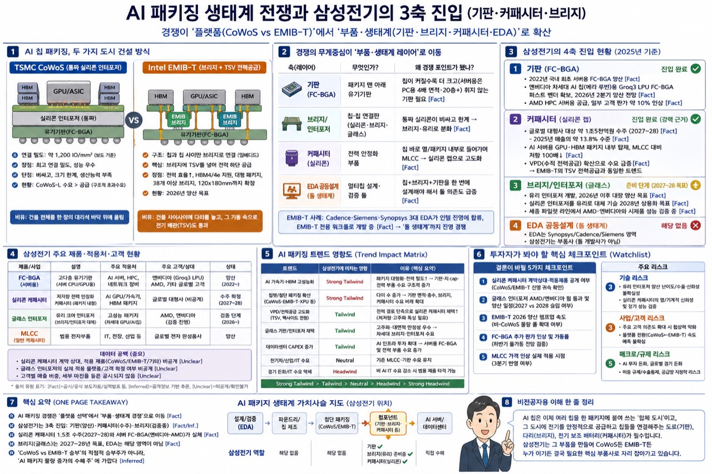

> 📚 Samsung Electro-Mechanics Series
> [₩1.5 Trillion Silicon Capacitor Contract](/post/samsung-electro-mechanics-silicon-capacitor-1p5tn-2026-05-21/) / [Understanding MLCC and Silicon Capacitors](/post/mlcc-silicon-capacitor-ai-package-power-integrity-2026-05-22/) / [AI Server Passive Component Bottleneck](/post/ai-server-passive-components-bottleneck-samsung-electro-mechanics-2026-05-26/) / [Samsung Electro-Mechanics Breaks ₩100 Trillion Market Cap](/post/samsung-electro-mechanics-100tn-murata-hyundai-market-cap-2026-05-26/) / [Marvell Q1 and Korea Semiconductor Read-Through](/post/marvell-q1-fy2027-korea-semiconductor-readthrough-2026-05-28/)
> Related Hubs: [AI Substrate & PCB Hub](/page/korea-ai-pcb-substrate-hub/) / [Korea Semiconductor Value Chain Hub](/page/korea-semiconductor-equipment-ip-hub/)

<small>One-page Korean infographic: AI packaging competition is expanding from a CoWoS-vs-EMIB-T platform battle into a broader ecosystem contest across substrates, bridges, capacitors, and EDA. Samsung Electro-Mechanics' key position sits in FC-BGA, silicon capacitors, and the optional bridge/interposer ecosystem.</small>

## TL;DR

The essence of this story is that <strong>Samsung Electro-Mechanics has begun moving inside AI semiconductors</strong>.

Traditional MLCCs are capacitive components mounted across smartphones, automobiles, and server boards. But the latest packages housing AI accelerators and HBM experience current transients too large for board-level MLCCs to handle alone. Clamping the voltage fluctuations that arise directly beside the die requires placing fast-discharge energy storage components as close to the chip as possible. Samsung Electro-Mechanics' silicon capacitors are designed precisely for this role.

Intel EMIB-T is a useful technical frame for understanding this shift. Intel describes EMIB as a 2.5D packaging technology using a small silicon bridge embedded in the substrate to connect logic-to-logic and logic-to-HBM dies, with EMIB-T adding TSVs to the bridge to reinforce power delivery and signal routing. As AI chips grow larger and HBM stacks multiply, power delivery networks inside packages become increasingly complex—making ultra-low-ESL components like silicon capacitors an inevitable priority. ([Intel][3])

Customer identity, however, requires caution. What is officially confirmed is that <strong>Samsung Electro-Mechanics signed a silicon capacitor supply agreement worth approximately ₩1.5 trillion with a large global company, covering January 1, 2027 through December 31, 2028</strong>. Claims connecting this contract to Google TPU v8e, MediaTek, or Intel EMIB-T adoption come from industry media and sell-side analysts—not from official statements by Samsung Electro-Mechanics, Google, or Intel. ([Samsung Electro-Mechanics][1])

The bottom line: this news has the potential to reshape Samsung Electro-Mechanics' valuation story. The company has historically been viewed as an electronic components name driven by MLCC cycles, smartphone camera modules, and package substrate cycles. But if Si-Cap enters mass production from 2027 and the customer base expands to EMIB-T or other AI ASIC packages, Samsung Electro-Mechanics could be re-rated as a <strong>core supplier of AI infrastructure package power delivery components</strong>. Conversely, if the ₩1.5 trillion contract remains a single-customer, single-project event, or if customer ramp-up delays or dual-sourcing intensifies, current expectations could deflate quickly.

---

## 1. Why This Is Not an MLCC Story

Power delivery challenges in AI packages are not simply about high power consumption. The problem is that <strong>voltage droops when current demand changes abruptly</strong>. GPUs, AI ASICs, and HBM stacks demand large current bursts over extremely short time intervals. Voltage droop shrinks clock margins, increases the probability of errors, and forces conservative performance guardbands.

High-performance packages therefore place power stabilization components as close to the die as possible. Board-level MLCCs remain essential, but inside or immediately adjacent to AI GPU and HBM packages, thinner components with lower ESL and ESR are required.

Samsung Electro-Mechanics describes its silicon capacitors as follows: dielectric layers and internal electrodes are stacked on a silicon wafer; wafer grinding enables thinning to below 100 µm; and low-ESL characteristics are advantageous for power stabilization. Application configurations include Land-side, Top-side, and Embedded types—meaning the component is not simply a board-level part but one that can be placed inside the package design itself. ([Samsung Electro-Mechanics][2])

This is the crux of the Samsung Electro-Mechanics investment thesis. The company has already accumulated deep expertise in high-temperature, high-voltage, and ultra-high-capacitance MLCC technology, and in FC-BGA it is moving toward high-layer-count, large-format substrates for AI accelerators and server CPUs. Adding Si-Cap to this portfolio extends the company's "AI server power stabilization component" coverage from board-level MLCCs all the way into package-internal power delivery.

---

## 2. Why EMIB-T Matters

Intel EMIB replaces a full silicon interposer with a small silicon bridge embedded in the substrate, connecting multiple dies in a 2.5D packaging configuration. Intel describes EMIB as its solution for logic-to-logic and logic-to-HBM interconnection, with volume manufacturing dating back to 2017. ([Intel][4])

The evolution to EMIB-T is more significant. Intel states that EMIB-M adds MIM capacitors inside the bridge to reinforce power delivery, while EMIB-T goes further by adding TSVs to address the vertical power delivery demands of growing HBM stacks. In other words, the bridge is evolving from a pure signal interconnect into a structure that also carries <strong>power delivery infrastructure</strong>. ([Intel][4])

Synopsys characterizes EMIB-T in the same direction: TSV-based power delivery, backside bumping, denser MIM capacitors, and high-speed protocol routing. The motivation is that larger compute dies, next-generation HBM, and expanding AI accelerator clusters must simultaneously satisfy signal integrity and power delivery requirements. ([Synopsys][5])

The investment point here is not "Intel EMIB will unconditionally succeed." A more precise statement is:

> As AI packages scale, the power delivery network inside the package—the PDN—becomes more sophisticated. EMIB-T is a concrete example of that trend, and silicon capacitors are a component category rising within it.

---

## 3. What Is Confirmed vs. What Remains an Estimate

| Item | Judgment | Comment |
|---|---:|---|
| Samsung Electro-Mechanics ₩1.5 trillion silicon capacitor contract | <strong>Fact</strong> | Samsung Electro-Mechanics disclosed a supply agreement of approximately ₩1.5 trillion with a large global company, covering January 1, 2027 through December 31, 2028. ([Samsung Electro-Mechanics][1]) |
| Si-Cap's role in power stabilization inside AI server GPU and HBM packages | <strong>Fact</strong> | Confirmed in Samsung Electro-Mechanics' official press release and product page. ([Samsung Electro-Mechanics][1], [2]) |
| EMIB as Intel's 2.5D packaging for logic-to-HBM interconnection | <strong>Fact</strong> | Confirmed in Intel's official packaging page and EMIB technology brief. ([Intel][3], [4]) |
| EMIB-T adding TSVs to enhance power delivery and signal routing | <strong>Fact</strong> | Intel and Synopsys descriptions are consistent. ([Intel][4], [Synopsys][5]) |
| Ibiden's capacity expansion for high-performance IC package substrates for AI and high-performance servers | <strong>Fact</strong> | Ibiden disclosed a ¥500 billion investment plan for FY2026–FY2028, with phased ramp-up and mass production from FY2027. ([Ibiden][6]) |
| Claims that Samsung Electro-Mechanics' counterparty is Google and that the product will be used in TPU v8e | <strong>Unclear</strong> | Plausible as a market estimate, but not officially confirmed by Samsung Electro-Mechanics, Google, or Intel. |
| Claims that Ibiden's investment is exclusively for EMIB-T and largely funded by a specific hyperscaler | <strong>Unclear</strong> | Ibiden's official materials describe expansion for high-performance IC package substrates but do not identify the customer or confirm EMIB-T exclusivity. |

The distinction between confirmed fact and market estimate must be maintained rigorously. The quality of this contract is high, but labeling it "confirmed Google win" immediately undermines credibility. The safer framing is:

> What is officially confirmed is Samsung Electro-Mechanics' Si-Cap supply agreement with a large global customer. The market is interpreting this in the context of Intel EMIB-T, Google TPU product lines, and broader AI ASIC package PDN advancement.

---

## 4. The Samsung Electro-Mechanics Thesis: MLCC + FC-BGA + Si-Cap

For Samsung Electro-Mechanics, this is not simply a story about one new component being added. Three business axes are converging into a single narrative.

| Axis | Existing Position | Extension in AI Packaging |
|---|---|---|
| MLCC | Power stabilization for boards, servers, and automotive applications | Premium MLCC demand in AI servers and networking equipment |
| FC-BGA | High-layer-count, large-format substrates for server CPUs and AI accelerators | Die area and layer count climb as GPU, ASIC, and network ASIC complexity grows |
| Si-Cap | New high-value passive component | Die-near PDN component inside GPU, HBM, and AI ASIC packages |

This combination matters. Samsung Electro-Mechanics does not design or manufacture chips. But for chips to function, power must be delivered stably, signals must travel without loss, and multiple dies and HBM stacks must be integrated inside a single package. Samsung Electro-Mechanics' products sit in exactly that underlying infrastructure.

Si-Cap's advantage is not just price. Package-internal components carry high customer qualification barriers, and once a component is designed in, switching costs are substantial—requiring re-validation of electrical characteristics, thermal behavior, reliability, and assembly yield for the specific package. The first large design win therefore carries <strong>reference value</strong> that exceeds the revenue it represents.

---

## 5. Value Chain: Who Captures What

| Value Chain | Benefit / Impact | Investment Interpretation |
|---|---|---|
| Intel Foundry / Advanced Packaging | EMIB-T emerges as an alternative and complement to CoWoS bottlenecks | Even without catching TSMC on leading-edge logic, securing advanced packaging slots gives Intel a customer touchpoint for AI ASICs. |
| Ibiden and other high-performance substrate suppliers | Capacity expansion for IC package substrates serving AI and high-performance servers | Ibiden's ¥500 billion plan signals that the substrate bottleneck is structural. However, EMIB-T-specific customer allocations remain unconfirmed. ([Ibiden][6]) |
| Samsung Electro-Mechanics | ₩1.5 trillion Si-Cap contract officially confirmed | Customer identity undisclosed, but this is a strong signal that AI package-internal power stabilization components have entered commercial scale. ([Samsung Electro-Mechanics][1]) |
| Murata | Established leader in silicon capacitors and IPD | Murata holds an existing portfolio of 3D silicon capacitors and custom IPDs. The competitive and dual-sourcing dynamic with Samsung Electro-Mechanics warrants close monitoring. ([Murata][7]) |
| Synopsys and the EDA / package design ecosystem | Beneficiary of rising EMIB-T design complexity | Simultaneously validating chiplets, UCIe, HBM, PDN, thermal, and signal integrity raises the value of 3D-IC design flows. ([Synopsys][5]) |
| TSMC CoWoS | Competitive but near-term substitution is limited | EMIB-T is more likely to serve as a second path for AI ASIC customers amid CoWoS supply constraints than to immediately displace CoWoS. |

---

## 6. Technical Moat: The Hard Parts of Silicon Capacitors

First, <strong>achieving ultra-low ESL and ESR</strong>. In AI packages, what matters is not just the capacitor's intrinsic performance but the length of the current loop from capacitor to die. Placing components below the package, above the die, or embedded within the substrate to shorten current paths is the design challenge.

Second, <strong>co-qualification with the package</strong>. Silicon capacitors are not sold as standalone generic parts; capacitance value, thickness, pad layout, placement, and reliability requirements are all defined relative to the PDN design of a specific AI ASIC package. This is why Samsung Electro-Mechanics emphasizes customer qualification and technical barriers to entry. ([Samsung Electro-Mechanics][1])

Third, <strong>yield and supply stability</strong>. Silicon capacitors are wafer-based components. The manufacturing philosophy differs fundamentally from traditional MLCC, and yield management is required across thinning, grinding, dicing, and package assembly.

Fourth, <strong>customer lock-in</strong>. Once a particular silicon capacitor is designed into an AI package PDN, replacing it with an alternative supplier requires re-validating electrical characteristics, thermal performance, reliability, and assembly yield from scratch. Early design-win incumbents enjoy a structural advantage.

---

## 7. Investment Judgment: Good News and Good Price Are Different Things

Samsung Electro-Mechanics' direction is correct. Si-Cap addresses a power integrity bottleneck in AI packages, and the company has secured a meaningful first large-scale reference. But the equity market has already moved quickly to price this story.

The appropriate investment posture at this point is therefore <strong>Wait / Watchlist</strong>. The rationale is straightforward.

First, the ₩1.5 trillion contract, while substantial, is recognized over 2027–2028. That single contract alone is insufficient to justify a full re-rating of Samsung Electro-Mechanics' market capitalization.

Second, the real alpha lies in repeatability. If this contract is limited to a single customer and a single project, re-rating momentum will be difficult to sustain. Conversely, if a second or third AI ASIC customer or a follow-on generation contract is confirmed during 2027, the narrative shifts from "component win" to "platform supplier."

Third, margins have not been disclosed. Si-Cap is a premium component, but actual operating margins will depend on initial yield, customer pricing terms, process costs, and inspection costs.

The monitoring checklist:

| Checkpoint | Why It Matters |
|---|---|
| Si-Cap revenue recognition begins in 2027 | First evidence that the contract translates into the income statement |
| Customer diversification | Determines whether this is a repeatable platform or a single-project event |
| Placement configuration | Whether Top-side, Land-side, or Embedded affects ASP and lock-in intensity |
| Yield and capacity | Thin wafer-based products make initial yield the primary margin driver |
| MLCC and FC-BGA co-growth | Confirms whether the full AI power integrity portfolio is expanding, not just Si-Cap alone |

---

## 8. Red Team: Where the Thesis Could Be Wrong

First, <strong>customer identity overreach</strong>. Linking this contract to Google TPU v8e, MediaTek, or Intel EMIB-T is a compelling narrative for investors, but none of it is officially confirmed. Google's public TPU page describes the direction of its eighth-generation TPU but does not confirm Samsung Electro-Mechanics Si-Cap content or EMIB-T adoption. ([Google Cloud][8])

Second, <strong>EMIB-T yield and schedule risk</strong>. EMIB-T must simultaneously improve power delivery and signal routing, making production ramp-up technically demanding. Even if the technology direction is sound, delayed customer production ramp means delayed component revenue.

Third, <strong>competitive risk</strong>. Murata is an established incumbent with an existing portfolio of silicon capacitors and IPDs. Samsung Electro-Mechanics winning the first large contract does not automatically lock in long-term market share. ([Murata][7])

Fourth, <strong>TSMC CoWoS resilience</strong>. EMIB-T gaining traction does not mean CoWoS disappears. Real customers will evaluate yield, cost, HBM procurement, package turnaround time, and long-term capacity commitments across multiple options simultaneously.

---

## 9. Conclusion

This news illustrates a broader shift in AI semiconductor investment: the focus is expanding from front-end miniaturization to back-end power and signal integrity. EMIB-T is Intel's packaging card to press into the CoWoS supply bottleneck; silicon capacitors are a component category newly rising within that dynamic.

The most realistic interpretation:

| Conviction | Judgment |
|---|---|
| High | The importance of die-near and package-embedded power stabilization components in AI packages will continue to grow. |
| Medium | Silicon capacitor suppliers such as Samsung Electro-Mechanics and Murata can establish a new growth axis in the high-performance packaging component market from 2027 onward. |
| Low–Medium | The chain of evidence connecting Google TPU v8e or Amazon AI ASICs adopting Intel EMIB-T at scale, with a specific Korean supplier's silicon capacitors inside, remains insufficiently confirmed. |

In plain terms: building a great AI chip is no longer enough on its own. Integrating the chip and HBM into a single package—and delivering power to that package without voltage instability—now determines real-world performance. Silicon capacitors are the premium component that suppresses that instability directly beside the die.

If this story develops as anticipated, competition in AI packaging will expand beyond <strong>TSMC CoWoS vs. Intel EMIB-T</strong> to encompass the entire <strong>substrate, bridge, capacitor, and EDA co-design ecosystem</strong> that lives inside those packages. Samsung Electro-Mechanics has begun to move inside that ecosystem.

---

## Evidence Classification

### [Fact]

- Samsung Electro-Mechanics signed a silicon capacitor supply agreement of approximately ₩1.5 trillion with a large global company, covering January 1, 2027 through December 31, 2028. ([Samsung Electro-Mechanics][1])
- Samsung Electro-Mechanics describes its silicon capacitors as power stabilization components placed inside high-performance semiconductor packages, including AI server GPUs and HBM. ([Samsung Electro-Mechanics][1])
- Samsung Electro-Mechanics silicon capacitors support thinning below 100 µm, low ESL characteristics, and Land-side, Top-side, and Embedded placement configurations. ([Samsung Electro-Mechanics][2])
- Intel EMIB is a 2.5D packaging technology for logic-to-logic and logic-to-HBM interconnection; EMIB-T adds TSVs to the bridge. ([Intel][3])
- Ibiden plans to invest ¥500 billion in FY2026–FY2028 to expand production capacity for high-performance IC package substrates serving AI and high-performance servers, with phased ramp-up and mass production beginning in FY2027. ([Ibiden][6])

### [Inference]

- Samsung Electro-Mechanics' core alpha lies less in Si-Cap unit revenue than in securing a reference position in AI package power integrity.
- Silicon capacitors are best understood not as a wholesale replacement for MLCCs but as a premium layer added to handle the near-die, high-frequency domain that MLCCs cannot adequately reach.
- The competition between EMIB-T and CoWoS intensifies the complexity of package-internal PDN, substrate, bridge, and EDA co-design rather than merely reprising a front-end process node race.

### [Speculation]

- Claims that Samsung Electro-Mechanics' product will be adopted in Google TPU v8e or specific Intel EMIB-T packages have not been officially confirmed.
- Whether Samsung Electro-Mechanics' Si-Cap business will expand into repeat contracts beyond 2028 requires confirmation of additional customers and product generations.
- Si-Cap margins may structurally exceed those of MLCC and FC-BGA, but actual yield outcomes and pricing terms are undisclosed.

### [Blocked]

- Identity of the contracting counterparty.
- Per-product ASP, volume, cost structure, and yield.
- Exact placement location within the final chip and package.
- Whether the contract includes take-or-pay provisions or cancellation clauses.
- Whether repeat contracts will be established beyond 2028.

[1]: https://samsungsem.com/global/newsroom/news/view.do?id=10310 "Samsung Electro-Mechanics Signs 1.5 Trillion KRW Silicon Capacitor Supply Contract with Global Large-Scale Company"
[2]: https://www.samsungsem.com/global/product/passive-component/silicon-capacitor.do "Silicon Capacitor | Samsung Electro-Mechanics"
[3]: https://www.intel.com/content/www/us/en/foundry/packaging.html "Advanced Packaging Innovations | Intel Foundry"
[4]: https://www.intel.com/content/dam/www/central-libraries/us/en/documents/2025-07/emib-product-brief.pdf "Intel Foundry EMIB Technology Brief"
[5]: https://www.synopsys.com/blogs/chip-design/accelerating-emib-t-packaging-synopsys-intel-foundry.html "Accelerating Next-Generation EMIB-T Packaging | Synopsys"
[6]: https://www.ibiden.com/company/2026/02/notice-regarding-capital-investment-plan-for-high-performance-ic-package-substrates.html "Ibiden Notice Regarding Capital Investment Plan for High-Performance IC Package Substrates"
[7]: https://www.murata.com/products/capacitor/siliconcapacitors "Silicon Capacitors | Murata"
[8]: https://cloud.google.com/tpu "Tensor Processing Units | Google Cloud"

*Disclaimer: For research and information purposes only. Not investment advice. Names cited are for analytical illustration; readers should perform their own due diligence and consult licensed advisors before any investment decision.*
