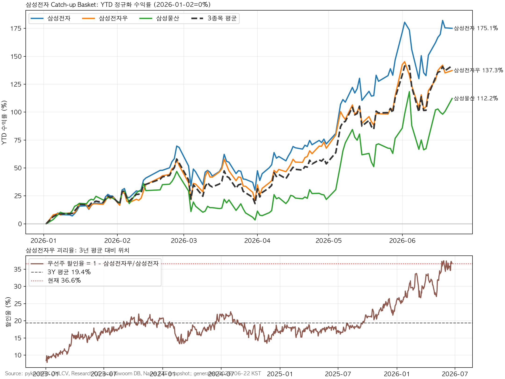

# 삼성전자 캐치업을 무엇으로 살까: 삼성전자우 괴리율과 삼성물산 NAV 갭

삼성전자 보통주가 HBM, 메모리 업황, FCF 환원 기대를 한 번에 반영하면서 많이 올랐다. 그래서 다음 질문은 단순하다. 삼성전자 캐치업 논리를 계속 산다면 꼭 보통주로만 사야 할까. 아니면 삼성전자우나 삼성물산이 더 나은 표현일까.

결론은 삼성전자우가 더 선명하고, 삼성물산은 조건부 위성에 가깝다는 것이다. 삼성전자우는 보통주와 경제적 이익을 거의 공유하지만, 2026년 6월 22일 기준 보통주 대비 할인율이 36.6%까지 벌어졌다. 3년 평균 할인율 19.4%와 비교하면 +3.1표준편차 구간이다. 삼성물산은 삼성전자 지분가치, 삼성바이오로직스·삼성바이오에피스 지분, 계열사 배당 환원, 그룹 ETF 수급 옵션을 함께 가진다. 다만 삼성전자 지분가치 상승분의 약 66.3%가 이미 시가총액에 반영된 상태라, 지금은 삼성전자우보다 진입 조건이 까다롭다.

이 글은 두 분석을 충돌 없이 합친다. 하나는 삼성전자우 괴리율 정상화다. 다른 하나는 삼성물산의 삼성전자 지분가치와 ETF 수급 대체 가능성이다. 정리하면 이렇다. ETF 캡 재배분은 실제로 생길 수 있는 보조 수급이지만, 이번 투자 논리의 중심은 아니다. 핵심은 삼성전자우의 극단적 괴리율, 그리고 삼성물산의 NAV 반영률이다.

관련 글은 다음 순서로 보면 좋다.

- [삼성전자는 고배당주가 아니다: FCF 50% 환원과 DS 성과급 자사주 매수 플로우](/ko/post/samsung-electronics-shareholder-return-ds-bonus-buyback-flow-2026-06-22/)
- [삼성전자는 2028년까지 메모리 슈퍼사이클을 인정한 것인가](/ko/post/samsung-electronics-stock-bonus-supercycle-buyback-2026-05-27/)
- [삼성물산은 삼성전자 후행 Proxy인가: 지분가치 반영률 51.7%와 NAV Gap Trade](/ko/post/samsung-ct-samsung-electronics-proxy-nav-gap-trade-2026-06-01/)
- [삼성전자 HBM4E 12단 샘플 출하](/ko/post/samsung-electronics-hbm4e-12h-sample-market-watch-hanmi-tc-bonder-2026-06-01/)
- [AI HBM 허브](/ko/page/korea-semiconductor-hbm-kospi-hub/)
- [Exclusive Analysis 허브](/ko/page/exclusive-analysis-hub/)

## TL;DR

- 삼성전자 캐치업 알파로는 삼성전자우가 더 선명하다. 2026년 6월 22일 기준 삼성전자우는 YTD로 삼성전자 대비 -37.8%p 뒤처졌고, 보통주 대비 할인율은 36.6%다.
- 삼성전자우 할인율 36.6%는 3년 평균 19.4%, 중앙값 18.1%와 비교해 매우 높은 구간이다. 현재 z-score는 +3.11, 3년 백분위는 99.1%다.
- 삼성물산은 삼성전자 단순 대체재가 아니다. 삼성전자 지분가치, 삼성바이오 지분, 계열사 배당 환원, 건설·에너지 옵션이 섞인 NAV 할인주다.
- ETF 캡 재배분은 보조 논리다. 삼성전자 비중이 높은 ETF가 많은 것은 사실이지만, 30% 초과분을 나머지 구성종목에 단순 재배분한다고 해도 삼성전자우 약 246억원, 삼성물산 약 460억원 수준의 이론 수급이다.
- 실행 관점은 삼성전자우 조건부 매수, 삼성물산은 눌림 또는 520,000원 위 안착 확인이다. 삼성전자 보통주는 core로 유지하되, 추가 매수 효율은 외국인·프로그램 매도 진정 전까지 낮다.

## 1. 왜 지금 이 질문을 다시 보는가

삼성전자 본주 논리는 강하다. HBM4E 샘플, DS 이익 회복, 메모리 슈퍼사이클, FCF 50% 환원 정책, DS 성과급용 자사주 매수 가능성이 모두 붙었다. 하지만 보통주가 YTD +175.1% 오른 뒤에는 같은 논리를 더 효율적으로 표현할 방법이 중요해진다.

| 후보 | 성격 | 핵심 질문 |
|---|---|---|
| 삼성전자 보통주 | 메모리·HBM·주주환원 core | 외국인·프로그램 매도 후에도 추세가 유지되는가 |
| 삼성전자우 | 같은 경제적 이익에 대한 할인 spread | 보통주 대비 할인율 36.6%가 정상화될 수 있는가 |
| 삼성물산 | 삼성전자 지분가치와 삼성그룹 NAV proxy | 지분가치 반영률과 계열사 배당 환원이 재평가될 수 있는가 |

삼성전자 보통주는 본체다. 삼성전자우는 본체를 덜 오른 가격으로 사는 상대가치 거래에 가깝다. 삼성물산은 삼성전자 후행 proxy라는 설명만으로는 부족하다. NAV, 계열사 배당 환원, 바이오 지분, 그룹 지배구조, 에너지·건설 옵션까지 함께 봐야 한다.

## 2. YTD 수익률 위치

기준은 pykrx/KRX OHLCV, 기간은 2026년 1월 2일부터 2026년 6월 22일까지다.

| 종목 | 1월 2일 종가 | 6월 22일 종가 | YTD | 삼성전자 대비 |
|---|---:|---:|---:|---:|
| 삼성전자 | 128,500원 | 353,500원 | +175.1% | 기준 |
| 삼성전자우 | 94,400원 | 224,000원 | +137.3% | -37.8%p |
| 삼성물산 | 245,000원 | 520,000원 | +112.2% | -62.9%p |
| 3종목 평균 | - | - | +141.5% | - |

다른 공개 시세 화면에서는 조정 방식과 기준 시점 차이 때문에 수익률 숫자가 다르게 보일 수 있다. 일부 화면에서는 삼성전자 +195.6%, 삼성전자우 +148.9%, 삼성물산 +122.4%처럼 표시된다. 숫자는 다르지만 순서는 같다. 보통주가 가장 많이 올랐고, 우선주는 뒤처졌고, 삼성물산은 더 뒤처졌다.

여기서 바로 “가장 덜 오른 삼성물산을 사면 된다”로 가면 안 된다. 삼성전자우는 보통주와 수익 구조가 거의 같은 주식이다. 삼성물산은 건설, 상사, 바이오 지분, 지주 할인, 계열사 배당 정책이 섞인다. lag의 의미가 다르다.

## 3. 삼성전자우와 삼성물산의 베타는 다르다

| 항목 | 삼성전자 | 삼성전자우 | 삼성물산 |
|---|---:|---:|---:|
| 20D 수익률 | +18.0% | +19.3% | +24.3% |
| 60D 수익률 | +86.3% | +67.0% | +84.7% |
| 삼성전자와의 상관계수 | 1.000 | 0.949 | 0.779 |
| 삼성전자 대비 베타 | 1.000 | 0.912 | 0.848 |
| 핵심 할인·갭 | 없음 | 보통주 대비 -36.6% | 삼성전자 지분가치 상승분 반영률 약 66.3% |

삼성전자우는 삼성전자와 거의 같은 방향으로 움직인다. 상관계수 0.949, 베타 0.912다. 보통주 추세가 살아 있다면 우선주 lag는 비교적 직접적인 catch-up 후보가 된다.

삼성물산은 다르다. 상관계수 0.779, 베타 0.848이다. 삼성전자와 연결되어 있지만 삼성전자 가격만으로 설명하기 어렵다. 삼성물산을 사는 것은 삼성전자 지분가치만 사는 것이 아니라 삼성그룹 NAV 할인, 바이오 지분, 배당 환원, 건설·에너지 옵션까지 함께 사는 것이다.

## 4. ETF 캡 재배분은 존재하지만 핵심은 아니다

KII 내부 Naver ETF 구성종목 스냅샷 기준일은 2026년 6월 22일이다. 전체 데이터는 1,140개 ETF, 524,628개 구성행이다.

| 종목 | ETF 보유 ETF 수 | ETF 추정 노출액 | 최대 편입비중 | 25% 이상 ETF | 30% 이상 ETF |
|---|---:|---:|---:|---:|---:|
| 삼성전자 | 230개 | 61.9조원 | 98.15% | 107개 | 59개 |
| 삼성전자, 단일종목·레버리지 제외 | 216개 | 52.9조원 | 38.59% | 96개 | 53개 |
| 삼성전자우 | 15개 | 0.56조원 | 26.06% | 1개 | 0개 |
| 삼성물산 | 127개 | 1.84조원 | 28.87% | 1개 | 0개 |

삼성전자는 ETF 안에서도 거대한 종목이다. 삼성전자가 더 오르면 일부 지수·ETF에서는 비중 부담이 생긴다. 다만 한국 KOSPI200 30% 캡 제도는 2020년에 폐지됐다. 따라서 “30%를 넘으면 삼성전자우나 삼성물산으로 강제 재배분된다”는 단순 주장은 맞지 않는다.

30% 초과 ETF의 초과분을 나머지 구성종목에 단순 비례 재배분한다고 가정해도, 삼성전자우와 삼성물산으로 가는 수급은 크지 않다.

| 가정 | 삼성전자우 이론 수급 | 삼성물산 이론 수급 |
|---|---:|---:|
| 삼성전자 비중 30% 초과 ETF에서 초과분을 나머지 구성종목에 비례 재배분 | 약 246억원 | 약 460억원 |

이 정도는 단기 수급 트리거가 될 수 있다. 하지만 독립 투자 논리로는 약하다. 삼성전자우의 핵심은 ETF 수급이 아니라 우선주 괴리율 정상화다. 삼성물산의 핵심은 패시브 대체수요가 아니라 삼성전자 지분가치 반영률과 계열사 배당 환원이다.

## 5. 삼성전자우: 36.6% 할인은 통계적으로 극단적이다

우선주 할인율 = 1 - 삼성전자우 가격 ÷ 삼성전자 가격

2026년 6월 22일 기준 가격은 삼성전자 353,500원, 삼성전자우 224,000원이다.

| 항목 | 값 |
|---|---:|
| 삼성전자우/삼성전자 가격비율 | 63.37% |
| 현재 할인율 | 36.63% |
| 3년 평균 할인율 | 19.43% |
| 3년 중앙값 할인율 | 18.14% |
| 3년 표준편차 | 5.54%p |
| 현재 z-score | +3.11 |
| 3년 백분위 | 99.1% |
| 1년 평균 할인율 | 25.36% |
| 1년 z-score | +1.85 |

보통주 가격을 353,500원으로 고정하고 우선주/보통주 비율이 정상화된다고 가정하면 다음과 같다.

| 우선주/보통주 비율 | 삼성전자우 이론가 | 현재 대비 |
|---:|---:|---:|
| 현재 63.4% | 224,000원 | 기준 |
| 70.0% | 247,450원 | +10.5% |
| 75.0% | 265,125원 | +18.4% |
| 78.0% | 275,730원 | +23.1% |
| 80.0% | 282,800원 | +26.3% |
| 85.0% | 300,475원 | +34.1% |

보통주가 더 오른다는 가정을 넣으면 우선주의 상승 여력은 더 커진다. 삼성전자 보통주가 457,917원까지 올라가고 우선주/보통주 비율이 현재 63.4%에 머문다면 우선주 이론가는 약 290,000원이다. 같은 보통주 가격에서 2026년 평균에 가까운 69.1% 비율까지 회복되면 우선주 이론가는 약 316,000원이다.

핵심은 “우선주가 싸다”가 아니다. 삼성전자 보통주 투자 논리가 훼손되지 않는다면, 우선주가 보통주보다 효율적인 캐치업 수단이 될 수 있다는 뜻이다.

## 6. 삼성물산: 삼성전자 proxy지만 1:1 대체재는 아니다

삼성물산은 삼성전자 보통주 298,818,100주를 보유한 것으로 계산된다. 삼성전자 353,500원 기준 이 지분가치는 약 105.6조원이다. 삼성물산 시가총액 추정치는 약 84.3조원이다.

| 항목 | 값 |
|---|---:|
| 삼성전자 보유 지분 수 | 298,818,100주 |
| 2026년 6월 22일 삼성전자 지분가치 | 약 105.6조원 |
| 삼성물산 시가총액 추정치 | 약 84.3조원 |
| YTD 삼성전자 지분가치 증가분 | 약 +67.2조원 |
| YTD 삼성물산 시가총액 증가분 | 약 +44.6조원 |
| 삼성전자 지분가치 상승분 반영률 | 약 66.3% |

이전 삼성물산 분석에서는 삼성전자 지분가치 상승분 반영률이 51.7% 수준이었다. 이제는 약 66.3%까지 올라왔다. 삼성물산은 아직 할인주이지만, “아직 거의 반영되지 않았다”고 말하기는 어렵다.

| 삼성전자 지분가치 상승분 반영률 | 삼성물산 이론가 |
|---:|---:|
| 50% | 452,000원 |
| 60% | 494,000원 |
| 70% | 535,000원 |
| 80% | 577,000원 |
| 100% | 660,000원 |

현재가 520,000원은 60% 반영률보다 높고, 70% 반영률 535,000원에는 가깝다. 그래서 삼성물산은 여전히 좋은 후행 후보일 수 있지만, 지금 가격에서 무리하게 추격할 자리는 아니다.

삼성물산에는 삼성전자 지분 말고도 중요한 변수가 있다. 회사는 2026년부터 2028년까지 계열사 배당수익의 60-70%를 환원하고, 최소 DPS 2,500원을 제시했다. 삼성물산은 삼성바이오로직스와 삼성바이오에피스 지분도 각각 약 43% 보유한 것으로 회사 FAQ에 공개되어 있다.

## 7. 최근 수급

기준은 2026년 6월 22일 KII 내부 세부 수급 DB다. 단위는 억원이다. Real money는 투신, 연기금 등, 보험을 합산했다.

| 종목 | 1D 외국인 | 1D 기관 | 1D real money | 1D 프로그램 | 5D 외국인 | 5D 기관 | 5D real money | 5D 프로그램 |
|---|---:|---:|---:|---:|---:|---:|---:|---:|
| 삼성전자 | -4,418 | -1,164 | +617 | -3,925 | -11,499 | +7,449 | +2,568 | -20,247 |
| 삼성전자우 | +149 | +389 | +122 | 0 | -270 | -142 | -512 | 0 |
| 삼성물산 | -627 | +401 | +387 | -755 | -936 | +450 | +597 | -1,162 |

삼성전자는 최근 5일 외국인과 프로그램 매도가 컸다. 삼성전자우는 6월 22일 하루만 보면 외국인과 기관이 함께 샀지만, 5일 누적으로는 아직 강한 축적이 아니다. 삼성물산은 5일 기준 기관과 real money가 샀지만 외국인과 프로그램은 팔았다.

| 종목 | 외국인 보유율 | 최근 변화 |
|---|---:|---:|
| 삼성전자 | 47.56% | 약 -4,455만주, -0.76%p |
| 삼성전자우 | 76.74% | 약 -327만주, -0.40%p |
| 삼성물산 | 31.13% | 약 +23.6만주, +0.15%p |

## 8. 실행 판단

| 종목 | 판단 | 이유 | 확인 조건 |
|---|---|---|---|
| 삼성전자우 | Conditional Buy | 할인율 36.6%, 3년 z-score +3.11. 보통주 thesis 유지 시 가장 직접적인 catch-up 알파 | 할인율 34-37% 유지, 삼성전자 추세 훼손 없음, 5D 외국인·기관 순매수 전환 |
| 삼성물산 | Watchlist / Pullback Buy | 삼성전자 지분가치와 계열사 배당 환원 옵션은 유효. 다만 반영률 66.3%까지 올라와 추격 부담 | 500,000원 방어, 외국인·프로그램 매도 둔화, 535,000원 위 안착 |
| 삼성전자 보통주 | Core Hold / 추가는 신중 | HBM·FCF 환원 thesis의 본체. 그러나 YTD +175% 뒤 외국인·프로그램 매도 부담 | 외국인 매도 둔화, 프로그램 매도 완화, 20일선 방어 |

이미 삼성전자 익스포저를 크게 갖고 있다면, 신규 자금을 보통주에 더 얹기보다 일부를 삼성전자우로 돌리는 방식이 더 효율적일 수 있다. 예를 들어 삼성전자 관련 익스포저 안에서 20-30%를 우선주로 바꾸는 식의 상대가치 접근이다. 이는 포트폴리오 예시일 뿐이며, 실제 비중은 각자의 위험한도와 세금, 유동성, 거래비용을 반영해야 한다.

## 9. 무효화 조건

| 조건 | 의미 |
|---|---|
| 삼성전자 보통주 추세 훼손 | 우선주 괴리율 정상화보다 시장 베타 하락이 먼저 작동 |
| 우선주/보통주 비율 60% 하회 후 회복 실패 | 괴리율 정상화 thesis 약화 |
| 삼성전자우 5D 외국인·기관 수급 재악화 | 하루짜리 수급 신호로 끝날 가능성 |
| 삼성물산 500,000원 이탈 | NAV 반영률 60%대 유지 실패 가능성 |
| 삼성물산 외국인·프로그램 매도 지속 | 국내 기관 매수만으로는 추세 유지가 어려울 수 있음 |
| 삼성전자 FCF 환원·HBM 기대 약화 | 세 종목 모두의 공통 전제 훼손 |

## 최종 결론

삼성전자 캐치업을 보통주, 삼성전자우, 삼성물산으로 나눠 보면 답은 분명하다. 보통주는 본체다. 삼성전자우는 같은 본체를 할인된 가격으로 사는 상대가치 알파다. 삼성물산은 삼성전자 지분가치와 그룹 NAV를 함께 사는 조건부 위성이다.

지금 가장 선명한 것은 삼성전자우다. 36.6% 할인율은 통계적으로 극단적이고, 보통주 thesis가 유지된다면 70-75% 비율 회복만으로도 의미 있는 상승 여력이 생긴다. 삼성물산은 좋은 후보지만 이미 반영률이 66.3%까지 올라왔다. 그래서 지금은 삼성전자우가 우선이고, 삼성물산은 500,000원 방어 또는 535,000원 돌파 확인이 필요하다.

핵심 문장은 이것이다. <strong>삼성전자 catch-up의 다음 알파는 ETF 캡 대체수급이 아니라 삼성전자우 괴리율 정상화에서 나올 가능성이 더 크다.</strong>

## 근거 구분

| 구분 | 내용 |
|---|---|
| Fact | 2026년 6월 22일 기준 삼성전자 353,500원, 삼성전자우 224,000원, 삼성물산 520,000원. 삼성전자우/보통주 비율 63.37%, 할인율 36.63%. 삼성물산은 삼성전자 298,818,100주를 보유한 것으로 계산된다. 삼성전자 공식 주주환원 정책은 2024-2026년 연간 정규 배당 총액 9.8조원과 FCF 50% 환원이다. 삼성물산 공식 주주환원 정책은 2026-2028년 계열사 배당수익의 60-70% 환원과 최소 DPS 2,500원이다. |
| Inference | 삼성전자우 할인율은 3년 평균 대비 극단적으로 벌어져 있어 보통주 thesis가 유지될 경우 가장 직접적인 catch-up 알파다. 삼성물산은 삼성전자 proxy지만 1:1 대체재가 아니라 NAV 할인주다. |
| Speculation | 삼성전자 보통주가 쉬는 동안 우선주/보통주 비율이 70-75%로 회복될 수 있다. 삼성물산은 535,000원 위 안착 시 반영률 70% 이상을 시장이 인정하는 신호가 될 수 있다. |
| Blocked | ETF 실제 설정·환매와 동시호가 체결까지 포함한 완전한 패시브 플로우는 확인하지 못했다. 삼성물산 전체 SOTP의 실시간 순자산가치, 세금, 비상장 지분 가치, 사업부별 할인율은 별도 검증이 필요하다. 우선주 장기 수급 데이터는 일부 구간에서 백필 한계가 있다. |

## 출처와 참고

- [Samsung Electronics shareholder return policy](https://www.samsung.com/global/ir/stock-information/shareholder-return/)
- [Samsung C&T shareholder return policy](https://www.samsungcnt.com/eng/ir/stock-info/sharereturn.do)
- [KCMI, KOSPI200 30% cap 도입 배경](https://www.kcmi.re.kr/publications/pub_detail_view?cno=5340&syear=2019&zcd=002001016&zno=1496)
- [Korea Herald, KRX abolishes KOSPI200 30% cap rule](https://www.koreaherald.com/article/2298653)
- KII 내부 가격·수급·ETF 구성 스냅샷, 기준일 2026년 6월 22일

*Disclaimer: For research and information purposes only. Not investment advice. Names cited are for analytical illustration; readers should perform their own due diligence and consult licensed advisors before any investment decision.*
