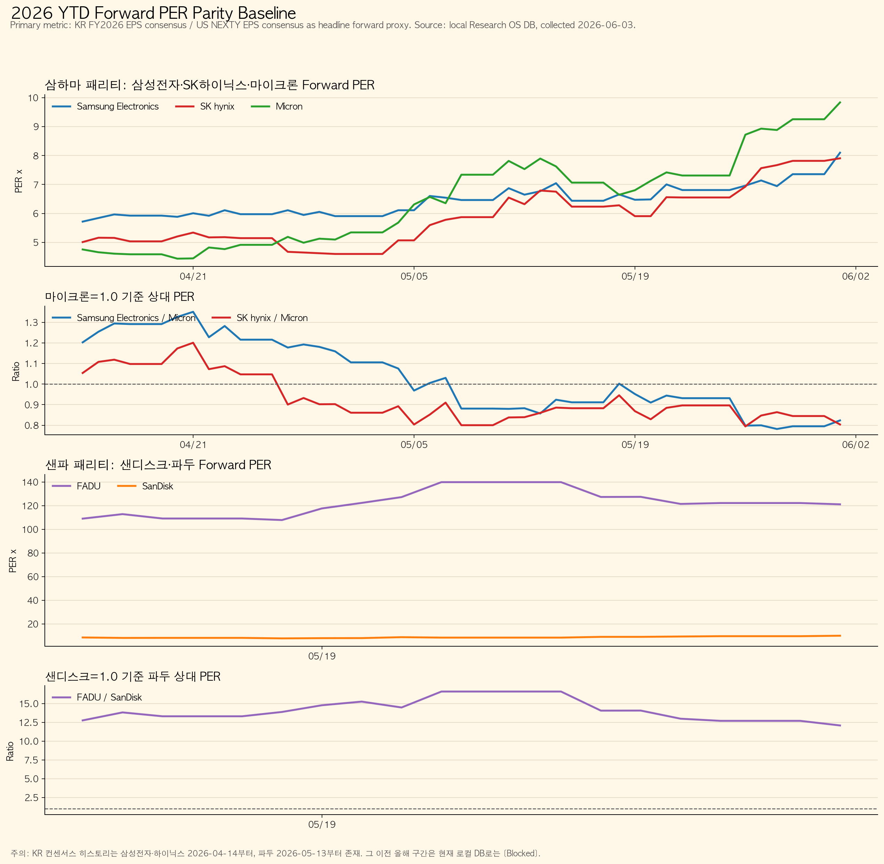
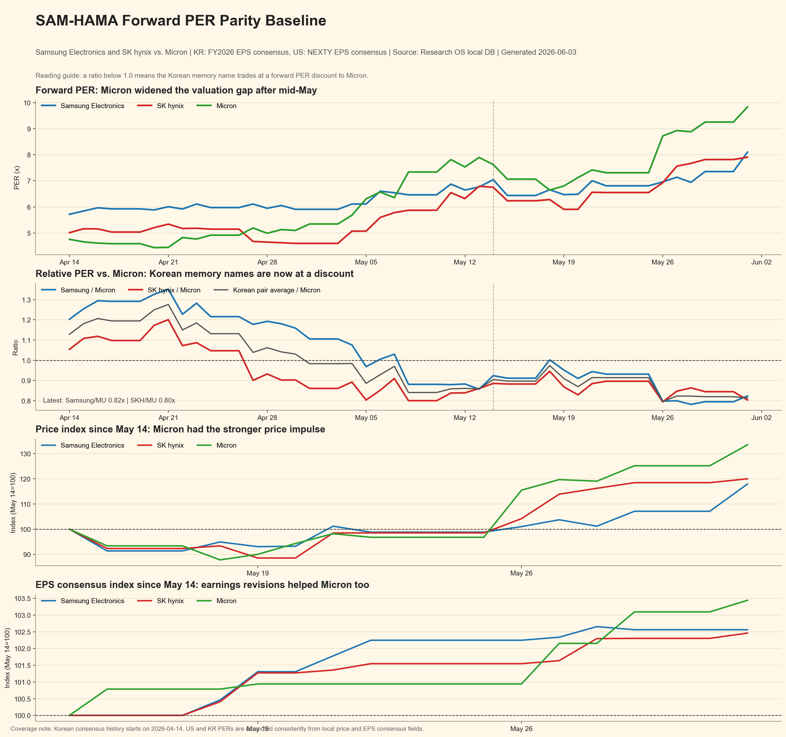

> Bối cảnh: bài viết nối tiếp các phân tích về Samsung, SK hynix, Micron và HBM. Hub liên quan: [AI HBM hub](/page/korea-semiconductor-hbm-kospi-hub/) và [Korea Daily Market Hub](/page/korea-daily-market-hub/).

## TL;DR

- Khoảng chiết khấu gần đây không đến từ việc Samsung hay SK hynix xấu đi. Chủ yếu là vì **Micron được định giá lại nhanh hơn**.
- Tại ngày 1/6/2026, Samsung/Micron ở **0.82x**, SK hynix/Micron ở **0.80x** theo forward PER.
- Samsung thấp hơn khoảng 20% so với tỷ lệ trung bình trước Micron; SK hynix thấp hơn khoảng 13%.
- SK hynix có thể mua một phần đầu tiên, nhưng dòng tiền ngoại vẫn cần được xác nhận.
- Samsung có tiềm năng bắt kịp lớn hơn nếu niềm tin vào HBM4E/HBM4 cải thiện.

| Công ty | Forward PER hiện tại | PER trung bình | Hiện tại vs Micron | Trung bình vs Micron |
|---|---:|---:|---:|---:|
| Samsung Electronics | **8.10x** | 6.43x | **0.82x** | **1.03x** |
| SK hynix | **7.90x** | 5.87x | **0.80x** | **0.93x** |
| Micron | **9.84x** | 6.49x | 1.00x | 1.00x |

Dữ liệu: Research OS local DB, EPS FY2026 cho Hàn Quốc và EPS NEXTY cho Micron, 49 phiên từ 14/4 đến 1/6/2026. CSV: [daily panel](per_parity_daily_panel_20260603.csv), [summary](per_parity_baseline_summary_20260603.csv).

## Góc nhìn đầu tư

SK hynix vẫn là cổ phiếu HBM rõ ràng hơn. Nếu tỷ lệ SK hynix/Micron quay lại 0.89x, mức bắt kịp multiple khoảng 10%; nếu quay lại trung bình 0.93x, khoảng 15%.

Samsung chưa được chứng minh mạnh bằng trong HBM, nhưng chiết khấu tương đối lớn hơn. Nếu Samsung quay lại tỷ lệ trung bình 1.03x so với Micron và PER của Micron giữ quanh 9.84x, PER ngụ ý của Samsung sẽ gần 10.1x so với 8.1x hiện tại.

Rủi ro: Micron giảm định giá, Samsung chậm xác nhận HBM, nhà đầu tư ngoại tiếp tục bán cổ phiếu Hàn Quốc, hoặc EPS bị hạ.

Nguồn: [Micron FY2Q26 results](https://investors.micron.com/news-releases/news-release-details/micron-technology-inc-reports-results-second-quarter-fiscal-2026), [Micron prepared remarks](https://investors.micron.com/static-files/e089f8c0-065d-47b8-9d02-bfa863cdb357).

