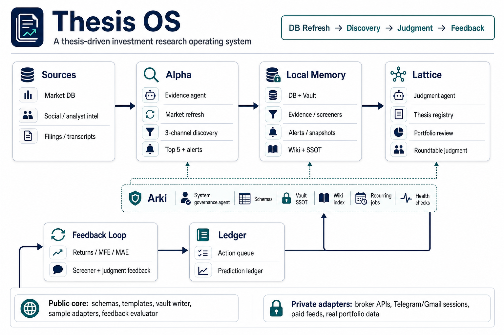

> 🔗 <strong>Go to repo</strong>: <strong>Thesis Investment OS repository</strong> — the open-source system that runs this blog's research

Today's post is a little different from the usual. It isn't about a stock — it's about <strong>how the posts on this blog actually get made</strong>. Let me pull back the curtain for a moment.

## What it takes to produce a single post

The posts on Korea Invest Insights are not improvised by a person staring at a blank screen. Behind them runs a small operating system called the <strong>Thesis Investment OS</strong>. The name sounds grand, but the idea is simple.

> Make investment judgment <strong>visible, testable, and honest about its own track record.</strong>

It is not an automated trading bot, not a signal-selling service, and not an "AI that picks stocks for you." It is a <strong>framework</strong> that gathers fragmented market information into a thesis — and lets you go back later and check whether that thesis turned out right or wrong.

The structure breaks into three roles. Think of them as three people on one team.

---

## 1. Alpha — the one who gathers the evidence

Alpha is the role that <strong>collects and verifies facts.</strong>

- <strong>Quantitative data</strong>: prices, volume, flows, fundamentals, filings
- <strong>Qualitative data</strong>: news, filings, earnings transcripts, community signals
- Narrowing down candidates with screeners, then layering on context to surface names worth watching

What Alpha produces is evidence records, market snapshots, intraday alerts, screener candidates, and research packets. In short, it is the one who <strong>honestly stacks up "what happened."</strong> It does not judge yet. It only gathers the raw material.

---

## 2. Lattice — the one who builds judgment from evidence

The name Lattice comes from Charlie Munger's idea of a <strong>"latticework of mental models"</strong> — a mind built from many interlocking frameworks.

Its role is to take the material Alpha gathered and turn it into an actual investment decision.

- Registering a thesis and organizing it into a decision card
- Running a <strong>devil's advocate</strong> review that deliberately argues the other side
- Recording predictions in a prediction ledger, then revisiting them later to see if they held up

The structure you read on the blog — "here's the conclusion," "this is a fact and this is speculation" — comes straight from Lattice. The point is to <strong>make a call, but leave it in a form you can grade later.</strong>

---

## 3. Arki — the one who keeps the system running

Arki is the least visible role, and perhaps the most important. It is the one that <strong>keeps the whole system healthy.</strong>

- Defining the schemas that hold the data and the vault layout that stores it
- Managing recurring jobs and running health checks
- Keeping migration logs and governing the permissions and rules of each role

If the system were a house, Arki is the one making sure the electricity, water and heating keep running while Alpha and Lattice do their work. It is not glamorous, but without Arki the other two wouldn't last long.

---

## What these three roles have produced — real examples

This is abstract in words, so here are two recent posts that came through this system.

- [Dell Q1 earnings and the Korea AI-server margin read-through](/post/dell-q1-fy2027-earnings-korea-ai-server-margin-readthrough-2026-05-29/) — Alpha gathered Dell's earnings numbers, and Lattice connected them into the Korean semiconductor and server value chain to build a view.
- [Marvell Q1 FY2027 results and the Korea semiconductor read-through](/post/marvell-q1-fy2027-korea-semiconductor-readthrough-2026-05-28/) — same flow: starting from Marvell's custom-silicon numbers and carrying them into a Korea read-through.

Both posts separate "this is a Fact, this is an Inference, this is Speculation." That habit is exactly the structure Lattice enforces, and the facts holding it up are the ones Alpha gathered.

---

## Why publish this at all

When you do research long enough, the scariest thing is <strong>"not remembering what you said before."</strong> Good-looking theses are plentiful; going back to check whether they were actually right is tedious and uncomfortable. So most analysis is written once and forgotten.

Thesis OS deliberately builds that discomfort into the system. Every judgment gets evidence attached, every prediction gets logged, and everything gets graded later. Not because it is perfect, but because it is built so that <strong>when it's wrong, you can see it.</strong>

The system is designed to run locally. You can try it with the bundled sample data — no API keys, broker logins, or paid feeds required. The license is MIT, and it needs Python 3.10 or newer.

And the three channels this system publishes through are exactly these: the <strong>blog (Korea Invest Insights)</strong> you're reading now, <strong>Telegram @korea_invest_insights</strong>, and <strong>Substack</strong>.

---

## Come take a look

The point of this post isn't to brag — it's an invitation. If you've ever wondered how to make investment research more honest and more testable, take a peek.

> You don't have to read all the code. Even skimming the README should give you a feel for "ah, so this is how these blog posts get made."

👉 <strong>Thesis Investment OS repository</strong>

A star is welcome, but just browsing the structure is fine too. There is only one reason I opened the curtain: <strong>so you can see for yourself where and how this blog's judgments come from.</strong>

---

*Disclaimer: For research and information purposes only. Not personalized investment advice. The open-source system described is a research tool; readers are responsible for their own investment decisions and outcomes.*
