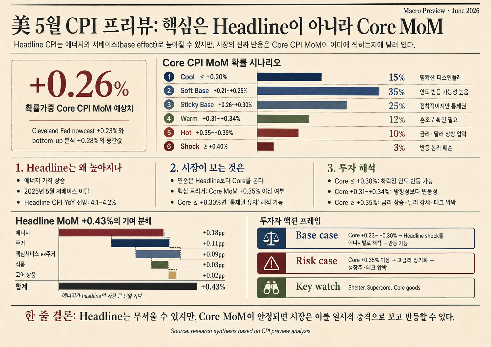

> Bối cảnh: bài này là phần đào sâu CPI sau bài về cụm sự kiện **CPI → đáo hạn phái sinh Hàn Quốc → BOJ → FOMC**.



## Tóm tắt

- CPI headline có khả năng cao: vùng trung tâm là **+0,43~0,46% MoM / 4,1~4,2% YoY**.
- Biến số quan trọng là **Core CPI MoM**, không phải headline. Cleveland Fed nowcast ngày 5/6 đặt core CPI tháng 5 ở **+0,23% MoM / 2,82% YoY**; tính toán bottom-up là **+0,28%**. Trung tâm xác suất là **+0,26%**. ([Cleveland Fed][1])
- Xác suất: **Core ≤ +0,30% = 75%**, **Core ≥ +0,35% = 13%**. Trường hợp cơ sở cho phép relief bounce, nhưng trên +0,35% cần chuyển sang phòng thủ.

## Phân phối Core CPI MoM

| Kịch bản | Core CPI MoM | Xác suất | Diễn giải | Phản ứng cổ phiếu |
|---|---:|---:|---|---|
| Cool | ≤ +0,20% | 15% | Giảm phát rõ | Relief bounce mạnh |
| Soft Base | +0,21~0,25% | 35% | Khớp Cleveland | Khả năng hồi cao |
| Sticky Base | +0,26~0,30% | 25% | Dính nhưng kiểm soát | Có thể giảm rồi hồi |
| Warm | +0,31~0,34% | 12% | Mơ hồ | Hồi hạn chế hoặc lẫn lộn |
| Hot | +0,35~0,39% | 10% | Rủi ro vòng hai | Tech/growth chịu áp lực |
| Shock | ≥ +0,40% | 3% | Lặp lại tháng 4 | Hồi thất bại; lợi suất/USD tăng |

## Vì sao headline có thể cao

BLS cho biết CPI tháng 4/2026 tăng **+0,6% MoM / +3,8% YoY**, core tăng **+0,4% MoM / +2,8% YoY**. Năng lượng tăng **+3,8%**, xăng **+5,4%**, shelter **+0,6%**, vé máy bay **+2,8%**. ([BLS][3])

Tháng 5/2025 là nền thấp: headline và core đều chỉ tăng **+0,1% MoM SA**. ([BLS May 2025][4])

Giá xăng hàng tuần của EIA tăng từ khoảng **$4,103/gal** trong tháng 4 lên **$4,479/gal** trong tháng 5:

```text
4.479 / 4.103 - 1 = +9.2%
```

Điều này hỗ trợ headline, dù giá ngày 1/6 giảm còn **$4,305/gal**, có thể làm CPI tháng 6 bớt nóng. ([EIA][5])

## Kiểm tra bằng trọng số

Theo BLS tháng 4/2026, trọng số năng lượng là **7,090%**, thực phẩm **13,560%**, core **79,351%**, hàng hóa core **19,002%**, shelter **35,320%**. ([BLS Table 1][7])

```text
Headline proxy = 0.445% ≈ +0.45%
Core proxy = 0.277% ≈ +0.28%
```

Vì vậy **core khoảng +0,28%** là trung tâm hợp lý. **+0,35~0,40%** là vùng rủi ro.

## Ý nghĩa đầu tư

| Kết quả | Diễn giải | Hành động |
|---|---|---|
| Core ≤ +0,25% | Headline do năng lượng, core ổn định. | Quality growth, một số bán dẫn và duration có thể hồi. |
| Core +0,26~0,34% | Không rõ ràng. | Chờ PPI và FOMC. |
| Core ≥ +0,35% | Lo ngại lan truyền vòng hai. | Giảm growth định giá cao, small caps, REITs; ưu tiên energy/quality/defensive. |
| Core ≥ +0,40% + shelter/supercore | Fed repricing. | Giảm beta, tăng cash/USD/short duration. |

Đối với Hàn Quốc, CPI Mỹ tác động qua hai đường: **lãi suất/USD/KRW** và **chi phí năng lượng**. Bán dẫn có lợi từ KRW yếu nhưng có thể chịu áp lực nếu định giá tech Mỹ giảm. Lọc dầu phòng thủ hơn; hóa chất, hàng không và utilities dễ bị áp lực chi phí.

## Kết luận

Headline **4,1~4,2%** là kịch bản có thể xảy ra, nhưng chưa đủ để bán mạnh tài sản rủi ro. Trung tâm xác suất là **Core +0,26%**, xác suất **+0,30% hoặc thấp hơn là 75%**, nên trường hợp cơ sở là relief bounce. Điểm chuyển sang phòng thủ là **Core CPI MoM +0,35% trở lên**.

[1]: https://www.clevelandfed.org/indicators-and-data/inflation-nowcasting
[2]: https://www.bls.gov/schedule/news_release/cpi.htm
[3]: https://www.bls.gov/news.release/cpi.nr0.htm
[4]: https://www.bls.gov/news.release/archives/cpi_06112025.pdf
[5]: https://www.eia.gov/dnav/pet/hist/LeafHandler.ashx?f=W&n=PET&s=EMM_EPMR_PTE_NUS_DPG
[7]: https://www.bls.gov/news.release/cpi.t01.htm
